Meeting 2: Data Visualization and Tibbles
================
July 29, 2021 from 7:00-8:30pm ET

## Chapters to Read

This week, we’ll be discussing:

-   Data Visualization with `ggplot2`
-   Tibbles

### Physical Book

If you’re reading the physical book, the chapters to read are:

| Physical book chapters                 | Pages   |
|:---------------------------------------|:--------|
| Ch. 1: Data Visualization with ggplot2 | 1-35    |
| Ch. 7: Tibbles                         | 119-124 |

### Online Book

If you’re reading the online book, the chapters to read are:

| Chapter                       | Link                                             |
|:------------------------------|:-------------------------------------------------|
| Ch. 2: Introduction (Explore) | <https://r4ds.had.co.nz/explore-intro.html>      |
| Ch. 3: Data visualization     | <https://r4ds.had.co.nz/data-visualisation.html> |
| Ch. 10: Tibbles               | <https://r4ds.had.co.nz/tibbles.html>            |

## Exercises

All exercises refer to the online book chapters. The book exercises and
online exercises may differ, so to make sure everyone is doing the same
exercises, please refer to the online book chapters.

-   Chapter 3: Section 3.2.4 \#1, 4
-   Chapter 3: Section 3.3.1 \#1, 3
-   Chapter 3: Section 3.5.1 \#1,2,5
-   Chapter 3: Section 3.6.1 \#1,2,4
-   Chapter 3: Section 3.7.1 \#2, 5
-   Chapter 3: Section 3.8.1 \#1,2
-   Chapter 3: Section 3.9.1 \# 2,4
-   Chapter 10: Section 10.5 \#1-3

Exercises are reproduced below.

### Chapter 3 Exercises

#### Section 3.2.4

1.  Run `ggplot(data = mpg)`. What do you see? (\#1)

> Solution:

``` r
library(ggplot2)
ggplot(data = mpg)
```

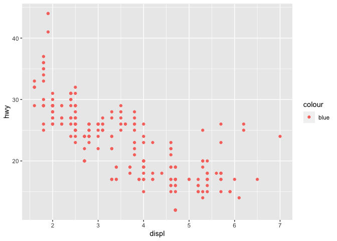

4.  Make a scatterplot of `hwy` vs `cyl`. (\#4)

> Solution:

``` r
ggplot(data = mpg) + 
  geom_point(aes(x = cyl, y = hwy))
```

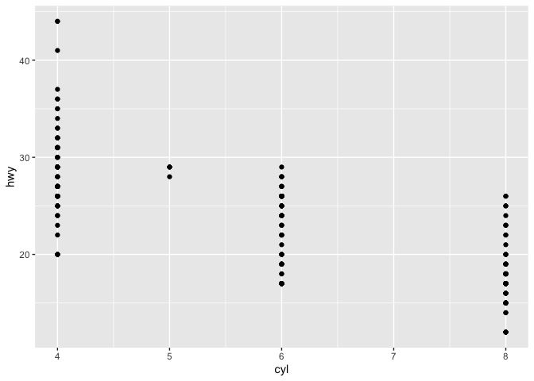

``` r
ggplot(data = mpg) + 
  geom_point(aes(x = hwy, y = cyl))
```

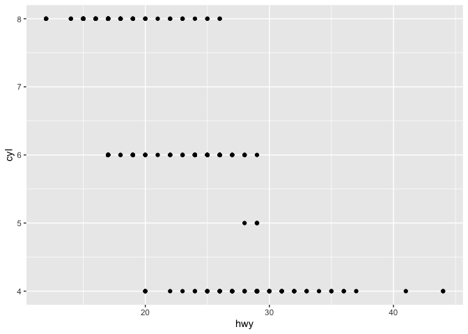

#### Section 3.3.1

1.  What’s gone wrong with this code? Why are the points not blue? (\#1)

    ``` r
    ggplot(data = mpg) + 
      geom_point(mapping = aes(x = displ, y = hwy, color = "blue"))
    ```

    

> Solution: `color = "blue"` is inside of `aes()` which means it’s
> expecting a mapping: map the variable on the right of `=` (“blue”) to
> the aesthetic value on the left of `=` (color). Because `"blue"` is a
> single value, all points are assigned the value “blue” and the default
> `ggplot2` color palette is used, which is where the pinkish-red comes
> from. When manually changing color for all points, do not put your
> request inside of `aes()`, as in the revised example below.

``` r
ggplot(data = mpg) + 
  geom_point(aes( x = displ, y = hwy), color = "blue")
```

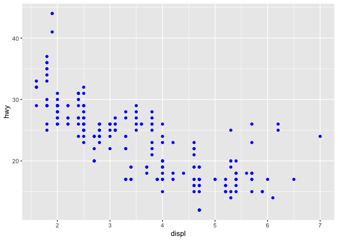

3.  Map a continuous variable to `color`, `size`, and `shape`. How do
    these aesthetics behave differently for categorical vs. continuous
    variables? (\#3)

> Solution:

``` r
library(patchwork)

p_color <- ggplot(data = mpg) + 
  geom_point(aes( x = displ, y = hwy, color = cty)) + 
  ggtitle("Color")

p_size <- ggplot(data = mpg) + 
  geom_point(aes( x = displ, y = hwy, size = cty)) + 
  ggtitle("Size")

p_shape <- ggplot(data = mpg) + 
  geom_point(aes( x = displ, y = hwy, shape = cty)) + 
  ggtitle("Shape")

p_color + p_size
```

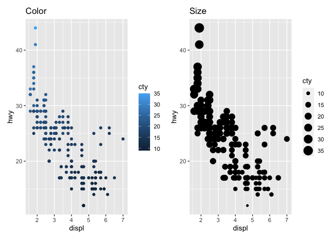

``` r
p_shape
```

    > Error: A continuous variable can not be mapped to shape
    > Run `rlang::last_error()` to see where the error occurred.

> Shape cannot be mapped to a continuous variable. The color aes mapping
> uses a gradient for continuous variables and palettes of different
> colors for categorical variables. The size aes mapping maps continuous
> values to area; it is not advised to use size for a discrete variable.

#### Section 3.5.1

1.  What happens if you facet on a continuous variable? (\#1)

> Solution: It creates one facet per unique value.

``` r
ggplot(data = mpg) + 
  geom_point(aes( x = displ, y = hwy)) + 
  facet_wrap(~cty, nrow = 3)
```

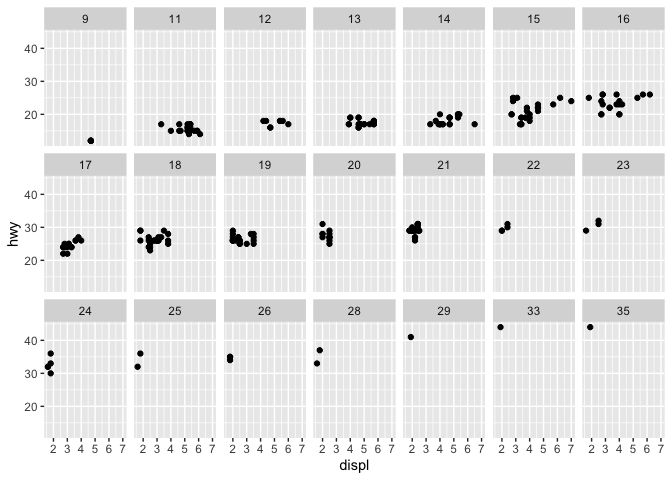

2.  What do the empty cells in plot with `facet_grid(drv ~ cyl)` mean?
    How do they relate to this plot? (\#2)

    ``` r
    ggplot(data = mpg) + 
      geom_point(mapping = aes(x = drv, y = cyl))
    ```

    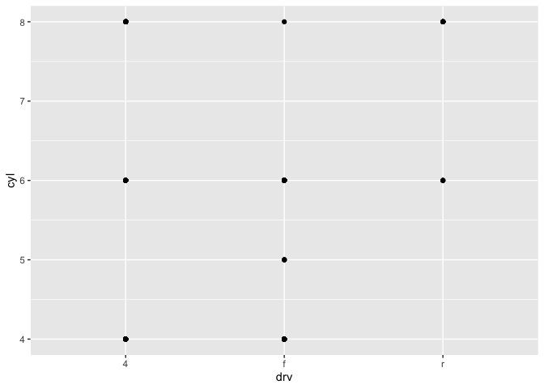

> Solution: The reference plot is below.

``` r
ggplot(data = mpg) + 
  geom_point(mapping = aes(x = displ, y = hwy)) + 
  facet_grid(drv ~ cyl)
```

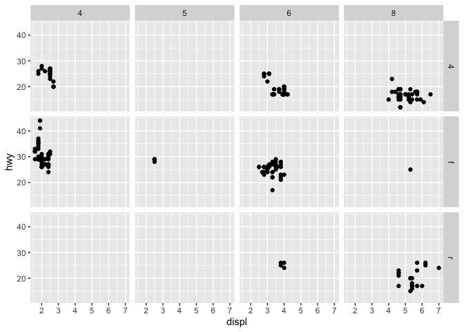

> The empty cells mean that there are no observations where the value of
> `drv` is 4 (r) and the value of `cyl` is 5 (4 or 5). It relates to the
> scatterplot above as follows: there are no observations on the
> intersections of the major gridlines.

5.  Read `?facet_wrap`. What does `nrow` do? What does `ncol` do? What
    other options control the layout of the individual panels? Why
    doesn’t `facet_grid()` have `nrow` and `ncol` arguments? (\#5)

> Solution: `nrow` dictates how many rows of plots are drawn, while
> `ncol` dictacts how many columns of plots are drawn. Other options:
> `as.table` (arrange values from smallest to largest (default) or
> largest to smallest?), `drop` (drop all factor levels not in data),
> `dir` (‘h’ for horizontal fill (default) or ‘v’ for vertical fill).
> Facet\_grid doesn’t have ncol and nrow because the data determines the
> number of rows and columns.

#### Section 3.6.1

1.  What geom would you use to draw a line chart? geom\_line() A
    boxplot? geom\_boxplot() A histogram? geom\_histogram() An area
    chart? geom\_area() (\#1)

> Solution: For a line chart, I would use `geom_line`. For a boxplot, I
> would use `geom_boxplot`. For a histogram, I would use
> `geom_histogram`. For an area chart, I would use `geom_area`.

2.  Run this code in your head and predict what the output will look
    like. Then, run the code in R and check your predictions. (\#2)

    ``` r
    ggplot(data = mpg, mapping = aes(x = displ, y = hwy, color = drv)) + 
      geom_point() + 
      geom_smooth(se = FALSE)
    ```

> Solution: I predict that it will be a scatterplot of the `mpg` data
> with `displ` on the x-axis and `hwy` on the y-axis. The points will be
> colored according to the `drv` variable. There will be a smoother
> drawn through each group of points (according to the `drv` variable)

``` r
ggplot(data = mpg, 
       mapping = aes(x = displ, y = hwy, color = drv)) + 
  geom_point() + 
  geom_smooth(se = FALSE)
```


``` r
ggplot(data = mpg, 
       mapping = aes(x = displ, y = hwy)) + 
  geom_point(aes(color = drv)) + 
  geom_smooth(se = FALSE)
```

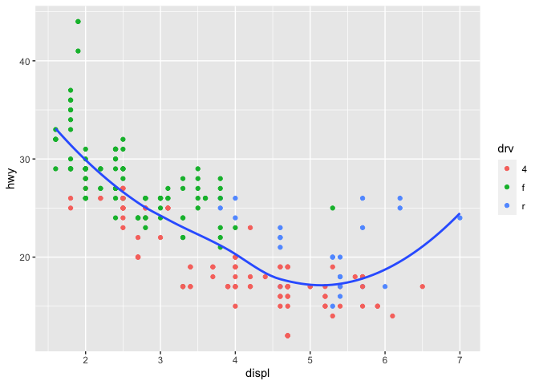

``` r
ggplot(data = mpg, 
       mapping = aes(x = displ, y = hwy)) + 
  geom_point() + 
  geom_smooth(aes(color = drv), se = FALSE)
```

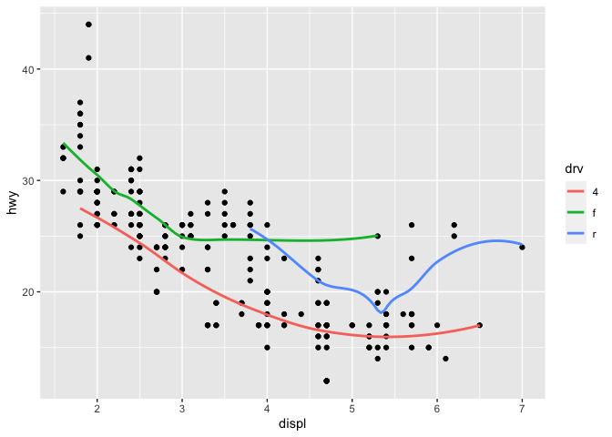

``` r
# remove points from legend 
ggplot(data = mpg, 
       mapping = aes(x = displ, y = hwy, color = drv)) + 
  geom_point(show.legend = FALSE) + 
  geom_smooth(se = FALSE)
```

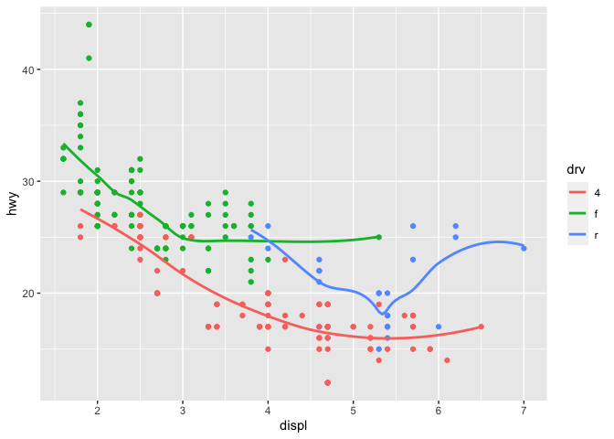

4.  What does the `se` argument to `geom_smooth()` do? (\#4)

> Solution: It draws the confidence interval around the smoother.

``` r
ggplot(data = mpg, mapping = aes(x = displ, y = hwy, color = drv)) + 
  geom_point() + 
  geom_smooth()
```

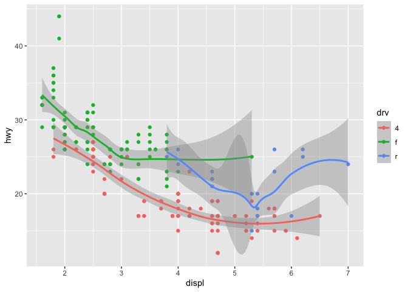

> Bonus: You can control the level of confidence (default is 0.95 for
> 95% confidence) with the `level` argument to `geom_smooth()`.

``` r
ggplot(data = mpg, mapping = aes(x = displ, y = hwy, color = drv)) + 
  geom_point() + 
  geom_smooth(level = .5)
```

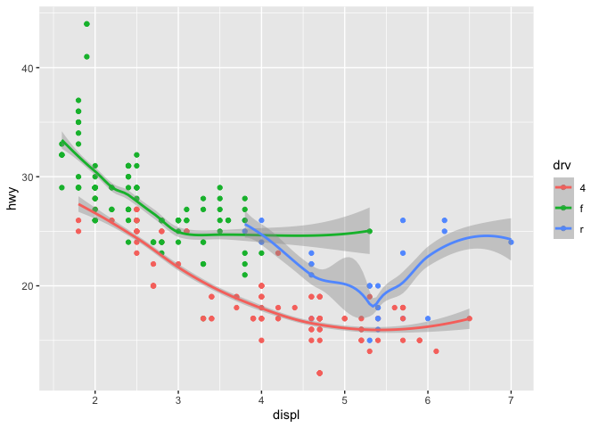

``` r
ggplot(data = mpg, mapping = aes(x = displ, y = hwy, color = drv)) + 
  geom_point() + 
  geom_smooth(method = "lm") -> p_se 

# how to get out the computed values that ggplot2
# used "behind the scenes"
# ggplot2::ggplot_build(p_se)
```

#### Section 3.7.1

2.  What does `geom_col()` do? How is it different to `geom_bar()`?
    (\#2)

> Solution: `col` is short for “column”. It draws a column with a
> specified height (y) at a specified location (x). x and y are mapped
> to variables in the data. `bar` is short for “bar chart”. It draws a
> bar at a specified location (x), the height of which represent how
> many observations in the data have the corresponding x value.

``` r
ggplot(data = mtcars) + 
  geom_bar(aes(x = gear))
```

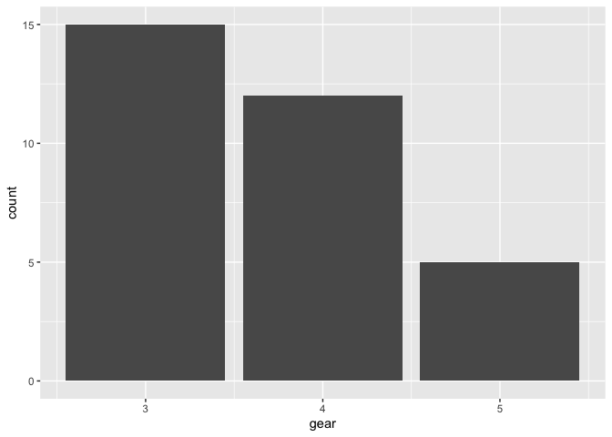

``` r
ggplot(data = mtcars) + 
  geom_col(aes(x = mpg, y = disp))
```

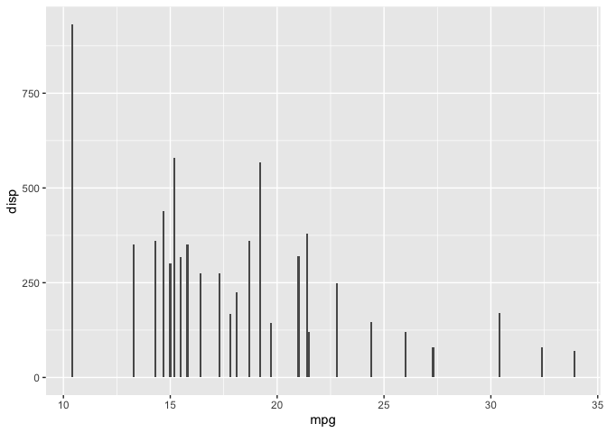

``` r
ggplot(data = mtcars) + 
  geom_bar(aes(x = mpg, y = disp), stat = "identity")
```


``` r
# histograms hug: bars are touching 
ggplot(data = mtcars) + 
  geom_histogram(aes(x = mpg), binwidth = 5)
```

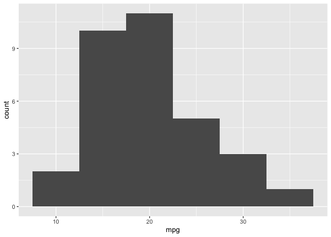

``` r
# bar charts don't hug
ggplot(data = mtcars) + 
  geom_bar(aes(x = carb))
```

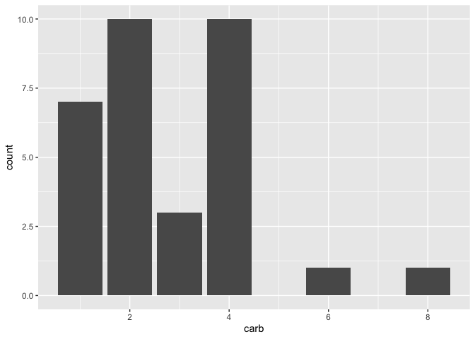

5.  In our proportion bar chart, we need to set `group = 1`. Why? In
    other words what is the problem with these two graphs? (\#5)

    ``` r
    ggplot(data = diamonds) + 
      geom_bar(mapping = aes(x = cut, y = after_stat(prop)))
    ggplot(data = diamonds) + 
      geom_bar(mapping = aes(x = cut, fill = color, y = after_stat(prop)))
    ```

> Solution: The group value defaults to existing aes mappings. So in the
> first plot, `after_stat` is computing what proportion of the data in
> each group (fair, good, etc.) belong to that group, which is always 1.
> In the second example, the colors of the bars show the proportion
> within those groups of each value, but not the overall proprtions. We
> get the latter when adding the `group = color` aesthetic mapping.

``` r
ggplot(data = diamonds) + 
  geom_bar(mapping = aes(x = cut, y = after_stat(prop), 
                         group = 1))
ggplot(data = diamonds) + 
  geom_bar(mapping = aes(x = cut, fill = color, y = after_stat(prop), group = color))
```

#### Section 3.8.1

1.  What is the problem with this plot? How could you improve it? (\#1)

    ``` r
    ggplot(data = mpg, mapping = aes(x = cty, y = hwy)) + 
      geom_point(position = "jitter")
    ```

    

> Solution: There is overplotting (multiple observations represented by
> only 1 visual point). Resolve it with `geom_jitter` instead of
> `geom_point`.

``` r
ggplot(data = mpg, mapping = aes(x = cty, y = hwy)) + 
  geom_jitter()
```

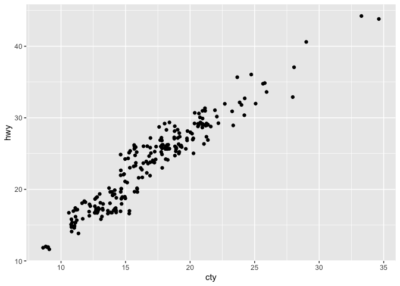

``` r
ggplot(data = mpg, mapping = aes(x = cty, y = hwy)) + 
  geom_point(alpha = 0.1)
```

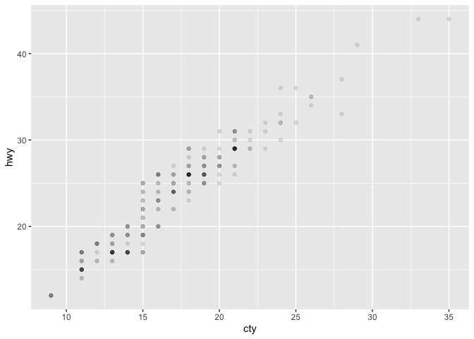

``` r
ggplot(data = mpg, mapping = aes(x = cty, y = hwy)) + 
  geom_jitter(alpha = 0.5, width = .1, height = .1)
```

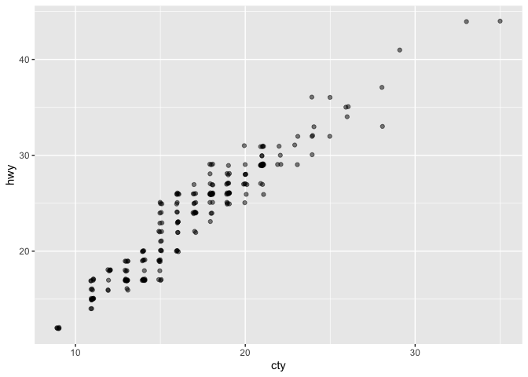

2.  What parameters to `geom_jitter()` control the amount of jittering?
    (\#2)

> Solution: `width` and `height`.

``` r
ggplot(data = mpg, mapping = aes(x = cty, y = hwy)) + 
  geom_jitter(height = 0, width = 1)
```

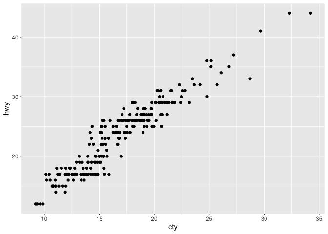

``` r
ggplot(data = mpg, mapping = aes(x = cty, y = hwy)) + 
  geom_jitter(height = 1, width = 0)
```

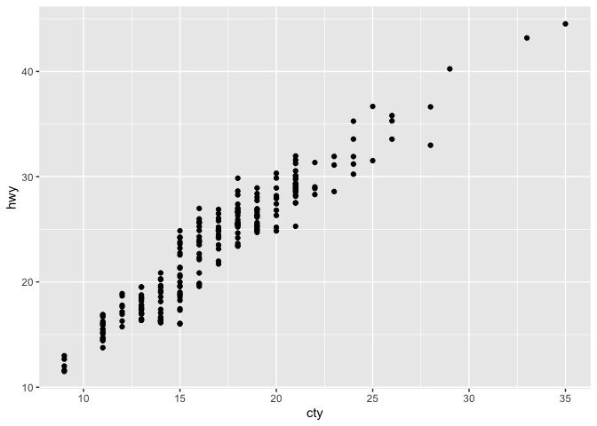

``` r
ggplot(data = mpg, mapping = aes(x = cty, y = hwy)) + 
  geom_jitter(height = 1, width = 1)
```

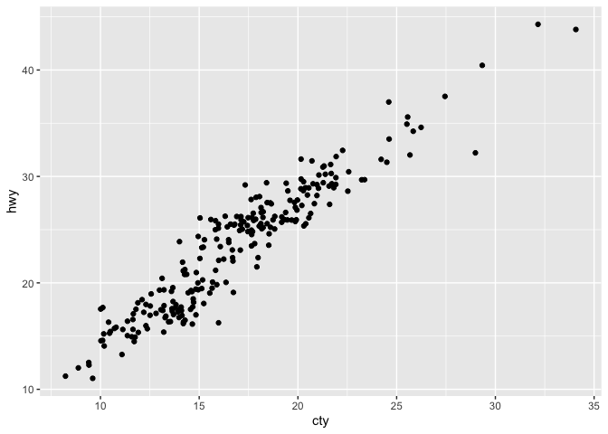

``` r
ggplot(data = mpg, mapping = aes(x = cty, y = hwy)) + 
  geom_jitter(height = .1, width = .1)
```

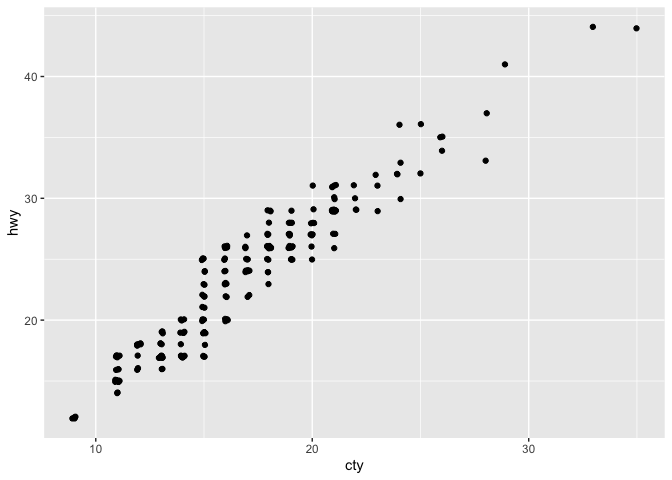

#### Section 3.9.1

2.  What does `labs()` do? Read the documentation. (\#2)

> Solution: `labs()` allows you to provide various **lab**els for parts
> of the plot (x-axis, plot title, plot subtitle, etc.)

``` r
ggplot(data = mpg, mapping = aes(x = cty, y = hwy, color = drv)) + 
  geom_jitter(height = .1, width = .1) + 
  labs(x = "X axis label", 
       y = "Y axis label", 
       title = "Plot title", 
       subtitle = "Plot subtitle",
       caption = "Plot caption", 
       tag = "Plot tag", 
       color = "Legend title")
```

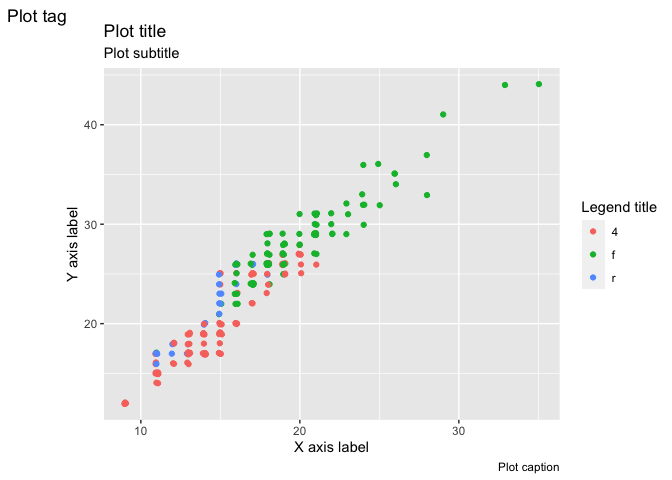

4.  What does the plot below tell you about the relationship between
    city and highway mpg? Why is `coord_fixed()` important? What does
    `geom_abline()` do? (\#4)

    ``` r
    ggplot(data = mpg, mapping = aes(x = cty, y = hwy)) +
      geom_point() + 
      geom_abline() +
      coord_fixed()
    ```

    

> Solution: As the city mpg of a car increases, so does the highway mpg.
> `coord_fixed()` draws the plot so that 1 unit on the x-axis is equal
> to 1 unit on the 1-axis, so 1 more mpg on the x-axis takes up the same
> amount of space as 1 more mpg on the y-axis. `geom_abline()` draws the
> line y = x, where the values of x- and y-axis are equal. The plot
> makes intuitive sense: nearly all cars get more MPG on the highway
> than they do in the city.

**Simina:** Use coord\_fixed for PCA plots (1st prin comp vs 2nd prin
comp)

**Maddie:** How to make the plot square?

``` r
ggplot(data = mpg, mapping = aes(x = cty, y = hwy)) +
  geom_point() + 
  geom_abline() +
  coord_fixed() + 
  xlim(c(0, 50)) + 
  ylim(c(0, 50))
```

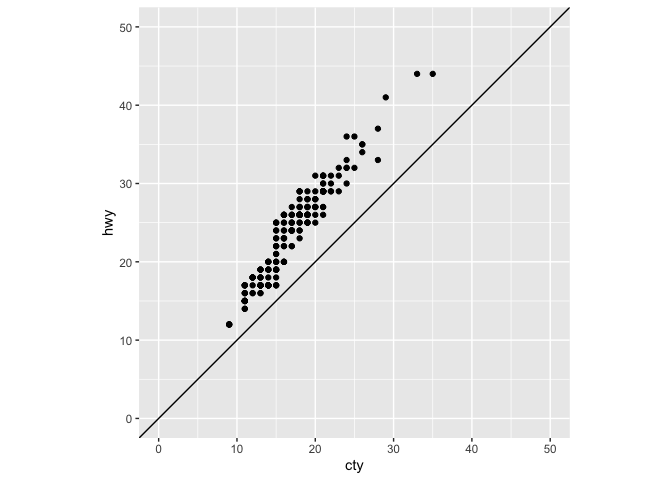

### Chapter 10 Exercises

1.  How can you tell if an object is a tibble? (Hint: try printing
    `mtcars`, which is a regular data frame).

> Solution: There are at least 2 ways. See below, where mtcars is a data
> frame, while diamonds is a tibble.

``` r
library(tibble)
# print the objects 
mtcars
```

    ##                      mpg cyl  disp  hp drat    wt  qsec vs am gear carb
    ## Mazda RX4           21.0   6 160.0 110 3.90 2.620 16.46  0  1    4    4
    ## Mazda RX4 Wag       21.0   6 160.0 110 3.90 2.875 17.02  0  1    4    4
    ## Datsun 710          22.8   4 108.0  93 3.85 2.320 18.61  1  1    4    1
    ## Hornet 4 Drive      21.4   6 258.0 110 3.08 3.215 19.44  1  0    3    1
    ## Hornet Sportabout   18.7   8 360.0 175 3.15 3.440 17.02  0  0    3    2
    ## Valiant             18.1   6 225.0 105 2.76 3.460 20.22  1  0    3    1
    ## Duster 360          14.3   8 360.0 245 3.21 3.570 15.84  0  0    3    4
    ## Merc 240D           24.4   4 146.7  62 3.69 3.190 20.00  1  0    4    2
    ## Merc 230            22.8   4 140.8  95 3.92 3.150 22.90  1  0    4    2
    ## Merc 280            19.2   6 167.6 123 3.92 3.440 18.30  1  0    4    4
    ## Merc 280C           17.8   6 167.6 123 3.92 3.440 18.90  1  0    4    4
    ## Merc 450SE          16.4   8 275.8 180 3.07 4.070 17.40  0  0    3    3
    ## Merc 450SL          17.3   8 275.8 180 3.07 3.730 17.60  0  0    3    3
    ## Merc 450SLC         15.2   8 275.8 180 3.07 3.780 18.00  0  0    3    3
    ## Cadillac Fleetwood  10.4   8 472.0 205 2.93 5.250 17.98  0  0    3    4
    ## Lincoln Continental 10.4   8 460.0 215 3.00 5.424 17.82  0  0    3    4
    ## Chrysler Imperial   14.7   8 440.0 230 3.23 5.345 17.42  0  0    3    4
    ## Fiat 128            32.4   4  78.7  66 4.08 2.200 19.47  1  1    4    1
    ## Honda Civic         30.4   4  75.7  52 4.93 1.615 18.52  1  1    4    2
    ## Toyota Corolla      33.9   4  71.1  65 4.22 1.835 19.90  1  1    4    1
    ## Toyota Corona       21.5   4 120.1  97 3.70 2.465 20.01  1  0    3    1
    ## Dodge Challenger    15.5   8 318.0 150 2.76 3.520 16.87  0  0    3    2
    ## AMC Javelin         15.2   8 304.0 150 3.15 3.435 17.30  0  0    3    2
    ## Camaro Z28          13.3   8 350.0 245 3.73 3.840 15.41  0  0    3    4
    ## Pontiac Firebird    19.2   8 400.0 175 3.08 3.845 17.05  0  0    3    2
    ## Fiat X1-9           27.3   4  79.0  66 4.08 1.935 18.90  1  1    4    1
    ## Porsche 914-2       26.0   4 120.3  91 4.43 2.140 16.70  0  1    5    2
    ## Lotus Europa        30.4   4  95.1 113 3.77 1.513 16.90  1  1    5    2
    ## Ford Pantera L      15.8   8 351.0 264 4.22 3.170 14.50  0  1    5    4
    ## Ferrari Dino        19.7   6 145.0 175 3.62 2.770 15.50  0  1    5    6
    ## Maserati Bora       15.0   8 301.0 335 3.54 3.570 14.60  0  1    5    8
    ## Volvo 142E          21.4   4 121.0 109 4.11 2.780 18.60  1  1    4    2

``` r
diamonds
```

    ## # A tibble: 53,940 × 10
    ##    carat cut       color clarity depth table price     x     y     z
    ##    <dbl> <ord>     <ord> <ord>   <dbl> <dbl> <int> <dbl> <dbl> <dbl>
    ##  1  0.23 Ideal     E     SI2      61.5    55   326  3.95  3.98  2.43
    ##  2  0.21 Premium   E     SI1      59.8    61   326  3.89  3.84  2.31
    ##  3  0.23 Good      E     VS1      56.9    65   327  4.05  4.07  2.31
    ##  4  0.29 Premium   I     VS2      62.4    58   334  4.2   4.23  2.63
    ##  5  0.31 Good      J     SI2      63.3    58   335  4.34  4.35  2.75
    ##  6  0.24 Very Good J     VVS2     62.8    57   336  3.94  3.96  2.48
    ##  7  0.24 Very Good I     VVS1     62.3    57   336  3.95  3.98  2.47
    ##  8  0.26 Very Good H     SI1      61.9    55   337  4.07  4.11  2.53
    ##  9  0.22 Fair      E     VS2      65.1    61   337  3.87  3.78  2.49
    ## 10  0.23 Very Good H     VS1      59.4    61   338  4     4.05  2.39
    ## # … with 53,930 more rows

``` r
# ask for their class
class(mtcars)
```

    ## [1] "data.frame"

``` r
class(diamonds)
```

    ## [1] "tbl_df"     "tbl"        "data.frame"

``` r
# Simina: 
is_tibble(mtcars)
```

    ## [1] FALSE

``` r
is_tibble(diamonds)
```

    ## [1] TRUE

2.  Compare and contrast the following operations on a `data.frame` and
    equivalent tibble. What is different? Why might the default data
    frame behaviours cause you frustration?

    ``` r
    df <- data.frame(abc = 1, xyz = "a")
    df$x
    df[, "xyz"]
    df[, c("abc", "xyz")]
    ```

> Solution:

``` r
df <- data.frame(abc = 1, xyz = "a")
df$x
```

    ## [1] "a"

``` r
df[, "xyz"]
```

    ## [1] "a"

``` r
df[, c("abc", "xyz")]
```

    ##   abc xyz
    ## 1   1   a

``` r
tbl <- tibble(abc = 1, xyz = "a")
tbl$x
```

    ## NULL

``` r
tbl[, "xyz"]
```

    ## # A tibble: 1 × 1
    ##   xyz  
    ##   <chr>
    ## 1 a

``` r
tbl[, c("abc", "xyz")]
```

    ## # A tibble: 1 × 2
    ##     abc xyz  
    ##   <dbl> <chr>
    ## 1     1 a

> There is no column with name `x`, yet `df$x` returns something.
> `df[, "xyz"]` returns a single vector (a different object than a data
> frame) while `tbl[, "xyz"]` returns a tibble (the same object type you
> started with).

3.  If you have the name of a variable stored in an object,
    e.g. `var <- "mpg"`, how can you extract the reference variable from
    a tibble?

> Solution:

``` r
var <- "mpg"
# var <- mpg
mtcars_tbl <- as_tibble(mtcars)
mtcars_tbl[var]
```

    ## # A tibble: 32 × 1
    ##      mpg
    ##    <dbl>
    ##  1  21  
    ##  2  21  
    ##  3  22.8
    ##  4  21.4
    ##  5  18.7
    ##  6  18.1
    ##  7  14.3
    ##  8  24.4
    ##  9  22.8
    ## 10  19.2
    ## # … with 22 more rows

``` r
mtcars_tbl
```

    ## # A tibble: 32 × 11
    ##      mpg   cyl  disp    hp  drat    wt  qsec    vs    am  gear  carb
    ##    <dbl> <dbl> <dbl> <dbl> <dbl> <dbl> <dbl> <dbl> <dbl> <dbl> <dbl>
    ##  1  21       6  160    110  3.9   2.62  16.5     0     1     4     4
    ##  2  21       6  160    110  3.9   2.88  17.0     0     1     4     4
    ##  3  22.8     4  108     93  3.85  2.32  18.6     1     1     4     1
    ##  4  21.4     6  258    110  3.08  3.22  19.4     1     0     3     1
    ##  5  18.7     8  360    175  3.15  3.44  17.0     0     0     3     2
    ##  6  18.1     6  225    105  2.76  3.46  20.2     1     0     3     1
    ##  7  14.3     8  360    245  3.21  3.57  15.8     0     0     3     4
    ##  8  24.4     4  147.    62  3.69  3.19  20       1     0     4     2
    ##  9  22.8     4  141.    95  3.92  3.15  22.9     1     0     4     2
    ## 10  19.2     6  168.   123  3.92  3.44  18.3     1     0     4     4
    ## # … with 22 more rows

``` r
my_vars <- names(mtcars_tbl)

for (v in my_vars){
  print(summary(mtcars_tbl[[v]]))
}
```

    ##    Min. 1st Qu.  Median    Mean 3rd Qu.    Max. 
    ##   10.40   15.43   19.20   20.09   22.80   33.90 
    ##    Min. 1st Qu.  Median    Mean 3rd Qu.    Max. 
    ##   4.000   4.000   6.000   6.188   8.000   8.000 
    ##    Min. 1st Qu.  Median    Mean 3rd Qu.    Max. 
    ##    71.1   120.8   196.3   230.7   326.0   472.0 
    ##    Min. 1st Qu.  Median    Mean 3rd Qu.    Max. 
    ##    52.0    96.5   123.0   146.7   180.0   335.0 
    ##    Min. 1st Qu.  Median    Mean 3rd Qu.    Max. 
    ##   2.760   3.080   3.695   3.597   3.920   4.930 
    ##    Min. 1st Qu.  Median    Mean 3rd Qu.    Max. 
    ##   1.513   2.581   3.325   3.217   3.610   5.424 
    ##    Min. 1st Qu.  Median    Mean 3rd Qu.    Max. 
    ##   14.50   16.89   17.71   17.85   18.90   22.90 
    ##    Min. 1st Qu.  Median    Mean 3rd Qu.    Max. 
    ##  0.0000  0.0000  0.0000  0.4375  1.0000  1.0000 
    ##    Min. 1st Qu.  Median    Mean 3rd Qu.    Max. 
    ##  0.0000  0.0000  0.0000  0.4062  1.0000  1.0000 
    ##    Min. 1st Qu.  Median    Mean 3rd Qu.    Max. 
    ##   3.000   3.000   4.000   3.688   4.000   5.000 
    ##    Min. 1st Qu.  Median    Mean 3rd Qu.    Max. 
    ##   1.000   2.000   2.000   2.812   4.000   8.000

``` r
summary(mtcars_tbl[["mpg"]])
```

    ##    Min. 1st Qu.  Median    Mean 3rd Qu.    Max. 
    ##   10.40   15.43   19.20   20.09   22.80   33.90

### Open discussions

``` r
# what is %in%? Not the same as the "in" in "for (i in 1:10)"
"hp" %in% my_vars
```

    ## [1] TRUE

``` r
1 %in% seq(0, 2)
```

    ## [1] TRUE

``` r
1 %in% 0:2
```

    ## [1] TRUE

``` r
seq(0, 2, by = 0.5)
```

    ## [1] 0.0 0.5 1.0 1.5 2.0

``` r
seq(0, 2, length.out = 10)
```

    ##  [1] 0.0000000 0.2222222 0.4444444 0.6666667 0.8888889 1.1111111 1.3333333
    ##  [8] 1.5555556 1.7777778 2.0000000

``` r
library(dplyr)
mtcars %>% 
  filter(cyl == 6)
```

    ##                 mpg cyl  disp  hp drat    wt  qsec vs am gear carb
    ## Mazda RX4      21.0   6 160.0 110 3.90 2.620 16.46  0  1    4    4
    ## Mazda RX4 Wag  21.0   6 160.0 110 3.90 2.875 17.02  0  1    4    4
    ## Hornet 4 Drive 21.4   6 258.0 110 3.08 3.215 19.44  1  0    3    1
    ## Valiant        18.1   6 225.0 105 2.76 3.460 20.22  1  0    3    1
    ## Merc 280       19.2   6 167.6 123 3.92 3.440 18.30  1  0    4    4
    ## Merc 280C      17.8   6 167.6 123 3.92 3.440 18.90  1  0    4    4
    ## Ferrari Dino   19.7   6 145.0 175 3.62 2.770 15.50  0  1    5    6

``` r
mtcars %>% 
  filter(cyl %in% c(6, 8))
```

    ##                      mpg cyl  disp  hp drat    wt  qsec vs am gear carb
    ## Mazda RX4           21.0   6 160.0 110 3.90 2.620 16.46  0  1    4    4
    ## Mazda RX4 Wag       21.0   6 160.0 110 3.90 2.875 17.02  0  1    4    4
    ## Hornet 4 Drive      21.4   6 258.0 110 3.08 3.215 19.44  1  0    3    1
    ## Hornet Sportabout   18.7   8 360.0 175 3.15 3.440 17.02  0  0    3    2
    ## Valiant             18.1   6 225.0 105 2.76 3.460 20.22  1  0    3    1
    ## Duster 360          14.3   8 360.0 245 3.21 3.570 15.84  0  0    3    4
    ## Merc 280            19.2   6 167.6 123 3.92 3.440 18.30  1  0    4    4
    ## Merc 280C           17.8   6 167.6 123 3.92 3.440 18.90  1  0    4    4
    ## Merc 450SE          16.4   8 275.8 180 3.07 4.070 17.40  0  0    3    3
    ## Merc 450SL          17.3   8 275.8 180 3.07 3.730 17.60  0  0    3    3
    ## Merc 450SLC         15.2   8 275.8 180 3.07 3.780 18.00  0  0    3    3
    ## Cadillac Fleetwood  10.4   8 472.0 205 2.93 5.250 17.98  0  0    3    4
    ## Lincoln Continental 10.4   8 460.0 215 3.00 5.424 17.82  0  0    3    4
    ## Chrysler Imperial   14.7   8 440.0 230 3.23 5.345 17.42  0  0    3    4
    ## Dodge Challenger    15.5   8 318.0 150 2.76 3.520 16.87  0  0    3    2
    ## AMC Javelin         15.2   8 304.0 150 3.15 3.435 17.30  0  0    3    2
    ## Camaro Z28          13.3   8 350.0 245 3.73 3.840 15.41  0  0    3    4
    ## Pontiac Firebird    19.2   8 400.0 175 3.08 3.845 17.05  0  0    3    2
    ## Ford Pantera L      15.8   8 351.0 264 4.22 3.170 14.50  0  1    5    4
    ## Ferrari Dino        19.7   6 145.0 175 3.62 2.770 15.50  0  1    5    6
    ## Maserati Bora       15.0   8 301.0 335 3.54 3.570 14.60  0  1    5    8

``` r
# what does stroke in ggplot2 do? 
# What does the stroke aesthetic do? What shapes does it work with? 
# (Hint: use ?geom_point)
mtcars %>% 
  ggplot() + 
  geom_point(aes( mpg, wt), shape = 21, fill = "red", stroke = 1)
```

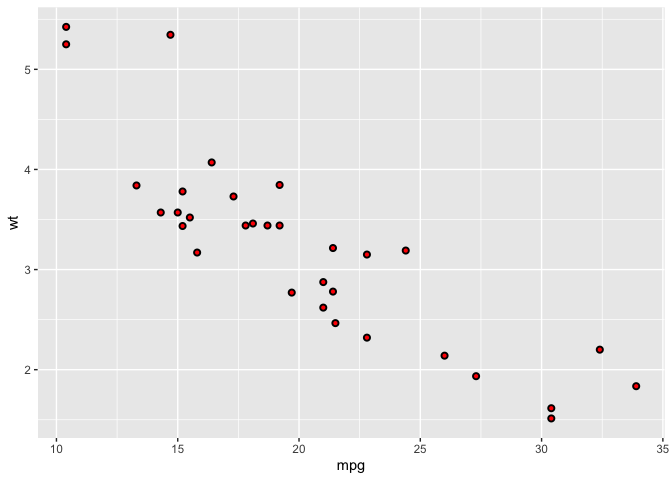
