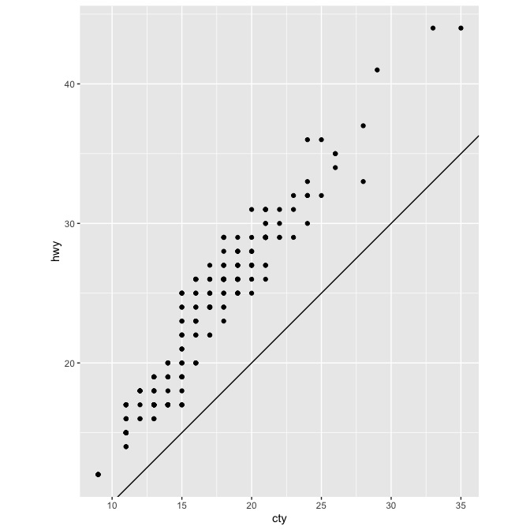

Meeting 2: Data Visualization and Tibbles
================
July 29, 2021 from 7:00-8:30pm ET

## Chapters to Read

This week, we’ll be discussing:

-   Data Visualization with `ggplot2`
-   Tibbles

### Physical Book

If you’re reading the physical book, the chapters to read are:

| Physical book chapters                 | Pages   |
|:---------------------------------------|:--------|
| Ch. 1: Data Visualization with ggplot2 | 1-35    |
| Ch. 7: Tibbles                         | 119-124 |

### Online Book

If you’re reading the online book, the chapters to read are:

| Chapter                       | Link                                             |
|:------------------------------|:-------------------------------------------------|
| Ch. 2: Introduction (Explore) | <https://r4ds.had.co.nz/explore-intro.html>      |
| Ch. 3: Data visualization     | <https://r4ds.had.co.nz/data-visualisation.html> |
| Ch. 10: Tibbles               | <https://r4ds.had.co.nz/tibbles.html>            |

## Exercises

All exercises refer to the online book chapters. The book exercises and
online exercises may differ, so to make sure everyone is doing the same
exercises, please refer to the online book chapters.

-   Chapter 3: Section 3.2.4 \#1, 4
-   Chapter 3: Section 3.3.1 \#1, 3
-   Chapter 3: Section 3.5.1 \#1,2,5
-   Chapter 3: Section 3.6.1 \#1,2,4
-   Chapter 3: Section 3.7.1 \#2, 5
-   Chapter 3: Section 3.8.1 \#1,2
-   Chapter 3: Section 3.9.1 \# 2,4
-   Chapter 10: Section 10.5 \#1-3

Exercises are reproduced below.

### Chapter 3 Exercises

#### Section 3.2.4

1.  Run `ggplot(data = mpg)`. What do you see? (\#1)

2.  Make a scatterplot of `hwy` vs `cyl`. (\#4)

#### Section 3.3.1

1.  What’s gone wrong with this code? Why are the points not blue? (\#1)

    ``` r
    ggplot(data = mpg) + 
      geom_point(mapping = aes(x = displ, y = hwy, color = "blue"))
    ```

    <!-- -->

2.  Map a continuous variable to `color`, `size`, and `shape`. How do
    these aesthetics behave differently for categorical vs. continuous
    variables? (\#3)

#### Section 3.5.1

1.  What happens if you facet on a continuous variable? (\#1)

2.  What do the empty cells in plot with `facet_grid(drv ~ cyl)` mean?
    How do they relate to this plot? (\#2)

    ``` r
    ggplot(data = mpg) + 
      geom_point(mapping = aes(x = drv, y = cyl))
    ```

    <!-- -->

3.  Read `?facet_wrap`. What does `nrow` do? What does `ncol` do? What
    other options control the layout of the individual panels? Why
    doesn’t `facet_grid()` have `nrow` and `ncol` arguments? (\#5)

#### Section 3.6.1

1.  What geom would you use to draw a line chart? A boxplot? A
    histogram? An area chart? (\#1)

2.  Run this code in your head and predict what the output will look
    like. Then, run the code in R and check your predictions. (\#2)

    ``` r
    ggplot(data = mpg, mapping = aes(x = displ, y = hwy, color = drv)) + 
      geom_point() + 
      geom_smooth(se = FALSE)
    ```

3.  What does the `se` argument to `geom_smooth()` do? (\#4)

#### Section 3.7.1

1.  What does `geom_col()` do? How is it different to `geom_bar()`?
    (\#2)

2.  In our proportion bar chart, we need to set `group = 1`. Why? In
    other words what is the problem with these two graphs? (\#5)

    ``` r
    ggplot(data = diamonds) + 
      geom_bar(mapping = aes(x = cut, y = after_stat(prop)))
    ggplot(data = diamonds) + 
      geom_bar(mapping = aes(x = cut, fill = color, y = after_stat(prop)))
    ```

#### Section 3.8.1

1.  What is the problem with this plot? How could you improve it? (\#1)

    ``` r
    ggplot(data = mpg, mapping = aes(x = cty, y = hwy)) + 
      geom_point()
    ```

    <!-- -->

2.  What parameters to `geom_jitter()` control the amount of jittering?
    (\#2)

#### Section 3.9.1

1.  What does `labs()` do? Read the documentation. (\#2)

2.  What does the plot below tell you about the relationship between
    city and highway mpg? Why is `coord_fixed()` important? What does
    `geom_abline()` do? (\#4)

    ``` r
    ggplot(data = mpg, mapping = aes(x = cty, y = hwy)) +
      geom_point() + 
      geom_abline() +
      coord_fixed()
    ```

    

### Chapter 10 Exercises

1.  How can you tell if an object is a tibble? (Hint: try printing
    `mtcars`, which is a regular data frame).

2.  Compare and contrast the following operations on a `data.frame` and
    equivalent tibble. What is different? Why might the default data
    frame behaviours cause you frustration?

    ``` r
    df <- data.frame(abc = 1, xyz = "a")
    df$x
    df[, "xyz"]
    df[, c("abc", "xyz")]
    ```

3.  If you have the name of a variable stored in an object,
    e.g. `var <- "mpg"`, how can you extract the reference variable from
    a tibble?
