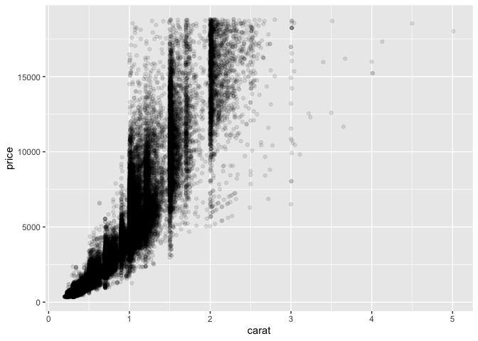
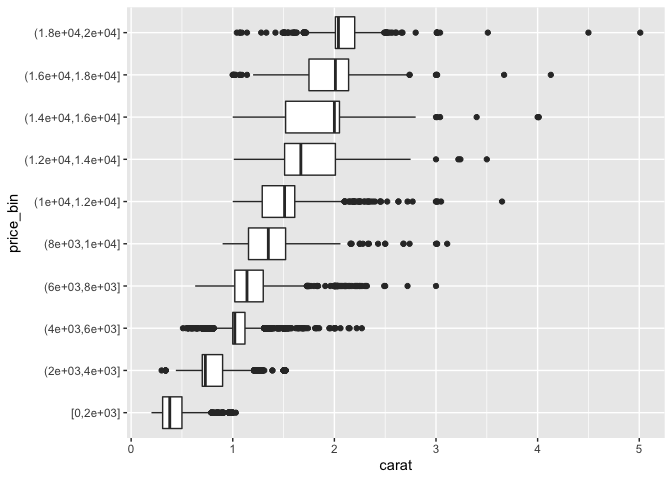

Meeting 3: Data Transformation & Exploratory Data Analysis
================
August 12, 2021 from 7:00-8:30pm ET

## Chapters to Read

This week, we’ll be discussing:

-   Pipes
-   Data Transformation
-   Exploratory Data Analysis (EDA)

### Physical Book

If you’re reading the physical book, the chapters to read are:

| Physical book chapters           | Pages   |
|:---------------------------------|:--------|
| Ch. 14: Pipes                    | 261-268 |
| Ch. 3: Data Transformation       | 43-76   |
| Ch. 5: Exploratory Data Analysis | 81-110  |

### Online Book

If you’re reading the online book, the chapters to read are:

| Chapter                          | Link                                                    |
|:---------------------------------|:--------------------------------------------------------|
| Ch. 18: Pipes                    | <https://r4ds.had.co.nz/pipes.html>                     |
| Ch. 5: Data Transformation       | <https://r4ds.had.co.nz/transform.html>                 |
| Ch. 7: Exploratory Data Analysis | <https://r4ds.had.co.nz/exploratory-data-analysis.html> |

## Exercises

All exercises refer to the online book chapters. The book exercises and
online exercises may differ, so to make sure everyone is doing the same
exercises, please refer to the online book chapters.

-   Chapter 5: Section 5.2.4 \# 1 (odd-numbered sub-parts only), \# 2 -
    4
-   Chapter 5: Section 5.3.1 \# 1, 3, 4
-   Chapter 5: Section 5.4.1 \# 1 - 4
-   Chapter 5: Section 5.5.2 \# 1, 3, 5
-   Chapter 5: Section 5.6.7 \# 2 - 6
-   Chapter 5: Section 5.7.1 \# 2, 4, 6, 8
-   Chapter 7: Section 7.3.4 \# 2 - 4
-   Chapter 7: Section 7.4.1 \# 1, 2
-   Chapter 7: Section 7.5. Do the first 2 problems of each section
    7.5.1.1, 7.5.2.1, and 7.5.3.1
-   BONUS: Follow the style of [this
    tweet](https://twitter.com/hadleywickham/status/1359852563726819332?s=20)
    to “translate” some of your favorite song lyrics into
    {tidyverse}-style code

Exercises are reproduced below. Here are the packages we’ll be using:

``` r
library(dplyr)
library(ggplot2)
```

### Chapter 5 Exercises

Whenever flights are referred to, use the `nycflights13::flights` data
to answer the question.

#### Section 5.2.4 \# 1 (odd-numbered sub-parts only), \# 2 - 4

1.  Find all flights that

    1.  Had an arrival delay of two or more hours
    2.  ~~Flew to Houston (`IAH` or `HOU`)~~
    3.  Were operated by United, American, or Delta
    4.  ~~Departed in summer (July, August, and September)~~
    5.  Arrived more than two hours late, but didn’t leave late
    6.  ~~Were delayed by at least an hour, but made up over 30 minutes
        in flight~~
    7.  Departed between midnight and 6am (inclusive)

> Sam’s Solution:

``` r
# first load the data: 
data("flights", package = "nycflights13")

# read the data documentation:
# ?nycflights13::flights

# Had an arrival delay of two or more hours
flights %>% 
  filter(arr_delay >= 120) %>% 
  glimpse()
```

    ## Rows: 10,200
    ## Columns: 19
    ## $ year           <int> 2013, 2013, 2013, 2013, 2013, 2013, 2013, 2013, 2013, 2…
    ## $ month          <int> 1, 1, 1, 1, 1, 1, 1, 1, 1, 1, 1, 1, 1, 1, 1, 1, 1, 1, 1…
    ## $ day            <int> 1, 1, 1, 1, 1, 1, 1, 1, 1, 1, 1, 1, 1, 1, 1, 1, 1, 1, 1…
    ## $ dep_time       <int> 811, 848, 957, 1114, 1505, 1525, 1549, 1558, 1732, 1803…
    ## $ sched_dep_time <int> 630, 1835, 733, 900, 1310, 1340, 1445, 1359, 1630, 1620…
    ## $ dep_delay      <dbl> 101, 853, 144, 134, 115, 105, 64, 119, 62, 103, 290, 26…
    ## $ arr_time       <int> 1047, 1001, 1056, 1447, 1638, 1831, 1912, 1718, 2028, 2…
    ## $ sched_arr_time <int> 830, 1950, 853, 1222, 1431, 1626, 1656, 1515, 1825, 175…
    ## $ arr_delay      <dbl> 137, 851, 123, 145, 127, 125, 136, 123, 123, 138, 338, …
    ## $ carrier        <chr> "MQ", "MQ", "UA", "UA", "EV", "B6", "EV", "EV", "EV", "…
    ## $ flight         <int> 4576, 3944, 856, 1086, 4497, 525, 4181, 5712, 4092, 462…
    ## $ tailnum        <chr> "N531MQ", "N942MQ", "N534UA", "N76502", "N17984", "N231…
    ## $ origin         <chr> "LGA", "JFK", "EWR", "LGA", "EWR", "EWR", "EWR", "JFK",…
    ## $ dest           <chr> "CLT", "BWI", "BOS", "IAH", "RIC", "MCO", "MCI", "IAD",…
    ## $ air_time       <dbl> 118, 41, 37, 248, 63, 152, 234, 53, 119, 154, 213, 46, …
    ## $ distance       <dbl> 544, 184, 200, 1416, 277, 937, 1092, 228, 533, 764, 113…
    ## $ hour           <dbl> 6, 18, 7, 9, 13, 13, 14, 13, 16, 16, 13, 14, 16, 17, 17…
    ## $ minute         <dbl> 30, 35, 33, 0, 10, 40, 45, 59, 30, 20, 25, 22, 45, 25, …
    ## $ time_hour      <dttm> 2013-01-01 06:00:00, 2013-01-01 18:00:00, 2013-01-01 0…

``` r
# Were operated by United, American, or Delta
# see ?nycflights13::airlines
data("airlines", package = "nycflights13")

# advanced solution to get airline codes
airlines %>% 
  filter(stringr::str_detect(name, "United|American|Delta")) %>% 
  pull(carrier) -> uad

# or, simply view the data and find the codes
# View(airlines)
# uad <- c("AA", "DL", "UA")

flights %>% 
  filter(carrier %in% uad) %>% 
  glimpse()
```

    ## Rows: 139,504
    ## Columns: 19
    ## $ year           <int> 2013, 2013, 2013, 2013, 2013, 2013, 2013, 2013, 2013, 2…
    ## $ month          <int> 1, 1, 1, 1, 1, 1, 1, 1, 1, 1, 1, 1, 1, 1, 1, 1, 1, 1, 1…
    ## $ day            <int> 1, 1, 1, 1, 1, 1, 1, 1, 1, 1, 1, 1, 1, 1, 1, 1, 1, 1, 1…
    ## $ dep_time       <int> 517, 533, 542, 554, 554, 558, 558, 558, 559, 559, 602, …
    ## $ sched_dep_time <int> 515, 529, 540, 600, 558, 600, 600, 600, 600, 600, 610, …
    ## $ dep_delay      <dbl> 2, 4, 2, -6, -4, -2, -2, -2, -1, -1, -8, -4, -4, 0, 11,…
    ## $ arr_time       <int> 830, 850, 923, 812, 740, 753, 924, 923, 941, 854, 812, …
    ## $ sched_arr_time <int> 819, 830, 850, 837, 728, 745, 917, 937, 910, 902, 820, …
    ## $ arr_delay      <dbl> 11, 20, 33, -25, 12, 8, 7, -14, 31, -8, -8, -12, -8, -1…
    ## $ carrier        <chr> "UA", "UA", "AA", "DL", "UA", "AA", "UA", "UA", "AA", "…
    ## $ flight         <int> 1545, 1714, 1141, 461, 1696, 301, 194, 1124, 707, 1187,…
    ## $ tailnum        <chr> "N14228", "N24211", "N619AA", "N668DN", "N39463", "N3AL…
    ## $ origin         <chr> "EWR", "LGA", "JFK", "LGA", "EWR", "LGA", "JFK", "EWR",…
    ## $ dest           <chr> "IAH", "IAH", "MIA", "ATL", "ORD", "ORD", "LAX", "SFO",…
    ## $ air_time       <dbl> 227, 227, 160, 116, 150, 138, 345, 361, 257, 337, 170, …
    ## $ distance       <dbl> 1400, 1416, 1089, 762, 719, 733, 2475, 2565, 1389, 2227…
    ## $ hour           <dbl> 5, 5, 5, 6, 5, 6, 6, 6, 6, 6, 6, 6, 6, 6, 6, 6, 6, 6, 6…
    ## $ minute         <dbl> 15, 29, 40, 0, 58, 0, 0, 0, 0, 0, 10, 10, 10, 7, 0, 15,…
    ## $ time_hour      <dttm> 2013-01-01 05:00:00, 2013-01-01 05:00:00, 2013-01-01 0…

``` r
# Arrived more than two hours late, but didn't leave late

flights %>% 
  filter(arr_delay > 120, dep_delay <= 0) %>% 
  glimpse() 
```

    ## Rows: 29
    ## Columns: 19
    ## $ year           <int> 2013, 2013, 2013, 2013, 2013, 2013, 2013, 2013, 2013, 2…
    ## $ month          <int> 1, 10, 10, 10, 11, 3, 4, 4, 4, 5, 5, 6, 6, 6, 6, 6, 7, …
    ## $ day            <int> 27, 7, 7, 16, 1, 18, 17, 18, 18, 22, 23, 5, 14, 24, 27,…
    ## $ dep_time       <int> 1419, 1350, 1357, 657, 658, 1844, 1635, 558, 655, 1827,…
    ## $ sched_dep_time <int> 1420, 1350, 1359, 700, 700, 1847, 1640, 600, 700, 1830,…
    ## $ dep_delay      <dbl> -1, 0, -2, -3, -2, -3, -5, -2, -5, -3, 0, -11, -2, -3, …
    ## $ arr_time       <int> 1754, 1736, 1858, 1258, 1329, 39, 2049, 1149, 1213, 221…
    ## $ sched_arr_time <int> 1550, 1526, 1654, 1056, 1015, 2219, 1845, 850, 950, 201…
    ## $ arr_delay      <dbl> 124, 130, 124, 122, 194, 140, 124, 179, 143, 127, 128, …
    ## $ carrier        <chr> "MQ", "EV", "AA", "B6", "VX", "UA", "MQ", "AA", "AA", "…
    ## $ flight         <int> 3728, 5181, 1151, 3, 399, 389, 4540, 707, 2083, 4674, 4…
    ## $ tailnum        <chr> "N1EAMQ", "N611QX", "N3CMAA", "N703JB", "N629VA", "N560…
    ## $ origin         <chr> "EWR", "LGA", "LGA", "JFK", "JFK", "JFK", "LGA", "LGA",…
    ## $ dest           <chr> "ORD", "MSN", "DFW", "SJU", "LAX", "SFO", "DTW", "DFW",…
    ## $ air_time       <dbl> 135, 117, 192, 225, 336, 386, 130, 234, 230, 90, 82, 15…
    ## $ distance       <dbl> 719, 812, 1389, 1598, 2475, 2586, 502, 1389, 1372, 419,…
    ## $ hour           <dbl> 14, 13, 13, 7, 7, 18, 16, 6, 7, 18, 18, 16, 17, 16, 21,…
    ## $ minute         <dbl> 20, 50, 59, 0, 0, 47, 40, 0, 0, 30, 10, 15, 10, 5, 0, 2…
    ## $ time_hour      <dttm> 2013-01-27 14:00:00, 2013-10-07 13:00:00, 2013-10-07 1…

``` r
# Departed between midnight and 6am (inclusive)

flights %>% 
  filter(dep_time == 2400 | (dep_time >=1 & dep_time <= 600)) %>% 
  glimpse()
```

    ## Rows: 9,373
    ## Columns: 19
    ## $ year           <int> 2013, 2013, 2013, 2013, 2013, 2013, 2013, 2013, 2013, 2…
    ## $ month          <int> 1, 1, 1, 1, 1, 1, 1, 1, 1, 1, 1, 1, 1, 1, 1, 1, 1, 1, 1…
    ## $ day            <int> 1, 1, 1, 1, 1, 1, 1, 1, 1, 1, 1, 1, 1, 1, 1, 1, 1, 1, 1…
    ## $ dep_time       <int> 517, 533, 542, 544, 554, 554, 555, 557, 557, 558, 558, …
    ## $ sched_dep_time <int> 515, 529, 540, 545, 600, 558, 600, 600, 600, 600, 600, …
    ## $ dep_delay      <dbl> 2, 4, 2, -1, -6, -4, -5, -3, -3, -2, -2, -2, -2, -2, -1…
    ## $ arr_time       <int> 830, 850, 923, 1004, 812, 740, 913, 709, 838, 753, 849,…
    ## $ sched_arr_time <int> 819, 830, 850, 1022, 837, 728, 854, 723, 846, 745, 851,…
    ## $ arr_delay      <dbl> 11, 20, 33, -18, -25, 12, 19, -14, -8, 8, -2, -3, 7, -1…
    ## $ carrier        <chr> "UA", "UA", "AA", "B6", "DL", "UA", "B6", "EV", "B6", "…
    ## $ flight         <int> 1545, 1714, 1141, 725, 461, 1696, 507, 5708, 79, 301, 4…
    ## $ tailnum        <chr> "N14228", "N24211", "N619AA", "N804JB", "N668DN", "N394…
    ## $ origin         <chr> "EWR", "LGA", "JFK", "JFK", "LGA", "EWR", "EWR", "LGA",…
    ## $ dest           <chr> "IAH", "IAH", "MIA", "BQN", "ATL", "ORD", "FLL", "IAD",…
    ## $ air_time       <dbl> 227, 227, 160, 183, 116, 150, 158, 53, 140, 138, 149, 1…
    ## $ distance       <dbl> 1400, 1416, 1089, 1576, 762, 719, 1065, 229, 944, 733, …
    ## $ hour           <dbl> 5, 5, 5, 5, 6, 5, 6, 6, 6, 6, 6, 6, 6, 6, 6, 5, 6, 6, 6…
    ## $ minute         <dbl> 15, 29, 40, 45, 0, 58, 0, 0, 0, 0, 0, 0, 0, 0, 0, 59, 0…
    ## $ time_hour      <dttm> 2013-01-01 05:00:00, 2013-01-01 05:00:00, 2013-01-01 0…

2.  Another useful dplyr filtering helper is `between()`. What does it
    do? Can you use it to simplify the code needed to answer the
    previous challenges?

``` r
flights %>% 
  filter(between(hour, 1, 3))
```

    ## # A tibble: 1 × 19
    ##    year month   day dep_time sched_dep_time dep_delay arr_time sched_arr_time
    ##   <int> <int> <int>    <int>          <int>     <dbl>    <int>          <int>
    ## 1  2013     7    27       NA            106        NA       NA            245
    ## # … with 11 more variables: arr_delay <dbl>, carrier <chr>, flight <int>,
    ## #   tailnum <chr>, origin <chr>, dest <chr>, air_time <dbl>, distance <dbl>,
    ## #   hour <dbl>, minute <dbl>, time_hour <dttm>

``` r
between(pi, 3, 4)
```

    ## [1] TRUE

> Sam’s Solution:

``` r
flights %>% 
  filter(dep_time == 2400 | between(dep_time, 1, 600)) %>% 
  glimpse()
```

    ## Rows: 9,373
    ## Columns: 19
    ## $ year           <int> 2013, 2013, 2013, 2013, 2013, 2013, 2013, 2013, 2013, 2…
    ## $ month          <int> 1, 1, 1, 1, 1, 1, 1, 1, 1, 1, 1, 1, 1, 1, 1, 1, 1, 1, 1…
    ## $ day            <int> 1, 1, 1, 1, 1, 1, 1, 1, 1, 1, 1, 1, 1, 1, 1, 1, 1, 1, 1…
    ## $ dep_time       <int> 517, 533, 542, 544, 554, 554, 555, 557, 557, 558, 558, …
    ## $ sched_dep_time <int> 515, 529, 540, 545, 600, 558, 600, 600, 600, 600, 600, …
    ## $ dep_delay      <dbl> 2, 4, 2, -1, -6, -4, -5, -3, -3, -2, -2, -2, -2, -2, -1…
    ## $ arr_time       <int> 830, 850, 923, 1004, 812, 740, 913, 709, 838, 753, 849,…
    ## $ sched_arr_time <int> 819, 830, 850, 1022, 837, 728, 854, 723, 846, 745, 851,…
    ## $ arr_delay      <dbl> 11, 20, 33, -18, -25, 12, 19, -14, -8, 8, -2, -3, 7, -1…
    ## $ carrier        <chr> "UA", "UA", "AA", "B6", "DL", "UA", "B6", "EV", "B6", "…
    ## $ flight         <int> 1545, 1714, 1141, 725, 461, 1696, 507, 5708, 79, 301, 4…
    ## $ tailnum        <chr> "N14228", "N24211", "N619AA", "N804JB", "N668DN", "N394…
    ## $ origin         <chr> "EWR", "LGA", "JFK", "JFK", "LGA", "EWR", "EWR", "LGA",…
    ## $ dest           <chr> "IAH", "IAH", "MIA", "BQN", "ATL", "ORD", "FLL", "IAD",…
    ## $ air_time       <dbl> 227, 227, 160, 183, 116, 150, 158, 53, 140, 138, 149, 1…
    ## $ distance       <dbl> 1400, 1416, 1089, 1576, 762, 719, 1065, 229, 944, 733, …
    ## $ hour           <dbl> 5, 5, 5, 5, 6, 5, 6, 6, 6, 6, 6, 6, 6, 6, 6, 5, 6, 6, 6…
    ## $ minute         <dbl> 15, 29, 40, 45, 0, 58, 0, 0, 0, 0, 0, 0, 0, 0, 0, 59, 0…
    ## $ time_hour      <dttm> 2013-01-01 05:00:00, 2013-01-01 05:00:00, 2013-01-01 0…

3.  How many flights have a missing `dep_time`? What other variables are
    missing? What might these rows represent?

> Live Solution:

``` r
flights %>% 
  filter(is.na(dep_time)) %>% 
  count()
```

    ## # A tibble: 1 × 1
    ##       n
    ##   <int>
    ## 1  8255

``` r
# what others variables have missing values 
summary(flights)
```

    ##       year          month             day           dep_time    sched_dep_time
    ##  Min.   :2013   Min.   : 1.000   Min.   : 1.00   Min.   :   1   Min.   : 106  
    ##  1st Qu.:2013   1st Qu.: 4.000   1st Qu.: 8.00   1st Qu.: 907   1st Qu.: 906  
    ##  Median :2013   Median : 7.000   Median :16.00   Median :1401   Median :1359  
    ##  Mean   :2013   Mean   : 6.549   Mean   :15.71   Mean   :1349   Mean   :1344  
    ##  3rd Qu.:2013   3rd Qu.:10.000   3rd Qu.:23.00   3rd Qu.:1744   3rd Qu.:1729  
    ##  Max.   :2013   Max.   :12.000   Max.   :31.00   Max.   :2400   Max.   :2359  
    ##                                                  NA's   :8255                 
    ##    dep_delay          arr_time    sched_arr_time   arr_delay       
    ##  Min.   : -43.00   Min.   :   1   Min.   :   1   Min.   : -86.000  
    ##  1st Qu.:  -5.00   1st Qu.:1104   1st Qu.:1124   1st Qu.: -17.000  
    ##  Median :  -2.00   Median :1535   Median :1556   Median :  -5.000  
    ##  Mean   :  12.64   Mean   :1502   Mean   :1536   Mean   :   6.895  
    ##  3rd Qu.:  11.00   3rd Qu.:1940   3rd Qu.:1945   3rd Qu.:  14.000  
    ##  Max.   :1301.00   Max.   :2400   Max.   :2359   Max.   :1272.000  
    ##  NA's   :8255      NA's   :8713                  NA's   :9430      
    ##    carrier              flight       tailnum             origin         
    ##  Length:336776      Min.   :   1   Length:336776      Length:336776     
    ##  Class :character   1st Qu.: 553   Class :character   Class :character  
    ##  Mode  :character   Median :1496   Mode  :character   Mode  :character  
    ##                     Mean   :1972                                        
    ##                     3rd Qu.:3465                                        
    ##                     Max.   :8500                                        
    ##                                                                         
    ##      dest              air_time        distance         hour      
    ##  Length:336776      Min.   : 20.0   Min.   :  17   Min.   : 1.00  
    ##  Class :character   1st Qu.: 82.0   1st Qu.: 502   1st Qu.: 9.00  
    ##  Mode  :character   Median :129.0   Median : 872   Median :13.00  
    ##                     Mean   :150.7   Mean   :1040   Mean   :13.18  
    ##                     3rd Qu.:192.0   3rd Qu.:1389   3rd Qu.:17.00  
    ##                     Max.   :695.0   Max.   :4983   Max.   :23.00  
    ##                     NA's   :9430                                  
    ##      minute        time_hour                  
    ##  Min.   : 0.00   Min.   :2013-01-01 05:00:00  
    ##  1st Qu.: 8.00   1st Qu.:2013-04-04 13:00:00  
    ##  Median :29.00   Median :2013-07-03 10:00:00  
    ##  Mean   :26.23   Mean   :2013-07-03 05:22:54  
    ##  3rd Qu.:44.00   3rd Qu.:2013-10-01 07:00:00  
    ##  Max.   :59.00   Max.   :2013-12-31 23:00:00  
    ## 

``` r
# simina's solution
sapply(flights, function(x){
  sum(is.na(x))
  }
)
```

    ##           year          month            day       dep_time sched_dep_time 
    ##              0              0              0           8255              0 
    ##      dep_delay       arr_time sched_arr_time      arr_delay        carrier 
    ##           8255           8713              0           9430              0 
    ##         flight        tailnum         origin           dest       air_time 
    ##              0           2512              0              0           9430 
    ##       distance           hour         minute      time_hour 
    ##              0              0              0              0

``` r
# what do the missing rows represent?? 
# cancelled flights
```

> Sam’s Solution:

``` r
flights %>% 
  filter(is.na(dep_time)) %>% 
  glimpse()
```

    ## Rows: 8,255
    ## Columns: 19
    ## $ year           <int> 2013, 2013, 2013, 2013, 2013, 2013, 2013, 2013, 2013, 2…
    ## $ month          <int> 1, 1, 1, 1, 1, 1, 1, 1, 1, 1, 1, 1, 1, 1, 1, 1, 1, 1, 1…
    ## $ day            <int> 1, 1, 1, 1, 2, 2, 2, 2, 2, 2, 2, 2, 3, 3, 3, 3, 3, 3, 3…
    ## $ dep_time       <int> NA, NA, NA, NA, NA, NA, NA, NA, NA, NA, NA, NA, NA, NA,…
    ## $ sched_dep_time <int> 1630, 1935, 1500, 600, 1540, 1620, 1355, 1420, 1321, 15…
    ## $ dep_delay      <dbl> NA, NA, NA, NA, NA, NA, NA, NA, NA, NA, NA, NA, NA, NA,…
    ## $ arr_time       <int> NA, NA, NA, NA, NA, NA, NA, NA, NA, NA, NA, NA, NA, NA,…
    ## $ sched_arr_time <int> 1815, 2240, 1825, 901, 1747, 1746, 1459, 1644, 1536, 19…
    ## $ arr_delay      <dbl> NA, NA, NA, NA, NA, NA, NA, NA, NA, NA, NA, NA, NA, NA,…
    ## $ carrier        <chr> "EV", "AA", "AA", "B6", "EV", "EV", "EV", "EV", "EV", "…
    ## $ flight         <int> 4308, 791, 1925, 125, 4352, 4406, 4434, 4935, 3849, 133…
    ## $ tailnum        <chr> "N18120", "N3EHAA", "N3EVAA", "N618JB", "N10575", "N139…
    ## $ origin         <chr> "EWR", "LGA", "LGA", "JFK", "EWR", "EWR", "EWR", "EWR",…
    ## $ dest           <chr> "RDU", "DFW", "MIA", "FLL", "CVG", "PIT", "MHT", "ATL",…
    ## $ air_time       <dbl> NA, NA, NA, NA, NA, NA, NA, NA, NA, NA, NA, NA, NA, NA,…
    ## $ distance       <dbl> 416, 1389, 1096, 1069, 569, 319, 209, 746, 645, 2475, 1…
    ## $ hour           <dbl> 16, 19, 15, 6, 15, 16, 13, 14, 13, 15, 13, 16, 6, 10, 1…
    ## $ minute         <dbl> 30, 35, 0, 0, 40, 20, 55, 20, 21, 45, 30, 1, 45, 30, 25…
    ## $ time_hour      <dttm> 2013-01-01 16:00:00, 2013-01-01 19:00:00, 2013-01-01 1…

4.  Why is `NA ^ 0` not missing? Why is `NA | TRUE` not missing? Why is
    `FALSE & NA` not missing? Can you figure out the general rule?
    (`NA * 0` is a tricky counterexample!)

> Sam’s Solution:

``` r
# anything to power of 0 is always 1.
NA ^ 0
```

    ## [1] 1

``` r
# anything or TRUE is always true, so TRUE
NA | TRUE
```

    ## [1] TRUE

``` r
# intersection of false with anything is false
FALSE & NA
```

    ## [1] FALSE

``` r
# NA could be Inf or -Inf which are undefined (NaN), so the NA is propogated
NA * 0
```

    ## [1] NA

#### Section 5.3.1 \# 1, 3, 4

1.  How could you use `arrange()` to sort all missing values to the
    start? (Hint: use `is.na()`).

> Live Solution:

``` r
flights %>% 
  arrange(!is.na(dep_time))
```

    ## # A tibble: 336,776 × 19
    ##     year month   day dep_time sched_dep_time dep_delay arr_time sched_arr_time
    ##    <int> <int> <int>    <int>          <int>     <dbl>    <int>          <int>
    ##  1  2013     1     1       NA           1630        NA       NA           1815
    ##  2  2013     1     1       NA           1935        NA       NA           2240
    ##  3  2013     1     1       NA           1500        NA       NA           1825
    ##  4  2013     1     1       NA            600        NA       NA            901
    ##  5  2013     1     2       NA           1540        NA       NA           1747
    ##  6  2013     1     2       NA           1620        NA       NA           1746
    ##  7  2013     1     2       NA           1355        NA       NA           1459
    ##  8  2013     1     2       NA           1420        NA       NA           1644
    ##  9  2013     1     2       NA           1321        NA       NA           1536
    ## 10  2013     1     2       NA           1545        NA       NA           1910
    ## # … with 336,766 more rows, and 11 more variables: arr_delay <dbl>,
    ## #   carrier <chr>, flight <int>, tailnum <chr>, origin <chr>, dest <chr>,
    ## #   air_time <dbl>, distance <dbl>, hour <dbl>, minute <dbl>, time_hour <dttm>

``` r
flights %>% 
  arrange(desc(is.na(dep_time)))
```

    ## # A tibble: 336,776 × 19
    ##     year month   day dep_time sched_dep_time dep_delay arr_time sched_arr_time
    ##    <int> <int> <int>    <int>          <int>     <dbl>    <int>          <int>
    ##  1  2013     1     1       NA           1630        NA       NA           1815
    ##  2  2013     1     1       NA           1935        NA       NA           2240
    ##  3  2013     1     1       NA           1500        NA       NA           1825
    ##  4  2013     1     1       NA            600        NA       NA            901
    ##  5  2013     1     2       NA           1540        NA       NA           1747
    ##  6  2013     1     2       NA           1620        NA       NA           1746
    ##  7  2013     1     2       NA           1355        NA       NA           1459
    ##  8  2013     1     2       NA           1420        NA       NA           1644
    ##  9  2013     1     2       NA           1321        NA       NA           1536
    ## 10  2013     1     2       NA           1545        NA       NA           1910
    ## # … with 336,766 more rows, and 11 more variables: arr_delay <dbl>,
    ## #   carrier <chr>, flight <int>, tailnum <chr>, origin <chr>, dest <chr>,
    ## #   air_time <dbl>, distance <dbl>, hour <dbl>, minute <dbl>, time_hour <dttm>

> Sam’s Solution:

``` r
flights %>% 
  arrange(!is.na(air_time))
```

    ## # A tibble: 336,776 × 19
    ##     year month   day dep_time sched_dep_time dep_delay arr_time sched_arr_time
    ##    <int> <int> <int>    <int>          <int>     <dbl>    <int>          <int>
    ##  1  2013     1     1     1525           1530        -5     1934           1805
    ##  2  2013     1     1     1528           1459        29     2002           1647
    ##  3  2013     1     1     1740           1745        -5     2158           2020
    ##  4  2013     1     1     1807           1738        29     2251           2103
    ##  5  2013     1     1     1939           1840        59       29           2151
    ##  6  2013     1     1     1952           1930        22     2358           2207
    ##  7  2013     1     1     2016           1930        46       NA           2220
    ##  8  2013     1     1       NA           1630        NA       NA           1815
    ##  9  2013     1     1       NA           1935        NA       NA           2240
    ## 10  2013     1     1       NA           1500        NA       NA           1825
    ## # … with 336,766 more rows, and 11 more variables: arr_delay <dbl>,
    ## #   carrier <chr>, flight <int>, tailnum <chr>, origin <chr>, dest <chr>,
    ## #   air_time <dbl>, distance <dbl>, hour <dbl>, minute <dbl>, time_hour <dttm>

3.  Sort flights to find the fastest (highest speed) flights.

> Sam’s Solution:

``` r
flights %>% 
  arrange(distance / air_time) %>% 
  glimpse()
```

    ## Rows: 336,776
    ## Columns: 19
    ## $ year           <int> 2013, 2013, 2013, 2013, 2013, 2013, 2013, 2013, 2013, 2…
    ## $ month          <int> 1, 6, 8, 1, 11, 5, 12, 6, 7, 4, 11, 12, 5, 6, 1, 11, 11…
    ## $ day            <int> 28, 29, 28, 30, 27, 21, 9, 10, 28, 11, 7, 26, 29, 17, 2…
    ## $ dep_time       <int> 1917, 755, 932, 1037, 556, 558, 1540, 1356, 1322, 1349,…
    ## $ sched_dep_time <int> 1825, 800, 940, 955, 600, 600, 1535, 1300, 1325, 1345, …
    ## $ dep_delay      <dbl> 52, -5, -8, 42, -4, -2, 5, 56, -3, 4, -6, -6, -8, -8, 3…
    ## $ arr_time       <int> 2118, 1035, 1116, 1221, 727, 721, 1720, 1646, 1612, 154…
    ## $ sched_arr_time <int> 1935, 909, 1051, 1100, 658, 657, 1656, 1414, 1432, 1453…
    ## $ arr_delay      <dbl> 103, 86, 25, 81, 29, 24, 24, 152, 100, 49, 9, -4, 6, 41…
    ## $ carrier        <chr> "US", "B6", "9E", "9E", "US", "US", "US", "US", "US", "…
    ## $ flight         <int> 1860, 1491, 3608, 3667, 1909, 1289, 1775, 2175, 1279, 3…
    ## $ tailnum        <chr> "N755US", "N328JB", "N8932C", "N832AY", "N951UW", "N956…
    ## $ origin         <chr> "LGA", "JFK", "JFK", "JFK", "LGA", "LGA", "LGA", "LGA",…
    ## $ dest           <chr> "PHL", "ACK", "PHL", "PHL", "PHL", "PHL", "PHL", "DCA",…
    ## $ air_time       <dbl> 75, 141, 61, 59, 60, 60, 59, 131, 57, 55, 56, 56, 56, 1…
    ## $ distance       <dbl> 96, 199, 94, 94, 96, 96, 96, 214, 96, 94, 96, 96, 96, 1…
    ## $ hour           <dbl> 18, 8, 9, 9, 6, 6, 15, 13, 13, 13, 6, 15, 6, 17, 13, 6,…
    ## $ minute         <dbl> 25, 0, 40, 55, 0, 0, 35, 0, 25, 45, 0, 35, 0, 0, 0, 0, …
    ## $ time_hour      <dttm> 2013-01-28 18:00:00, 2013-06-29 08:00:00, 2013-08-28 0…

4.  Which flights travelled the farthest? Which travelled the shortest?

> Sam’s Solution:

``` r
# Which flights travelled the farthest?
flights %>% 
  arrange(desc(distance)) %>% 
  glimpse()
```

    ## Rows: 336,776
    ## Columns: 19
    ## $ year           <int> 2013, 2013, 2013, 2013, 2013, 2013, 2013, 2013, 2013, 2…
    ## $ month          <int> 1, 1, 1, 1, 1, 1, 1, 1, 1, 1, 1, 1, 1, 1, 1, 1, 1, 1, 1…
    ## $ day            <int> 1, 2, 3, 4, 5, 6, 7, 8, 9, 10, 11, 12, 13, 14, 15, 16, …
    ## $ dep_time       <int> 857, 909, 914, 900, 858, 1019, 1042, 901, 641, 859, 855…
    ## $ sched_dep_time <int> 900, 900, 900, 900, 900, 900, 900, 900, 900, 900, 900, …
    ## $ dep_delay      <dbl> -3, 9, 14, 0, -2, 79, 102, 1, 1301, -1, -5, 1, -4, -1, …
    ## $ arr_time       <int> 1516, 1525, 1504, 1516, 1519, 1558, 1620, 1504, 1242, 1…
    ## $ sched_arr_time <int> 1530, 1530, 1530, 1530, 1530, 1530, 1530, 1530, 1530, 1…
    ## $ arr_delay      <dbl> -14, -5, -26, -14, -11, 28, 50, -26, 1272, -41, -48, -3…
    ## $ carrier        <chr> "HA", "HA", "HA", "HA", "HA", "HA", "HA", "HA", "HA", "…
    ## $ flight         <int> 51, 51, 51, 51, 51, 51, 51, 51, 51, 51, 51, 51, 51, 51,…
    ## $ tailnum        <chr> "N380HA", "N380HA", "N380HA", "N384HA", "N381HA", "N385…
    ## $ origin         <chr> "JFK", "JFK", "JFK", "JFK", "JFK", "JFK", "JFK", "JFK",…
    ## $ dest           <chr> "HNL", "HNL", "HNL", "HNL", "HNL", "HNL", "HNL", "HNL",…
    ## $ air_time       <dbl> 659, 638, 616, 639, 635, 611, 612, 645, 640, 633, 613, …
    ## $ distance       <dbl> 4983, 4983, 4983, 4983, 4983, 4983, 4983, 4983, 4983, 4…
    ## $ hour           <dbl> 9, 9, 9, 9, 9, 9, 9, 9, 9, 9, 9, 9, 9, 9, 9, 9, 9, 9, 9…
    ## $ minute         <dbl> 0, 0, 0, 0, 0, 0, 0, 0, 0, 0, 0, 0, 0, 0, 0, 0, 0, 0, 0…
    ## $ time_hour      <dttm> 2013-01-01 09:00:00, 2013-01-02 09:00:00, 2013-01-03 0…

``` r
# Which travelled the shortest?
flights %>% 
  arrange(distance) %>% 
  glimpse()
```

    ## Rows: 336,776
    ## Columns: 19
    ## $ year           <int> 2013, 2013, 2013, 2013, 2013, 2013, 2013, 2013, 2013, 2…
    ## $ month          <int> 7, 1, 1, 1, 1, 1, 1, 1, 1, 1, 1, 1, 1, 1, 1, 1, 1, 1, 1…
    ## $ day            <int> 27, 3, 4, 4, 4, 5, 6, 7, 8, 9, 10, 11, 12, 13, 14, 15, …
    ## $ dep_time       <int> NA, 2127, 1240, 1829, 2128, 1155, 2125, 2124, 2127, 212…
    ## $ sched_dep_time <int> 106, 2129, 1200, 1615, 2129, 1200, 2129, 2129, 2130, 21…
    ## $ dep_delay      <dbl> NA, -2, 40, 134, -1, -5, -4, -5, -3, -3, 4, 6, -4, 74, …
    ## $ arr_time       <int> NA, 2222, 1333, 1937, 2218, 1241, 2224, 2212, 2304, 221…
    ## $ sched_arr_time <int> 245, 2224, 1306, 1721, 2224, 1306, 2224, 2224, 2225, 22…
    ## $ arr_delay      <dbl> NA, -2, 27, 136, -6, -25, 0, -12, 39, -7, -1, 9, -14, 9…
    ## $ carrier        <chr> "US", "EV", "EV", "EV", "EV", "EV", "EV", "EV", "EV", "…
    ## $ flight         <int> 1632, 3833, 4193, 4502, 4645, 4193, 4619, 4619, 4619, 4…
    ## $ tailnum        <chr> NA, "N13989", "N14972", "N15983", "N27962", "N14902", "…
    ## $ origin         <chr> "EWR", "EWR", "EWR", "EWR", "EWR", "EWR", "EWR", "EWR",…
    ## $ dest           <chr> "LGA", "PHL", "PHL", "PHL", "PHL", "PHL", "PHL", "PHL",…
    ## $ air_time       <dbl> NA, 30, 30, 28, 32, 29, 22, 25, 30, 27, 30, 30, 36, 31,…
    ## $ distance       <dbl> 17, 80, 80, 80, 80, 80, 80, 80, 80, 80, 80, 80, 80, 80,…
    ## $ hour           <dbl> 1, 21, 12, 16, 21, 12, 21, 21, 21, 21, 21, 21, 16, 21, …
    ## $ minute         <dbl> 6, 29, 0, 15, 29, 0, 29, 29, 30, 29, 29, 29, 17, 29, 29…
    ## $ time_hour      <dttm> 2013-07-27 01:00:00, 2013-01-03 21:00:00, 2013-01-04 1…

#### Section 5.4.1 \# 1 - 4

1.  Brainstorm as many ways as possible to select `dep_time`,
    `dep_delay`, `arr_time`, and `arr_delay` from `flights`.

> Sam’s Solution:

``` r
my_vars <- c("dep_time", "dep_delay", "arr_time", "arr_delay")
flights %>% 
  select(my_vars) %>% 
  head()
```

    ## # A tibble: 6 × 4
    ##   dep_time dep_delay arr_time arr_delay
    ##      <int>     <dbl>    <int>     <dbl>
    ## 1      517         2      830        11
    ## 2      533         4      850        20
    ## 3      542         2      923        33
    ## 4      544        -1     1004       -18
    ## 5      554        -6      812       -25
    ## 6      554        -4      740        12

``` r
flights %>% 
  select(4, 6, 7, 9) %>% 
  head()
```

    ## # A tibble: 6 × 4
    ##   dep_time dep_delay arr_time arr_delay
    ##      <int>     <dbl>    <int>     <dbl>
    ## 1      517         2      830        11
    ## 2      533         4      850        20
    ## 3      542         2      923        33
    ## 4      544        -1     1004       -18
    ## 5      554        -6      812       -25
    ## 6      554        -4      740        12

``` r
flights %>% 
  select(contains("_time"), contains("_delay"), -contains("sched"), -contains("air")) %>% 
  head()
```

    ## # A tibble: 6 × 4
    ##   dep_time arr_time dep_delay arr_delay
    ##      <int>    <int>     <dbl>     <dbl>
    ## 1      517      830         2        11
    ## 2      533      850         4        20
    ## 3      542      923         2        33
    ## 4      544     1004        -1       -18
    ## 5      554      812        -6       -25
    ## 6      554      740        -4        12

``` r
flights %>% 
  select(matches("^dep_|^arr_")) %>% 
  head()
```

    ## # A tibble: 6 × 4
    ##   dep_time dep_delay arr_time arr_delay
    ##      <int>     <dbl>    <int>     <dbl>
    ## 1      517         2      830        11
    ## 2      533         4      850        20
    ## 3      542         2      923        33
    ## 4      544        -1     1004       -18
    ## 5      554        -6      812       -25
    ## 6      554        -4      740        12

2.  What happens if you include the name of a variable multiple times in
    a select() call?

> Sam’s Solution:

``` r
flights %>% 
  select(arr_time, arr_delay, dep_delay, arr_time) %>% 
  glimpse()
```

    ## Rows: 336,776
    ## Columns: 3
    ## $ arr_time  <int> 830, 850, 923, 1004, 812, 740, 913, 709, 838, 753, 849, 853,…
    ## $ arr_delay <dbl> 11, 20, 33, -18, -25, 12, 19, -14, -8, 8, -2, -3, 7, -14, 31…
    ## $ dep_delay <dbl> 2, 4, 2, -1, -6, -4, -5, -3, -3, -2, -2, -2, -2, -2, -1, 0, …

3.  What does the `any_of()` function do? Why might it be helpful in
    conjunction with this vector?

``` r
vars <- c("year", "month", "day", "dep_delay", "arr_delay")
```

> Live Solution:

``` r
flights %>% 
  select(any_of(vars))
```

    ## # A tibble: 336,776 × 5
    ##     year month   day dep_delay arr_delay
    ##    <int> <int> <int>     <dbl>     <dbl>
    ##  1  2013     1     1         2        11
    ##  2  2013     1     1         4        20
    ##  3  2013     1     1         2        33
    ##  4  2013     1     1        -1       -18
    ##  5  2013     1     1        -6       -25
    ##  6  2013     1     1        -4        12
    ##  7  2013     1     1        -5        19
    ##  8  2013     1     1        -3       -14
    ##  9  2013     1     1        -3        -8
    ## 10  2013     1     1        -2         8
    ## # … with 336,766 more rows

``` r
flights %>% 
  select(year, month, day, dep_delay, arr_delay)
```

    ## # A tibble: 336,776 × 5
    ##     year month   day dep_delay arr_delay
    ##    <int> <int> <int>     <dbl>     <dbl>
    ##  1  2013     1     1         2        11
    ##  2  2013     1     1         4        20
    ##  3  2013     1     1         2        33
    ##  4  2013     1     1        -1       -18
    ##  5  2013     1     1        -6       -25
    ##  6  2013     1     1        -4        12
    ##  7  2013     1     1        -5        19
    ##  8  2013     1     1        -3       -14
    ##  9  2013     1     1        -3        -8
    ## 10  2013     1     1        -2         8
    ## # … with 336,766 more rows

``` r
flights %>% 
  select(vars)
```

    ## # A tibble: 336,776 × 5
    ##     year month   day dep_delay arr_delay
    ##    <int> <int> <int>     <dbl>     <dbl>
    ##  1  2013     1     1         2        11
    ##  2  2013     1     1         4        20
    ##  3  2013     1     1         2        33
    ##  4  2013     1     1        -1       -18
    ##  5  2013     1     1        -6       -25
    ##  6  2013     1     1        -4        12
    ##  7  2013     1     1        -5        19
    ##  8  2013     1     1        -3       -14
    ##  9  2013     1     1        -3        -8
    ## 10  2013     1     1        -2         8
    ## # … with 336,766 more rows

``` r
vars <- c("year", "month", "day", "dep_delay", "arr_delay")
```

> Sam’s Solution:

``` r
# ?any_of

flights %>% 
  select(any_of(vars))
```

    ## # A tibble: 336,776 × 5
    ##     year month   day dep_delay arr_delay
    ##    <int> <int> <int>     <dbl>     <dbl>
    ##  1  2013     1     1         2        11
    ##  2  2013     1     1         4        20
    ##  3  2013     1     1         2        33
    ##  4  2013     1     1        -1       -18
    ##  5  2013     1     1        -6       -25
    ##  6  2013     1     1        -4        12
    ##  7  2013     1     1        -5        19
    ##  8  2013     1     1        -3       -14
    ##  9  2013     1     1        -3        -8
    ## 10  2013     1     1        -2         8
    ## # … with 336,766 more rows

4.  Does the result of running the following code surprise you? How do
    the select helpers deal with case by default? How can you change
    that default?

``` r
select(flights, contains("TIME"))
```

> Sam’s Solution:

``` r
# ?contains
select(flights, contains("TIME"))
```

    ## # A tibble: 336,776 × 6
    ##    dep_time sched_dep_time arr_time sched_arr_time air_time time_hour          
    ##       <int>          <int>    <int>          <int>    <dbl> <dttm>             
    ##  1      517            515      830            819      227 2013-01-01 05:00:00
    ##  2      533            529      850            830      227 2013-01-01 05:00:00
    ##  3      542            540      923            850      160 2013-01-01 05:00:00
    ##  4      544            545     1004           1022      183 2013-01-01 05:00:00
    ##  5      554            600      812            837      116 2013-01-01 06:00:00
    ##  6      554            558      740            728      150 2013-01-01 05:00:00
    ##  7      555            600      913            854      158 2013-01-01 06:00:00
    ##  8      557            600      709            723       53 2013-01-01 06:00:00
    ##  9      557            600      838            846      140 2013-01-01 06:00:00
    ## 10      558            600      753            745      138 2013-01-01 06:00:00
    ## # … with 336,766 more rows

``` r
select(flights, contains("TIME", ignore.case = F))
```

    ## # A tibble: 336,776 × 0

#### Section 5.5.2 \# 1, 3, 5

1.  Currently `dep_time` and `sched_dep_time` are convenient to look at,
    but hard to compute with because they’re not really continuous
    numbers. Convert them to a more convenient representation of number
    of minutes since midnight.

> Live Solution:

``` r
# 1. write a fn that takes HHMM numbers and converts them to minutes since midnight 

convert_minutes <- function(tm){
  
  hr <- tm %/% 100 # hour
  mins <- tm %% 100
  
  msm <- hr * 60 + mins
  
  if (msm == 1440){
    msm <- 0
  } 
  
  return(msm)
}


flights %>% 
  mutate(dep_time = convert_minutes(dep_time), 
         sched_dep_time = convert_minutes(sched_dep_time)) -> flights
```

> Sam’s Solution:

``` r
flights %>% 
  select(contains("dep_time")) %>% 
  head()
```

    ## # A tibble: 6 × 2
    ##   dep_time sched_dep_time
    ##      <dbl>          <dbl>
    ## 1      317            315
    ## 2      333            329
    ## 3      342            340
    ## 4      344            345
    ## 5      354            360
    ## 6      354            358

``` r
# function to convert time in hhmm form to number of minutes since midnight.
convert_time <- function(hhmm){
  hours = hhmm %/% 100 # integer division
  minutes = hhmm %% 100 # modulo
  
  hours * 60 + minutes
}

flights <- flights %>% 
  mutate(across(contains("dep_time"), convert_time))

flights %>% 
  select(contains("dep_time"))
```

    ## # A tibble: 336,776 × 2
    ##    dep_time sched_dep_time
    ##       <dbl>          <dbl>
    ##  1      197            195
    ##  2      213            209
    ##  3      222            220
    ##  4      224            225
    ##  5      234            240
    ##  6      234            238
    ##  7      235            240
    ##  8      237            240
    ##  9      237            240
    ## 10      238            240
    ## # … with 336,766 more rows

3.  Compare `dep_time`, `sched_dep_time`, and `dep_delay`. How would you
    expect those three numbers to be related?

> Live Solution:

``` r
flights %>% 
  select(dep_time, sched_dep_time, dep_delay) %>% 
  mutate(dep_delay2 = dep_time - sched_dep_time)
```

    ## # A tibble: 336,776 × 4
    ##    dep_time sched_dep_time dep_delay dep_delay2
    ##       <dbl>          <dbl>     <dbl>      <dbl>
    ##  1      197            195         2          2
    ##  2      213            209         4          4
    ##  3      222            220         2          2
    ##  4      224            225        -1         -1
    ##  5      234            240        -6         -6
    ##  6      234            238        -4         -4
    ##  7      235            240        -5         -5
    ##  8      237            240        -3         -3
    ##  9      237            240        -3         -3
    ## 10      238            240        -2         -2
    ## # … with 336,766 more rows

> Sam’s Solution:

``` r
# these are now the new versions of dep_time and sched_dep_time 
flights %>% 
  select(contains("dep")) %>% 
  glimpse()
```

    ## Rows: 336,776
    ## Columns: 3
    ## $ dep_time       <dbl> 197, 213, 222, 224, 234, 234, 235, 237, 237, 238, 238, …
    ## $ sched_dep_time <dbl> 195, 209, 220, 225, 240, 238, 240, 240, 240, 240, 240, …
    ## $ dep_delay      <dbl> 2, 4, 2, -1, -6, -4, -5, -3, -3, -2, -2, -2, -2, -2, -1…

``` r
flights %>% 
  select(contains("dep")) %>% 
  mutate(computed_dep_delay = dep_time - sched_dep_time) %>% 
  glimpse()
```

    ## Rows: 336,776
    ## Columns: 4
    ## $ dep_time           <dbl> 197, 213, 222, 224, 234, 234, 235, 237, 237, 238, 2…
    ## $ sched_dep_time     <dbl> 195, 209, 220, 225, 240, 238, 240, 240, 240, 240, 2…
    ## $ dep_delay          <dbl> 2, 4, 2, -1, -6, -4, -5, -3, -3, -2, -2, -2, -2, -2…
    ## $ computed_dep_delay <dbl> 2, 4, 2, -1, -6, -4, -5, -3, -3, -2, -2, -2, -2, -2…

5.  What does 1:3 + 1:10 return? Why?

> Sam’s Solution:

``` r
1:3 + 1:10
```

    ##  [1]  2  4  6  5  7  9  8 10 12 11

#### Section 5.6.7 \# 2 - 6

2.  Come up with another approach that will give you the same output as
    `not_cancelled %>% count(dest)` and
    `not_cancelled %>% count(tailnum, wt = distance)` (without using
    `count()`).

> Live Solution:

``` r
not_cancelled <- flights %>% 
  filter(!is.na(dep_delay), !is.na(arr_delay))

not_cancelled %>% 
  count(dest)
```

    ## # A tibble: 104 × 2
    ##    dest      n
    ##    <chr> <int>
    ##  1 ABQ     254
    ##  2 ACK     264
    ##  3 ALB     418
    ##  4 ANC       8
    ##  5 ATL   16837
    ##  6 AUS    2411
    ##  7 AVL     261
    ##  8 BDL     412
    ##  9 BGR     358
    ## 10 BHM     269
    ## # … with 94 more rows

``` r
not_cancelled %>% 
  group_by(dest) %>% 
  summarise(n = n())
```

    ## # A tibble: 104 × 2
    ##    dest      n
    ##    <chr> <int>
    ##  1 ABQ     254
    ##  2 ACK     264
    ##  3 ALB     418
    ##  4 ANC       8
    ##  5 ATL   16837
    ##  6 AUS    2411
    ##  7 AVL     261
    ##  8 BDL     412
    ##  9 BGR     358
    ## 10 BHM     269
    ## # … with 94 more rows

``` r
not_cancelled %>% 
  count(tailnum, wt = distance)
```

    ## # A tibble: 4,037 × 2
    ##    tailnum      n
    ##    <chr>    <dbl>
    ##  1 D942DN    3418
    ##  2 N0EGMQ  239143
    ##  3 N10156  109664
    ##  4 N102UW   25722
    ##  5 N103US   24619
    ##  6 N104UW   24616
    ##  7 N10575  139903
    ##  8 N105UW   23618
    ##  9 N107US   21677
    ## 10 N108UW   32070
    ## # … with 4,027 more rows

``` r
not_cancelled %>% 
  group_by(tailnum) %>% 
  summarize(total_distance = sum(distance, na.rm = TRUE))
```

    ## # A tibble: 4,037 × 2
    ##    tailnum total_distance
    ##    <chr>            <dbl>
    ##  1 D942DN            3418
    ##  2 N0EGMQ          239143
    ##  3 N10156          109664
    ##  4 N102UW           25722
    ##  5 N103US           24619
    ##  6 N104UW           24616
    ##  7 N10575          139903
    ##  8 N105UW           23618
    ##  9 N107US           21677
    ## 10 N108UW           32070
    ## # … with 4,027 more rows

> Sam’s Solution:

``` r
# not cancelled data created in section 5.6.2
not_cancelled <- flights %>% 
  filter(!is.na(dep_delay), !is.na(arr_delay))

# output 1 
not_cancelled %>% 
  count(dest) %>% 
  glimpse()
```

    ## Rows: 104
    ## Columns: 2
    ## $ dest <chr> "ABQ", "ACK", "ALB", "ANC", "ATL", "AUS", "AVL", "BDL", "BGR", "B…
    ## $ n    <int> 254, 264, 418, 8, 16837, 2411, 261, 412, 358, 269, 6084, 15022, 8…

``` r
# alternate method 
not_cancelled %>% 
  group_by(dest) %>% 
  summarize(n = n()) %>% 
  glimpse()
```

    ## Rows: 104
    ## Columns: 2
    ## $ dest <chr> "ABQ", "ACK", "ALB", "ANC", "ATL", "AUS", "AVL", "BDL", "BGR", "B…
    ## $ n    <int> 254, 264, 418, 8, 16837, 2411, 261, 412, 358, 269, 6084, 15022, 8…

``` r
# output 2
not_cancelled %>% 
  count(tailnum, wt = distance) %>% 
  glimpse()
```

    ## Rows: 4,037
    ## Columns: 2
    ## $ tailnum <chr> "D942DN", "N0EGMQ", "N10156", "N102UW", "N103US", "N104UW", "N…
    ## $ n       <dbl> 3418, 239143, 109664, 25722, 24619, 24616, 139903, 23618, 2167…

``` r
# alternate method 
not_cancelled %>% 
  group_by(tailnum) %>% 
  summarize(n = sum(distance)) %>% 
  glimpse()
```

    ## Rows: 4,037
    ## Columns: 2
    ## $ tailnum <chr> "D942DN", "N0EGMQ", "N10156", "N102UW", "N103US", "N104UW", "N…
    ## $ n       <dbl> 3418, 239143, 109664, 25722, 24619, 24616, 139903, 23618, 2167…

3.  Our definition of cancelled flights
    (`is.na(dep_delay) | is.na(arr_delay)` ) is slightly suboptimal.
    Why? Which is the most important column?

> Sam’s Solution:

``` r
# one solution: if a flight has a scheduled departure time (all do) but the 
# actual departure time is missing, it was cancelled 
flights %>% 
  filter(is.na(dep_time)) %>% 
  glimpse()
```

    ## Rows: 8,255
    ## Columns: 19
    ## $ year           <int> 2013, 2013, 2013, 2013, 2013, 2013, 2013, 2013, 2013, 2…
    ## $ month          <int> 1, 1, 1, 1, 1, 1, 1, 1, 1, 1, 1, 1, 1, 1, 1, 1, 1, 1, 1…
    ## $ day            <int> 1, 1, 1, 1, 2, 2, 2, 2, 2, 2, 2, 2, 3, 3, 3, 3, 3, 3, 3…
    ## $ dep_time       <dbl> NA, NA, NA, NA, NA, NA, NA, NA, NA, NA, NA, NA, NA, NA,…
    ## $ sched_dep_time <dbl> 630, 735, 540, 240, 580, 620, 515, 540, 481, 585, 490, …
    ## $ dep_delay      <dbl> NA, NA, NA, NA, NA, NA, NA, NA, NA, NA, NA, NA, NA, NA,…
    ## $ arr_time       <int> NA, NA, NA, NA, NA, NA, NA, NA, NA, NA, NA, NA, NA, NA,…
    ## $ sched_arr_time <int> 1815, 2240, 1825, 901, 1747, 1746, 1459, 1644, 1536, 19…
    ## $ arr_delay      <dbl> NA, NA, NA, NA, NA, NA, NA, NA, NA, NA, NA, NA, NA, NA,…
    ## $ carrier        <chr> "EV", "AA", "AA", "B6", "EV", "EV", "EV", "EV", "EV", "…
    ## $ flight         <int> 4308, 791, 1925, 125, 4352, 4406, 4434, 4935, 3849, 133…
    ## $ tailnum        <chr> "N18120", "N3EHAA", "N3EVAA", "N618JB", "N10575", "N139…
    ## $ origin         <chr> "EWR", "LGA", "LGA", "JFK", "EWR", "EWR", "EWR", "EWR",…
    ## $ dest           <chr> "RDU", "DFW", "MIA", "FLL", "CVG", "PIT", "MHT", "ATL",…
    ## $ air_time       <dbl> NA, NA, NA, NA, NA, NA, NA, NA, NA, NA, NA, NA, NA, NA,…
    ## $ distance       <dbl> 416, 1389, 1096, 1069, 569, 319, 209, 746, 645, 2475, 1…
    ## $ hour           <dbl> 16, 19, 15, 6, 15, 16, 13, 14, 13, 15, 13, 16, 6, 10, 1…
    ## $ minute         <dbl> 30, 35, 0, 0, 40, 20, 55, 20, 21, 45, 30, 1, 45, 30, 25…
    ## $ time_hour      <dttm> 2013-01-01 16:00:00, 2013-01-01 19:00:00, 2013-01-01 1…

4.  Look at the number of cancelled flights per day. Is there a pattern?
    Is the proportion of cancelled flights related to the average delay?

``` r
cancelled <- flights %>% 
  filter(is.na(dep_time))

cancelled %>% 
  group_by(year, month, day) %>% 
  count() %>% 
  mutate(date = lubridate::make_date(year, month, day)) %>% 
  ggplot() + 
  geom_line(aes(x = date, y = n ))
```


``` r
flights %>%
  group_by(year, month, day) %>% 
  summarise(cancel = sum(is.na(dep_delay)),
            mean_delay = mean(dep_delay, na.rm = TRUE)) %>% 
  filter(cancel <= 200) %>% 
  ggplot(aes(cancel, mean_delay)) +
  geom_point(alpha = 0.5) + 
  geom_smooth(method = "lm")
```


> Sam’s Solution:

``` r
flights %>% 
  mutate(is_cancelled = is.na(dep_time)) %>% 
  group_by(year, month, day) %>% 
  summarize(n_cancelled = sum(is_cancelled), 
            n_flights = n(),
            prop_cancelled = n_cancelled / n_flights, 
            avg_dep_delay = mean(dep_delay, na.rm = TRUE) ) %>% 
  arrange(desc(prop_cancelled)) %>% 
  ggplot(aes(x = avg_dep_delay, y= prop_cancelled)) + 
  geom_point() + 
  geom_smooth()
```


5.  Which carrier has the worst delays? Challenge: can you disentangle
    the effects of bad airports vs. bad carriers? Why/why not? (Hint:
    think about
    `flights %>% group_by(carrier, dest) %>% summarise(n())`)

> Sam’s Solution:

``` r
flights %>% 
  group_by(carrier) %>% 
  summarise(mean_delay = mean(dep_delay, na.rm = TRUE)) %>% 
  arrange(desc(mean_delay)) %>% 
  left_join(airlines)
```

    ## # A tibble: 16 × 3
    ##    carrier mean_delay name                       
    ##    <chr>        <dbl> <chr>                      
    ##  1 F9           20.2  Frontier Airlines Inc.     
    ##  2 EV           20.0  ExpressJet Airlines Inc.   
    ##  3 YV           19.0  Mesa Airlines Inc.         
    ##  4 FL           18.7  AirTran Airways Corporation
    ##  5 WN           17.7  Southwest Airlines Co.     
    ##  6 9E           16.7  Endeavor Air Inc.          
    ##  7 B6           13.0  JetBlue Airways            
    ##  8 VX           12.9  Virgin America             
    ##  9 OO           12.6  SkyWest Airlines Inc.      
    ## 10 UA           12.1  United Air Lines Inc.      
    ## 11 MQ           10.6  Envoy Air                  
    ## 12 DL            9.26 Delta Air Lines Inc.       
    ## 13 AA            8.59 American Airlines Inc.     
    ## 14 AS            5.80 Alaska Airlines Inc.       
    ## 15 HA            4.90 Hawaiian Airlines Inc.     
    ## 16 US            3.78 US Airways Inc.

``` r
data("airports", package = "nycflights13")
airports <- airports %>% select(faa, name, tzone)

flights %>% 
  group_by(origin) %>% 
  summarise(mean_delay = mean(dep_delay, na.rm = TRUE)) %>% 
  arrange(desc(mean_delay)) %>% 
  left_join(airports, by = c("origin" = "faa"))
```

    ## # A tibble: 3 × 4
    ##   origin mean_delay name                tzone           
    ##   <chr>       <dbl> <chr>               <chr>           
    ## 1 EWR          15.1 Newark Liberty Intl America/New_York
    ## 2 JFK          12.1 John F Kennedy Intl America/New_York
    ## 3 LGA          10.3 La Guardia          America/New_York

``` r
flights %>% 
  group_by(carrier, dest) %>% 
  summarise(mean_delay = mean(dep_delay, na.rm = TRUE)) %>% 
  arrange(desc(mean_delay)) %>% 
  left_join(airlines) %>% 
  left_join(airports, by = c("dest" = "faa"), suffix = c("_carrier", "_dest") ) %>% 
  glimpse()
```

    ## Rows: 314
    ## Columns: 6
    ## Groups: carrier [16]
    ## $ carrier      <chr> "UA", "OO", "OO", "UA", "EV", "EV", "EV", "EV", "9E", "WN…
    ## $ dest         <chr> "STL", "ORD", "DTW", "RDU", "PBI", "TYS", "CAE", "TUL", "…
    ## $ mean_delay   <dbl> 77.50000, 67.00000, 61.00000, 60.00000, 48.66667, 41.8184…
    ## $ name_carrier <chr> "United Air Lines Inc.", "SkyWest Airlines Inc.", "SkyWes…
    ## $ name_dest    <chr> "Lambert St Louis Intl", "Chicago Ohare Intl", "Detroit M…
    ## $ tzone        <chr> "America/Chicago", "America/Chicago", "America/New_York",…

6.  What does the `sort` argument to `count()` do. When might you use
    it?

> Sam’s Solution:

``` r
flights %>% 
  count(dest, sort = T)
```

    ## # A tibble: 105 × 2
    ##    dest      n
    ##    <chr> <int>
    ##  1 ORD   17283
    ##  2 ATL   17215
    ##  3 LAX   16174
    ##  4 BOS   15508
    ##  5 MCO   14082
    ##  6 CLT   14064
    ##  7 SFO   13331
    ##  8 FLL   12055
    ##  9 MIA   11728
    ## 10 DCA    9705
    ## # … with 95 more rows

#### Section 5.7.1 \# 2, 4, 6, 8

2.  Which plane (tailnum) has the worst on-time record?

> Sam’s Solution:

``` r
flights %>% 
  group_by(tailnum) %>% 
  summarize(mean_arr_delay = mean(arr_delay, na.rm = T)) %>% 
  arrange(desc(mean_arr_delay)) %>% 
  slice(1)
```

    ## # A tibble: 1 × 2
    ##   tailnum mean_arr_delay
    ##   <chr>            <dbl>
    ## 1 N844MH             320

4.  For each destination, compute the total minutes of delay. For each
    flight, compute the proportion of the total delay for its
    destination.

> Live Solution:

``` r
flights %>% 
  group_by(dest) %>% 
  filter(arr_delay > 0) %>% 
  mutate(total_min_delay = sum(arr_delay),
         prop_delay = arr_delay / total_min_delay
  ) %>% 
  arrange(desc(prop_delay))
```

    ## # A tibble: 133,004 × 21
    ## # Groups:   dest [103]
    ##     year month   day dep_time sched_dep_time dep_delay arr_time sched_arr_time
    ##    <int> <int> <int>    <dbl>          <dbl>     <dbl>    <int>          <int>
    ##  1  2013     8    17      660            625        75     2042           2003
    ##  2  2013     3    30      430            348       122     1346           1205
    ##  3  2013     3    16      406            415        -9     1412           1355
    ##  4  2013    11    22      733            705        68     2224           2131
    ##  5  2013    11     1      732            705        67     2221           2131
    ##  6  2013     3    16      325            310        15     1154           1111
    ##  7  2013    12    28      424            339       165     1353           1119
    ##  8  2013    12    25      453            335       198     1437           1142
    ##  9  2013    12    21      356            310        46     1149           1117
    ## 10  2013     3     8      875            740       255      109           2121
    ## # … with 132,994 more rows, and 13 more variables: arr_delay <dbl>,
    ## #   carrier <chr>, flight <int>, tailnum <chr>, origin <chr>, dest <chr>,
    ## #   air_time <dbl>, distance <dbl>, hour <dbl>, minute <dbl>, time_hour <dttm>,
    ## #   total_min_delay <dbl>, prop_delay <dbl>

> Sam’s Solution:

``` r
flights %>% 
  filter(arr_delay > 0) %>% 
  group_by(dest) %>% 
  mutate(total_arr_delay = sum(arr_delay),
         prop_tot_delay = arr_delay / total_arr_delay) %>%
  arrange(desc(prop_tot_delay))
```

    ## # A tibble: 133,004 × 21
    ## # Groups:   dest [103]
    ##     year month   day dep_time sched_dep_time dep_delay arr_time sched_arr_time
    ##    <int> <int> <int>    <dbl>          <dbl>     <dbl>    <int>          <int>
    ##  1  2013     8    17      660            625        75     2042           2003
    ##  2  2013     3    30      430            348       122     1346           1205
    ##  3  2013     3    16      406            415        -9     1412           1355
    ##  4  2013    11    22      733            705        68     2224           2131
    ##  5  2013    11     1      732            705        67     2221           2131
    ##  6  2013     3    16      325            310        15     1154           1111
    ##  7  2013    12    28      424            339       165     1353           1119
    ##  8  2013    12    25      453            335       198     1437           1142
    ##  9  2013    12    21      356            310        46     1149           1117
    ## 10  2013     3     8      875            740       255      109           2121
    ## # … with 132,994 more rows, and 13 more variables: arr_delay <dbl>,
    ## #   carrier <chr>, flight <int>, tailnum <chr>, origin <chr>, dest <chr>,
    ## #   air_time <dbl>, distance <dbl>, hour <dbl>, minute <dbl>, time_hour <dttm>,
    ## #   total_arr_delay <dbl>, prop_tot_delay <dbl>

6.  Look at each destination. Can you find flights that are suspiciously
    fast? (i.e. flights that represent a potential data entry error).
    Compute the air time of a flight relative to the shortest flight to
    that destination. Which flights were most delayed in the air?

> Sam’s Solution:

``` r
flights %>% 
  arrange(air_time)
```

    ## # A tibble: 336,776 × 19
    ##     year month   day dep_time sched_dep_time dep_delay arr_time sched_arr_time
    ##    <int> <int> <int>    <dbl>          <dbl>     <dbl>    <int>          <int>
    ##  1  2013     1    16      515            515        40     1442           1411
    ##  2  2013     4    13      217            207        10      622            628
    ##  3  2013    12     6      362            331        31     1021            954
    ##  4  2013     2     3      793            809        24     2247           2224
    ##  5  2013     2     5      503            515       -12     1342           1411
    ##  6  2013     2    12      803            810        -7     2211           2225
    ##  7  2013     3     2      570            540       -10     1547           1608
    ##  8  2013     3     8      746            735        51     2131           2056
    ##  9  2013     3    18      576            489        87     1533           1426
    ## 10  2013     3    19      826            785        41     2305           2246
    ## # … with 336,766 more rows, and 11 more variables: arr_delay <dbl>,
    ## #   carrier <chr>, flight <int>, tailnum <chr>, origin <chr>, dest <chr>,
    ## #   air_time <dbl>, distance <dbl>, hour <dbl>, minute <dbl>, time_hour <dttm>

``` r
flights %>% 
  filter(!is.na(arr_time)) %>% 
  group_by(dest) %>% 
  mutate(shortest_flight_airtime = air_time[which.min(distance)], 
         at_over_shortest_at = air_time / shortest_flight_airtime) %>% 
  arrange(at_over_shortest_at) %>% 
  select(origin, dest, air_time, shortest_flight_airtime, at_over_shortest_at) %>% 
  glimpse()
```

    ## Rows: 328,063
    ## Columns: 5
    ## Groups: dest [104]
    ## $ origin                  <chr> "EWR", "EWR", "EWR", "EWR", "EWR", "LGA", "LGA…
    ## $ dest                    <chr> "BNA", "CVG", "MSP", "GSP", "BNA", "ATL", "BNA…
    ## $ air_time                <dbl> 70, 62, 93, 55, 89, 65, 92, 92, 92, 92, 92, 92…
    ## $ shortest_flight_airtime <dbl> 168, 129, 190, 106, 168, 120, 168, 168, 168, 1…
    ## $ at_over_shortest_at     <dbl> 0.4166667, 0.4806202, 0.4894737, 0.5188679, 0.…

8.  For each plane, count the number of flights before the first delay
    of greater than 1 hour.

> Sam’s Solution:

``` r
flights %>% 
  group_by(tailnum) %>% 
  mutate(cumulative_hr_delays = cumsum(dep_delay > 60)) %>% 
  filter(cumulative_hr_delays < 1) %>% 
  count(sort = T)
```

    ## # A tibble: 3,784 × 2
    ## # Groups:   tailnum [3,784]
    ##    tailnum     n
    ##    <chr>   <int>
    ##  1 N952UW    215
    ##  2 N315NB    161
    ##  3 N705TW    160
    ##  4 N961UW    139
    ##  5 N713TW    128
    ##  6 N765US    122
    ##  7 N721TW    120
    ##  8 N5FAAA    117
    ##  9 N945UW    104
    ## 10 N19130    101
    ## # … with 3,774 more rows

### Chapter 7 Exercises

Unless otherwise noted, answer the questions using the `diamonds` data.

#### Section 7.3.4 \# 2 - 4

2.  Explore the distribution of `price`. Do you discover anything
    unusual or surprising? (Hint: Carefully think about the `binwidth`
    and make sure you try a wide range of values.)

> Sam’s Solution:

``` r
ggplot(data = diamonds) + 
  geom_histogram(aes(x = price))
```


3.  How many diamonds are 0.99 carat? How many are 1 carat? What do you
    think is the cause of the difference?

> Sam’s Solution:

``` r
diamonds %>% 
  filter(carat == .99) %>% 
  count()
```

    ## # A tibble: 1 × 1
    ##       n
    ##   <int>
    ## 1    23

``` r
diamonds %>% 
  filter(carat == 1) %>% 
  count()
```

    ## # A tibble: 1 × 1
    ##       n
    ##   <int>
    ## 1  1558

4.  Compare and contrast `coord_cartesian()` vs `xlim()` or `ylim()`
    when zooming in on a histogram. What happens if you leave binwidth
    unset? What happens if you try and zoom so only half a bar shows?

> Sam’s Solution:

``` r
ggplot(data = diamonds) + 
  geom_histogram(aes(x = carat), binwidth = .1)
```


``` r
ggplot(data = diamonds) + 
  geom_histogram(aes(x = carat), binwidth = .1) + 
  xlim(c(0,1))
```


``` r
ggplot(data = diamonds) + 
  geom_histogram(aes(x = carat), binwidth = .1) + 
  coord_cartesian(xlim = c(0, 1))
```


``` r
ggplot(data = diamonds) + 
  geom_histogram(aes(x = carat), binwidth = .1) + 
  coord_cartesian(xlim = c(1, 1.95))
```


#### Section 7.4.1 \# 1, 2

1.  What happens to missing values in a histogram? What happens to
    missing values in a bar chart? Why is there a difference?

> Sam’s Solution:

``` r
ggplot(data = flights ) + 
  geom_histogram(aes( x= dep_delay), binwidth = 10)
```


``` r
qplot(x = c("red", "red", "blue", NA), geom = "bar")
```


2.  What does `na.rm = TRUE` do in `mean()` and `sum()`?

> Sam’s Solution:

#### Section 7.5. Do the first 2 problems of each section 7.5.1.1, 7.5.2.1, and 7.5.3.1

##### Section 7.5.1.1

1.  Use what you’ve learned to improve the visualisation of the
    departure times of cancelled vs. non-cancelled flights.

> Sam’s Solution:

``` r
# original visualization from section 7.4: 
nycflights13::flights %>% 
  mutate(
    cancelled = is.na(dep_time),
    sched_hour = sched_dep_time %/% 100,
    sched_min = sched_dep_time %% 100,
    sched_dep_time = sched_hour + sched_min / 60
  ) -> dat_7.4
dat_7.4 %>% 
  ggplot(mapping = aes(sched_dep_time)) + 
    geom_freqpoly(mapping = aes(colour = cancelled), binwidth = 1/4)
```


2.  What variable in the diamonds dataset is most important for
    predicting the price of a diamond? How is that variable correlated
    with cut? Why does the combination of those two relationships lead
    to lower quality diamonds being more expensive?

> Sam’s Solution:

``` r
# i'm thinking carat is most important for price

ggplot(data = diamonds) + 
  geom_point(aes(x = carat, y = price), alpha = 0.1)
```



``` r
# how is carat correlated with cut? 
ggplot(data = diamonds) + 
  geom_boxplot(aes(x = cut, y = carat))
```


``` r
# look at the combination of carat and cut
ggplot(data = diamonds) + 
  geom_point(aes(x = carat, y = price), alpha = 0.1) + 
  facet_wrap(~cut)
```


``` r
# lower quality diamonds (cut = fair) can be very large (>4 carat), making them most expensive
```

##### Section 7.5.2.1

1.  How could you rescale the count dataset above to more clearly show
    the distribution of cut within colour, or colour within cut?

> Sam’s Solution:

``` r
# count dataset 
diamonds %>% 
  count(color, cut) %>% 
  glimpse()
```

    ## Rows: 35
    ## Columns: 3
    ## $ color <ord> D, D, D, D, D, E, E, E, E, E, F, F, F, F, F, G, G, G, G, G, H, H…
    ## $ cut   <ord> Fair, Good, Very Good, Premium, Ideal, Fair, Good, Very Good, Pr…
    ## $ n     <int> 163, 662, 1513, 1603, 2834, 224, 933, 2400, 2337, 3903, 312, 909…

``` r
# using group_by 
# dist of cut within colour 
diamonds %>% 
  count(color, cut) %>% 
  group_by(color) %>% 
  mutate(perc = n / sum(n)) %>% 
  glimpse()
```

    ## Rows: 35
    ## Columns: 4
    ## Groups: color [7]
    ## $ color <ord> D, D, D, D, D, E, E, E, E, E, F, F, F, F, F, G, G, G, G, G, H, H…
    ## $ cut   <ord> Fair, Good, Very Good, Premium, Ideal, Fair, Good, Very Good, Pr…
    ## $ n     <int> 163, 662, 1513, 1603, 2834, 224, 933, 2400, 2337, 3903, 312, 909…
    ## $ perc  <dbl> 0.02405904, 0.09771218, 0.22332103, 0.23660517, 0.41830258, 0.02…

``` r
# dist of color within cut 
diamonds %>% 
  count(color, cut) %>% 
  group_by(cut) %>% 
  arrange(cut, color) %>% 
  mutate(perc = n / sum(n))
```

    ## # A tibble: 35 × 4
    ## # Groups:   cut [5]
    ##    color cut       n   perc
    ##    <ord> <ord> <int>  <dbl>
    ##  1 D     Fair    163 0.101 
    ##  2 E     Fair    224 0.139 
    ##  3 F     Fair    312 0.194 
    ##  4 G     Fair    314 0.195 
    ##  5 H     Fair    303 0.188 
    ##  6 I     Fair    175 0.109 
    ##  7 J     Fair    119 0.0739
    ##  8 D     Good    662 0.135 
    ##  9 E     Good    933 0.190 
    ## 10 F     Good    909 0.185 
    ## # … with 25 more rows

2.  Use `geom_tile()` together with dplyr to explore how average flight
    delays vary by destination and month of year. What makes the plot
    difficult to read? How could you improve it?

> Sam’s Solution:

``` r
flights %>% 
  group_by(dest, month) %>% 
  filter(!is.na(dep_delay)) %>% 
  summarize(mean_dep_delay = mean(dep_delay)) %>% 
  ggplot() + 
  geom_tile(aes(x = month, y = dest, fill = mean_dep_delay))
```


``` r
# idea: group the destinations by time zone
flights %>% 
  group_by(dest, month) %>% 
  filter(!is.na(dep_delay)) %>% 
  summarize(mean_dep_delay = mean(dep_delay)) %>% 
  left_join(airports, 
            by = c("dest" = "faa")) -> by_tzone 

by_tzone %>%  
  ggplot() + 
  geom_tile(aes(x = month, y = dest, fill = mean_dep_delay)) + 
  facet_wrap(~tzone, scales = "free_y")
```


``` r
# ok, a bit tricky still. only look at chi, la, ny 

by_tzone %>% 
  filter(tzone %in% c("America/Chicago", "America/Los_Angeles", "America/New_York")) %>% 
  ggplot() + 
  geom_tile(aes(x = month, y = dest, fill = mean_dep_delay), color = "black", size = .1) + 
  facet_grid(rows = vars(tzone), scales = "free_y", space = "free_y") + 
  scale_x_continuous(breaks = 1:12, labels = 1:12, expand = c(0,0)) + 
  scale_fill_gradient2(low = "green", mid = "white", high = "red") 
```


##### Section 7.5.3.1

1.  Instead of summarising the conditional distribution with a boxplot,
    you could use a frequency polygon. What do you need to consider when
    using `cut_width()` vs `cut_number()`? How does that impact a
    visualisation of the 2d distribution of `carat` and `price`?

> Sam’s Solution:

``` r
# visualization using boxplots 
ggplot(data = diamonds, mapping = aes(x = carat, y = price)) + 
  geom_boxplot(mapping = aes(group = cut_number(carat, 20)))
```


``` r
# visualization with frequency polygon
ggplot(data = diamonds) + 
  geom_freqpoly(aes( x= price, 
                     color = cut_number(carat, 5)))
```


``` r
ggplot(data = diamonds) + 
  geom_freqpoly(aes( x= price, 
                     color = cut_width(carat, width = 1, boundary = 0)))
```


2.  Visualise the distribution of carat, partitioned by price.

> Sam’s Solution:

``` r
diamonds %>% 
  mutate(price_bin = cut_number(price, n = 10)) %>% 
  ggplot(aes(x = carat, y = price_bin)) + 
  geom_boxplot()
```


``` r
diamonds %>% 
  mutate(price_bin = cut_width(price, width = 2000, boundary = 0)) %>% 
  ggplot(aes(x = carat, y = price_bin)) + 
  geom_boxplot()
```



### Bonus Exercise

Follow the style of [this
tweet](https://twitter.com/hadleywickham/status/1359852563726819332?s=20)
to “translate” some of your favorite song lyrics into {tidyverse}-style
code


> Sam’s Song

``` r
scrub <- guy %>% 
  thinks(what = is(who = "he", what = "fly")) %>% 
  talkin(when = "always", about = wants(who = "he")) %>% 
  sits(where = "his broke a$$")

alias(scrub) == "busta"
# > [1] TRUE

I %>% 
  want(man != scrub)
```

### Open discussion

What is `%>%`?

-   “Pipe operator”
-   takes an object on the left of `%>%` and makes it the first argument
    of the function on the right of the `%>%`
-   makes code more human-readable: x %&gt;% g(y) %&gt;% h()
    vs. h(g(x,y))
-   “Take x, and do g to it, then take the output from g and do h to it”
