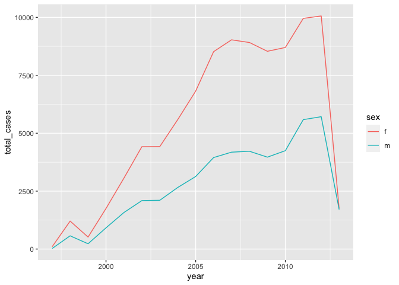

Meeting 4: Data Importing, Tidying, and Joining
================
August 26, 2021 from 7:00-8:30pm ET

## Chapters to Read

This week, we’ll be discussing:

-   Data Import
-   Data Tidying
-   Relational data

### Physical Book

If you’re reading the physical book, the chapters to read are:

| Physical book chapters  | Pages   |
|:------------------------|:--------|
| Ch. 8: Data Import      | 125-146 |
| Ch. 9: Tidy Data        | 147-170 |
| Ch. 10: Relational Data | 171-194 |

### Online Book

If you’re reading the online book, the chapters to read are:

| Chapter                       | Link                                          |
|:------------------------------|:----------------------------------------------|
| Ch. 9: Introduction (Wrangle) | <https://r4ds.had.co.nz/wrangle-intro.html>   |
| Ch. 11: Data Import           | <https://r4ds.had.co.nz/data-import.html>     |
| Ch. 12: Tidy Data             | <https://r4ds.had.co.nz/tidy-data.html>       |
| Ch. 13: Relational Data       | <https://r4ds.had.co.nz/relational-data.html> |

## Exercises

All exercises refer to the online book chapters. The book exercises and
online exercises may differ, so to make sure everyone is doing the same
exercises, please refer to the online book chapters.

-   Chapter 11: Section 11.2.2 \# 1, 2
-   Chapter 11: Section 11.3.5 \# 2, 5, 7
-   Chapter 12: Section 12.2.1 \# 2 (all parts)
-   Chapter 12: Section 12.3.3 \# 1, 3
-   Chapter 12: Section 12.4.3 \# 1, 2
-   Chapter 12: Section 12.5.1 \# 1, 2
-   Chapter 12: Section 12.6.1 \# 3, 4
-   Chapter 13: Section 13.2.1 \# 1, 4
-   Chapter 13: Section 13.3.1 \# 2 (all parts)
-   Chapter 13: Section 13.4.6 \# 1, 2, 5
-   Chapter 13: Section 13.5.1 \# 1, 2, 3, 5

Exercises are reproduced below.

### Chapter 11 Exercises

``` r
library(readr)
```

#### Section 11.2.2 (\#1, \#2)

1.  What function would you use to read a file where fields were
    separated with “\|”?

> Sam’s Solution:

``` r
read_delim(file, delim = "|")
```

2.  Apart from `file`, `skip`, and `comment`, what other arguments do
    `read_csv()` and `read_tsv()` have in common?

> Sam’s Solution:

``` r
args(read_csv)
```

    ## function (file, col_names = TRUE, col_types = NULL, col_select = NULL, 
    ##     id = NULL, locale = default_locale(), na = c("", "NA"), quoted_na = TRUE, 
    ##     quote = "\"", comment = "", trim_ws = TRUE, skip = 0, n_max = Inf, 
    ##     guess_max = min(1000, n_max), name_repair = "unique", num_threads = readr_threads(), 
    ##     progress = show_progress(), show_col_types = should_show_types(), 
    ##     skip_empty_rows = TRUE, lazy = TRUE) 
    ## NULL

``` r
args(read_tsv)
```

    ## function (file, col_names = TRUE, col_types = NULL, col_select = NULL, 
    ##     id = NULL, locale = default_locale(), na = c("", "NA"), quoted_na = TRUE, 
    ##     quote = "\"", comment = "", trim_ws = TRUE, skip = 0, n_max = Inf, 
    ##     guess_max = min(1000, n_max), progress = show_progress(), 
    ##     name_repair = "unique", num_threads = readr_threads(), show_col_types = should_show_types(), 
    ##     skip_empty_rows = TRUE, lazy = TRUE) 
    ## NULL

> Brigid’s question

11.2.2 \#4

Sometimes strings in a CSV file contain commas. To prevent them from
causing problems they need to be surrounded by a quoting character, like
" or ’. By default, read\_csv() assumes that the quoting character will
be ". What argument to read\_csv() do you need to specify to read the
following text into a data frame?

``` r
txt <- "x,y\n1,'a,b'"
read_csv(txt, quote = "\'")
```

    ## # A tibble: 1 × 2
    ##       x y    
    ##   <dbl> <chr>
    ## 1     1 a,b

#### Section 11.3.5 (\#2, \#5, \#7)

2.  What happens if you try and set `decimal_mark` and `grouping_mark`
    to the same character? What happens to the default value of
    `grouping_mark` when you set `decimal_mark` to `","`? What happens
    to the default value of `decimal_mark` when you set the
    `grouping_mark` to `"."`?

> Live solution:

``` r
library(readr)
parse_double("1,234.789", 
             locale = locale(grouping_mark = ",",
                             decimal_mark = "."))
```

    ## [1] NA
    ## attr(,"problems")
    ## # A tibble: 1 × 4
    ##     row   col expected               actual   
    ##   <int> <int> <chr>                  <chr>    
    ## 1     1    NA no trailing characters 1,234.789

``` r
parse_double("1,234.789")
```

    ## [1] NA
    ## attr(,"problems")
    ## # A tibble: 1 × 4
    ##     row   col expected               actual   
    ##   <int> <int> <chr>                  <chr>    
    ## 1     1    NA no trailing characters 1,234.789

``` r
parse_number("1,234.789", 
             locale = locale(grouping_mark = ",",
                             decimal_mark = "."))
```

    ## [1] 1234.789

``` r
parse_double("1234.789", 
             locale = locale(grouping_mark = ",",
                             decimal_mark = "."))
```

    ## [1] 1234.789

``` r
# parse_double only wants you to use one mark? 

# gwynn's solution
parse_number("123,456.789", locale = locale(decimal_mark = ","))
```

    ## [1] 123.4568

> Sam’s Solution:

``` r
parse_number("123,456,789.02", 
             locale = locale(decimal_mark = ",", 
                             grouping_mark = ","))
```

    ## Error: `decimal_mark` and `grouping_mark` must be different

``` r
parse_number("123.456.789,02", 
             locale = locale(grouping_mark = "."))
```

    ## [1] 123456789

``` r
parse_number("123,456,789.02", 
             locale = locale(grouping_mark = "."))
```

    ## [1] 123.456

5.  What’s the difference between `read_csv()` and `read_csv2()`?

> Sam’s Solution:

``` r
# read the Description of the read_csv function help page
?read_csv
```

7.  Generate the correct format string to parse each of the following
    dates and times:

``` r
d1 <- "January 1, 2010"
d2 <- "2015-Mar-07"
d3 <- "06-Jun-2017"
d4 <- c("August 19 (2015)", "July 1 (2015)")
d5 <- "12/30/14" # Dec 30, 2014
t1 <- "1705"
t2 <- "11:15:10.12 PM"
```

> Live Solution:

``` r
parse_time(t2)
```

    ## 23:15:10

``` r
parse_time(t2, "%H:%M:%OS %p")
```

    ## 23:15:10.12

``` r
parse_time("11:15:10.12 AM",  "%H:%M:%OS %p")
```

    ## 11:15:10.12

``` r
# reference 
# ?strptime
```

> Sam’s Solution:

``` r
# ?strptime
parse_date(d1, format = "%B %d, %Y")
```

    ## [1] "2010-01-01"

``` r
parse_date(d2, format = "%Y-%b-%d")
```

    ## [1] "2015-03-07"

``` r
parse_date(d3, format = "%d-%b-%Y")
```

    ## [1] "2017-06-06"

``` r
parse_date(d4, format = "%B %d (%Y)")
```

    ## [1] "2015-08-19" "2015-07-01"

``` r
parse_date(d5, format = "%m/%d/%y")
```

    ## [1] "2014-12-30"

``` r
parse_date(d5, format = "%D")
```

    ## [1] "2014-12-30"

``` r
parse_time(t1, format = "%H%M")
```

    ## 17:05:00

``` r
parse_time(t2, format = "%H:%M:%OS %p")
```

    ## 23:15:10.12

### Chapter 12 Exercises

``` r
library(tidyr)
```

#### Section 12.2.1 (\#2, all parts)

2.  Compute the rate for table2, and table4a + table4b. You will need to
    perform four operations:

    1.  Extract the number of TB cases per country per year.
    2.  Extract the matching population per country per year.
    3.  Divide cases by population, and multiply by 10000.
    4.  Store back in the appropriate place.

Which representation is easiest to work with? Which is hardest? Why?

``` r
head(table2) 
```

    ## # A tibble: 6 × 4
    ##   country      year type           count
    ##   <chr>       <int> <chr>          <int>
    ## 1 Afghanistan  1999 cases            745
    ## 2 Afghanistan  1999 population  19987071
    ## 3 Afghanistan  2000 cases           2666
    ## 4 Afghanistan  2000 population  20595360
    ## 5 Brazil       1999 cases          37737
    ## 6 Brazil       1999 population 172006362

``` r
head(table4a)
```

    ## # A tibble: 3 × 3
    ##   country     `1999` `2000`
    ##   <chr>        <int>  <int>
    ## 1 Afghanistan    745   2666
    ## 2 Brazil       37737  80488
    ## 3 China       212258 213766

``` r
head(table4b)
```

    ## # A tibble: 3 × 3
    ##   country         `1999`     `2000`
    ##   <chr>            <int>      <int>
    ## 1 Afghanistan   19987071   20595360
    ## 2 Brazil       172006362  174504898
    ## 3 China       1272915272 1280428583

> Sam’s Solution:

Table 2:

``` r
table2 %>% 
  # 1. Extract the number of TB cases per country per year.
  # 2. Extract the matching population per country per year.
  pivot_wider(names_from = type, values_from = count) %>% 
  # 3. Divide cases by population, and multiply by 10000.
  # 4. Store back in the appropriate place.
  mutate(rate = 10000 * cases / population)
```

    ## # A tibble: 6 × 5
    ##   country      year  cases population  rate
    ##   <chr>       <int>  <int>      <int> <dbl>
    ## 1 Afghanistan  1999    745   19987071 0.373
    ## 2 Afghanistan  2000   2666   20595360 1.29 
    ## 3 Brazil       1999  37737  172006362 2.19 
    ## 4 Brazil       2000  80488  174504898 4.61 
    ## 5 China        1999 212258 1272915272 1.67 
    ## 6 China        2000 213766 1280428583 1.67

Table 4a + 4b:

``` r
table4a %>% 
  pivot_longer(-country, names_to = "year", values_to = "cases") %>% 
  left_join(
    table4b %>% 
      pivot_longer(-country, names_to = "year", values_to = "population")
  ) %>% 
  mutate(rate = 10000* cases / population)
```

    ## # A tibble: 6 × 5
    ##   country     year   cases population  rate
    ##   <chr>       <chr>  <int>      <int> <dbl>
    ## 1 Afghanistan 1999     745   19987071 0.373
    ## 2 Afghanistan 2000    2666   20595360 1.29 
    ## 3 Brazil      1999   37737  172006362 2.19 
    ## 4 Brazil      2000   80488  174504898 4.61 
    ## 5 China       1999  212258 1272915272 1.67 
    ## 6 China       2000  213766 1280428583 1.67

#### Section 12.3.3 (\#1, \#3)

1.  Why are `pivot_longer()` and `pivot_wider()` not perfectly
    symmetrical? Carefully consider the following example:

``` r
stocks <- tibble(
  year   = c(2015, 2015, 2016, 2016),
  half  = c(   1,    2,     1,    2),
  return = c(1.88, 0.59, 0.92, 0.17)
)
stocks %>% 
  pivot_wider(names_from = year, values_from = return) %>% 
  pivot_longer(`2015`:`2016`, names_to = "year", values_to = "return")
```

    ## # A tibble: 4 × 3
    ##    half year  return
    ##   <dbl> <chr>  <dbl>
    ## 1     1 2015    1.88
    ## 2     1 2016    0.92
    ## 3     2 2015    0.59
    ## 4     2 2016    0.17

(Hint: look at the variable types and think about column names.)

`pivot_longer()` has a names\_ptypes argument,
e.g. `names_ptypes = list(year = double())`. What does it do?

> Sam’s Solution:

``` r
stocks %>% 
  pivot_wider(names_from = year, values_from = return) %>% 
  pivot_longer(`2015`:`2016`, names_to = "year", values_to = "return", names_ptypes =numeric())
```

    ## # A tibble: 4 × 3
    ##    half year  return
    ##   <dbl> <chr>  <dbl>
    ## 1     1 2015    1.88
    ## 2     1 2016    0.92
    ## 3     2 2015    0.59
    ## 4     2 2016    0.17

3.  What would happen if you widen this table? Why? How could you add a
    new column to uniquely identify each value?

``` r
people <- tribble(
  ~name,             ~names,  ~values,
  #-----------------|--------|------
  "Phillip Woods",   "age",       45,
  "Phillip Woods",   "height",   186,
  "Phillip Woods",   "age",       50,
  "Jessica Cordero", "age",       37,
  "Jessica Cordero", "height",   156
)
```

> Live Solution:

``` r
people %>% 
  pivot_wider(names_from = names, values_from = values)
```

    ## # A tibble: 2 × 3
    ##   name            age       height   
    ##   <chr>           <list>    <list>   
    ## 1 Phillip Woods   <dbl [2]> <dbl [1]>
    ## 2 Jessica Cordero <dbl [1]> <dbl [1]>

``` r
people %>% 
  group_by(name, names) %>% 
  mutate(sample_id = row_number()) %>% 
  pivot_wider(names_from = names, values_from = values)
```

    ## # A tibble: 3 × 4
    ## # Groups:   name [2]
    ##   name            sample_id   age height
    ##   <chr>               <int> <dbl>  <dbl>
    ## 1 Phillip Woods           1    45    186
    ## 2 Phillip Woods           2    50     NA
    ## 3 Jessica Cordero         1    37    156

> Sam’s Solution:

``` r
# multiple values for Phillip's age 
people %>% 
  pivot_wider(names_from = names, values_from = values) 
```

    ## # A tibble: 2 × 3
    ##   name            age       height   
    ##   <chr>           <list>    <list>   
    ## 1 Phillip Woods   <dbl [2]> <dbl [1]>
    ## 2 Jessica Cordero <dbl [1]> <dbl [1]>

``` r
people %>% 
  group_by(name, names) %>% 
  mutate(sample_id = row_number()) %>% 
  pivot_wider(names_from = names, values_from = values)
```

    ## # A tibble: 3 × 4
    ## # Groups:   name [2]
    ##   name            sample_id   age height
    ##   <chr>               <int> <dbl>  <dbl>
    ## 1 Phillip Woods           1    45    186
    ## 2 Phillip Woods           2    50     NA
    ## 3 Jessica Cordero         1    37    156

#### Section 12.4.3 (\#1, \#2)

1.  What do the extra and fill arguments do in `separate()`? Experiment
    with the various options for the following two toy datasets.

``` r
tibble(x = c("a,b,c", "d,e,f,g", "h,i,j")) %>% 
  separate(x, c("one", "two", "three"))
```

    ## # A tibble: 3 × 3
    ##   one   two   three
    ##   <chr> <chr> <chr>
    ## 1 a     b     c    
    ## 2 d     e     f    
    ## 3 h     i     j

``` r
tibble(x = c("a,b,c", "d,e", "f,g,i")) %>% 
  separate(x, c("one", "two", "three"))
```

    ## # A tibble: 3 × 3
    ##   one   two   three
    ##   <chr> <chr> <chr>
    ## 1 a     b     c    
    ## 2 d     e     <NA> 
    ## 3 f     g     i

> Sam’s Solution:

``` r
tibble(x = c("a,b,c", "d,e,f,g", "h,i,j")) %>% 
  separate(x, c("one", "two", "three"), extra = "warn")
```

    ## Warning: Expected 3 pieces. Additional pieces discarded in 1 rows [2].

    ## # A tibble: 3 × 3
    ##   one   two   three
    ##   <chr> <chr> <chr>
    ## 1 a     b     c    
    ## 2 d     e     f    
    ## 3 h     i     j

``` r
tibble(x = c("a,b,c", "d,e,f,g", "h,i,j")) %>% 
  separate(x, c("one", "two", "three"), extra = "drop")
```

    ## # A tibble: 3 × 3
    ##   one   two   three
    ##   <chr> <chr> <chr>
    ## 1 a     b     c    
    ## 2 d     e     f    
    ## 3 h     i     j

``` r
tibble(x = c("a,b,c", "d,e,f,g", "h,i,j")) %>% 
  separate(x, c("one", "two", "three"), extra = "merge")
```

    ## # A tibble: 3 × 3
    ##   one   two   three
    ##   <chr> <chr> <chr>
    ## 1 a     b     c    
    ## 2 d     e     f,g  
    ## 3 h     i     j

``` r
tibble(x = c("a,b,c", "d,e", "f,g,i")) %>% 
  separate(x, c("one", "two", "three"), fill = "warn")
```

    ## Warning: Expected 3 pieces. Missing pieces filled with `NA` in 1 rows [2].

    ## # A tibble: 3 × 3
    ##   one   two   three
    ##   <chr> <chr> <chr>
    ## 1 a     b     c    
    ## 2 d     e     <NA> 
    ## 3 f     g     i

``` r
tibble(x = c("a,b,c", "d,e", "f,g,i")) %>% 
  separate(x, c("one", "two", "three"), fill = "left")
```

    ## # A tibble: 3 × 3
    ##   one   two   three
    ##   <chr> <chr> <chr>
    ## 1 a     b     c    
    ## 2 <NA>  d     e    
    ## 3 f     g     i

``` r
tibble(x = c("a,b,c", "d,e", "f,g,i")) %>% 
  separate(x, c("one", "two", "three"), fill = "right")
```

    ## # A tibble: 3 × 3
    ##   one   two   three
    ##   <chr> <chr> <chr>
    ## 1 a     b     c    
    ## 2 d     e     <NA> 
    ## 3 f     g     i

2.  Both `unite()` and `separate()` have a remove argument. What does it
    do? Why would you set it to `FALSE`?

> Sam’s Solution:

``` r
tibble(x = c("a,b,c", "d,e", "f,g,i")) %>% 
  separate(x, c("one", "two", "three"), fill = "right", remove = FALSE)
```

    ## # A tibble: 3 × 4
    ##   x     one   two   three
    ##   <chr> <chr> <chr> <chr>
    ## 1 a,b,c a     b     c    
    ## 2 d,e   d     e     <NA> 
    ## 3 f,g,i f     g     i

#### Section 12.5.1 (\#1, \#2)

1.  Compare and contrast the `fill` arguments to `pivot_wider()` and
    `complete()`.

> Sam’s Solution

``` r
# values_fill is an argument in pivot_wider() that you give a scalar value that specifies what to do when there is missing data 

# example from the complete() documentation: 
df <- tibble(
  group = c(1:2, 1),
  item_id = c(1:2, 2),
  item_name = c("a", "b", "b"),
  value1 = 1:3,
  value2 = 4:6
)
# fill takes a list 
df %>% complete(group, nesting(item_id, item_name), 
                fill = list(value1 = 0, value2 = 99))
```

    ## # A tibble: 4 × 5
    ##   group item_id item_name value1 value2
    ##   <dbl>   <dbl> <chr>      <dbl>  <dbl>
    ## 1     1       1 a              1      4
    ## 2     1       2 b              3      6
    ## 3     2       1 a              0     99
    ## 4     2       2 b              2      5

``` r
# note: pivot_wider's fill can also take a list! but complete's can't
people %>% 
  group_by(name, names) %>% 
  mutate(sample_id = row_number()) %>% 
  pivot_wider(names_from = names, values_from = values, values_fill = list(values = 999))
```

    ## # A tibble: 3 × 4
    ## # Groups:   name [2]
    ##   name            sample_id   age height
    ##   <chr>               <int> <dbl>  <dbl>
    ## 1 Phillip Woods           1    45    186
    ## 2 Phillip Woods           2    50    999
    ## 3 Jessica Cordero         1    37    156

2.  What does the direction argument to `fill()` do?

> Sam’s Solution

``` r
# example from tidyr::fill help 
sales <- tibble::tribble(
  ~quarter, ~year, ~sales,
  "Q1",    2000,    66013,
  "Q2",      NA,    69182,
  "Q3",      NA,    53175,
  "Q4",      NA,    21001,
  "Q1",    2001,    46036,
  "Q2",      NA,    58842,
  "Q3",      NA,    44568,
  "Q4",      NA,    50197,
  "Q1",    2002,    39113,
  "Q2",      NA,    41668,
  "Q3",      NA,    30144,
  "Q4",      NA,    52897,
  "Q1",    2004,    32129,
  "Q2",      NA,    67686,
  "Q3",      NA,    31768,
  "Q4",      NA,    49094
)

sales %>% 
  fill(year) %>% 
  head()
```

    ## # A tibble: 6 × 3
    ##   quarter  year sales
    ##   <chr>   <dbl> <dbl>
    ## 1 Q1       2000 66013
    ## 2 Q2       2000 69182
    ## 3 Q3       2000 53175
    ## 4 Q4       2000 21001
    ## 5 Q1       2001 46036
    ## 6 Q2       2001 58842

``` r
sales %>% 
  fill(year, .direction = "up") %>% 
  head()
```

    ## # A tibble: 6 × 3
    ##   quarter  year sales
    ##   <chr>   <dbl> <dbl>
    ## 1 Q1       2000 66013
    ## 2 Q2       2001 69182
    ## 3 Q3       2001 53175
    ## 4 Q4       2001 21001
    ## 5 Q1       2001 46036
    ## 6 Q2       2002 58842

``` r
sales %>% 
  fill(year, .direction = "updown") %>% 
  head()
```

    ## # A tibble: 6 × 3
    ##   quarter  year sales
    ##   <chr>   <dbl> <dbl>
    ## 1 Q1       2000 66013
    ## 2 Q2       2001 69182
    ## 3 Q3       2001 53175
    ## 4 Q4       2001 21001
    ## 5 Q1       2001 46036
    ## 6 Q2       2002 58842

``` r
sales %>% 
  fill(year, .direction = "downup") %>% 
  head()
```

    ## # A tibble: 6 × 3
    ##   quarter  year sales
    ##   <chr>   <dbl> <dbl>
    ## 1 Q1       2000 66013
    ## 2 Q2       2000 69182
    ## 3 Q3       2000 53175
    ## 4 Q4       2000 21001
    ## 5 Q1       2001 46036
    ## 6 Q2       2001 58842

#### Section 12.6.1 (\#3, \#4)

3.  I claimed that `iso2` and `iso3` were redundant with country.
    Confirm this claim.

``` r
who %>% 
  count(country, iso2, iso3)
```

    ## # A tibble: 219 × 4
    ##    country             iso2  iso3      n
    ##    <chr>               <chr> <chr> <int>
    ##  1 Afghanistan         AF    AFG      34
    ##  2 Albania             AL    ALB      34
    ##  3 Algeria             DZ    DZA      34
    ##  4 American Samoa      AS    ASM      34
    ##  5 Andorra             AD    AND      34
    ##  6 Angola              AO    AGO      34
    ##  7 Anguilla            AI    AIA      34
    ##  8 Antigua and Barbuda AG    ATG      34
    ##  9 Argentina           AR    ARG      34
    ## 10 Armenia             AM    ARM      34
    ## # … with 209 more rows

``` r
length(unique(who$country))
```

    ## [1] 219

``` r
length(unique(who$iso2))
```

    ## [1] 219

``` r
length(unique(who$iso3))
```

    ## [1] 219

4.  For each country, year, and sex compute the total number of cases of
    TB. Make an informative visualisation of the data.

> Live Solution

``` r
who %>%
  pivot_longer(
    cols = new_sp_m014:newrel_f65, 
    names_to = "key", 
    values_to = "cases", 
    values_drop_na = TRUE
  ) %>% 
  mutate(
    key = stringr::str_replace(key, "newrel", "new_rel")
  ) %>%
  separate(key, c("new", "var", "sexage")) %>% 
  select(-new, -iso2, -iso3) %>% 
  separate(sexage, c("sex", "age"), sep = 1) -> who5

who5 %>% 
  count(var)
```

    ## # A tibble: 4 × 2
    ##   var       n
    ##   <chr> <int>
    ## 1 ep    14304
    ## 2 rel    2580
    ## 3 sn    14342
    ## 4 sp    44820

``` r
who5 %>% 
  group_by(country, year, sex) %>% 
  summarize(total_cases = sum(cases)) %>% 
  filter(country == "Afghanistan") %>% 
  ggplot(aes(x = year, y = total_cases, color = sex)) + 
  geom_line()
```

<!-- -->

``` r
who5 %>% 
  group_by(country, year, sex) %>% 
  summarize(total_cases = sum(cases)) %>% 
  unite(country_sex, country, sex, remove = FALSE) %>% 
  ggplot(aes(x = year, y = total_cases, color = sex, 
             group = country_sex)) + 
  geom_line(alpha = .5)
```

<!-- -->

``` r
who5 %>% 
  group_by(country, year, sex) %>% 
  summarize(total_cases = sum(cases)) %>% 
  unite(country_sex, country, sex, remove = FALSE) %>% 
  ggplot(aes(x = year, y = total_cases, color = sex, 
             group = country)) + 
  geom_line(alpha = .5)
```

<!-- -->

> Sam’s Solution:

``` r
# we'll work with who5 from the book
who5 <- who %>% 
  pivot_longer(
    cols = new_sp_m014:newrel_f65, 
    names_to = "key", 
    values_to = "cases", 
    values_drop_na = TRUE
  ) %>% 
  mutate(key = stringr::str_replace(key, "newrel", "new_rel")) %>% 
  separate(key, c("new", "type", "sexage"), sep = "_") %>% 
  select(-new, -iso2, -iso3) %>% 
  separate(sexage, c("sex", "age"), sep = 1)

who5 %>%
  group_by(country, year, sex) %>% 
  summarize(total_cases = sum(cases)) %>% 
  unite(country_sex, country, sex, remove = FALSE) %>% 
  ggplot(aes(x = year, y = total_cases, group = country_sex, color = sex)) + 
  geom_line()
```

<!-- -->

``` r
# more complex solution 
continents <- countrycode::codelist %>% select(continent, country = country.name.en)
who5 %>%
  group_by(country, year, sex) %>% 
  summarize(total_cases = sum(cases)) %>% 
  left_join(continents) %>% 
  unite(country_sex, country, sex, remove = FALSE) %>% 
  ggplot(aes(x = year, y = total_cases, group = country_sex, color = sex)) + 
  geom_line() + 
  facet_wrap(~continent, scales = "free")
```

<!-- -->

``` r
# not very good, a lot of NAs. Need to look more precisely at the names in the codelist data 
```

### Chapter 13 Exercises

#### Section 13.2.1 (\#1, \#4)

1.  Imagine you wanted to draw (approximately) the route each plane
    flies from its origin to its destination. What variables would you
    need? What tables would you need to combine?

> Sam’s Solution

``` r
# You would need the coordinates of the origin and destination airports for each flight 
# found in the airports data 
# join the flights data to airports by origin and then join that data with the airports on the destination again
```

4.  We know that some days of the year are “special”, and fewer people
    than usual fly on them. How might you represent that data as a data
    frame? What would be the primary keys of that table? How would it
    connect to the existing tables?

> Sam’s Solution:

``` r
# could have a data frame with a date column and a holiday column e.g.

# month , day , holiday
# 12, 25, christmas
# 12, 31, new year's eve

# primary keys are month, day 
# connect to the flights table on month-day 
```

#### Section 13.3.1 (\#2, all parts)

2.  Identify the keys in the following datasets:

    -   Lahman::Batting,
    -   babynames::babynames
    -   nasaweather::atmos
    -   fueleconomy::vehicles
    -   ggplot2::diamonds

(You might need to install some packages and read some documentation.)

> Sam’s Solution:

``` r
glimpse(Lahman::Batting)
```

    ## Rows: 107,429
    ## Columns: 22
    ## $ playerID <chr> "abercda01", "addybo01", "allisar01", "allisdo01", "ansonca01…
    ## $ yearID   <int> 1871, 1871, 1871, 1871, 1871, 1871, 1871, 1871, 1871, 1871, 1…
    ## $ stint    <int> 1, 1, 1, 1, 1, 1, 1, 1, 1, 1, 1, 1, 1, 1, 1, 1, 1, 1, 1, 1, 1…
    ## $ teamID   <fct> TRO, RC1, CL1, WS3, RC1, FW1, RC1, BS1, FW1, BS1, CL1, CL1, W…
    ## $ lgID     <fct> NA, NA, NA, NA, NA, NA, NA, NA, NA, NA, NA, NA, NA, NA, NA, N…
    ## $ G        <int> 1, 25, 29, 27, 25, 12, 1, 31, 1, 18, 22, 1, 10, 3, 20, 29, 1,…
    ## $ AB       <int> 4, 118, 137, 133, 120, 49, 4, 157, 5, 86, 89, 3, 36, 15, 94, …
    ## $ R        <int> 0, 30, 28, 28, 29, 9, 0, 66, 1, 13, 18, 0, 6, 7, 24, 26, 0, 0…
    ## $ H        <int> 0, 32, 40, 44, 39, 11, 1, 63, 1, 13, 27, 0, 7, 6, 33, 32, 0, …
    ## $ X2B      <int> 0, 6, 4, 10, 11, 2, 0, 10, 1, 2, 1, 0, 0, 0, 9, 3, 0, 0, 1, 0…
    ## $ X3B      <int> 0, 0, 5, 2, 3, 1, 0, 9, 0, 1, 10, 0, 0, 0, 1, 3, 0, 0, 1, 0, …
    ## $ HR       <int> 0, 0, 0, 2, 0, 0, 0, 0, 0, 0, 3, 0, 0, 0, 1, 0, 0, 0, 0, 0, 0…
    ## $ RBI      <int> 0, 13, 19, 27, 16, 5, 2, 34, 1, 11, 18, 0, 1, 5, 21, 23, 0, 0…
    ## $ SB       <int> 0, 8, 3, 1, 6, 0, 0, 11, 0, 1, 0, 0, 2, 2, 4, 4, 0, 0, 3, 0, …
    ## $ CS       <int> 0, 1, 1, 1, 2, 1, 0, 6, 0, 0, 1, 0, 0, 0, 0, 4, 0, 0, 1, 0, 0…
    ## $ BB       <int> 0, 4, 2, 0, 2, 0, 1, 13, 0, 0, 3, 1, 2, 0, 2, 9, 0, 0, 4, 1, …
    ## $ SO       <int> 0, 0, 5, 2, 1, 1, 0, 1, 0, 0, 4, 0, 0, 0, 2, 2, 3, 0, 2, 0, 2…
    ## $ IBB      <int> NA, NA, NA, NA, NA, NA, NA, NA, NA, NA, NA, NA, NA, NA, NA, N…
    ## $ HBP      <int> NA, NA, NA, NA, NA, NA, NA, NA, NA, NA, NA, NA, NA, NA, NA, N…
    ## $ SH       <int> NA, NA, NA, NA, NA, NA, NA, NA, NA, NA, NA, NA, NA, NA, NA, N…
    ## $ SF       <int> NA, NA, NA, NA, NA, NA, NA, NA, NA, NA, NA, NA, NA, NA, NA, N…
    ## $ GIDP     <int> 0, 0, 1, 0, 0, 0, 0, 1, 0, 0, 0, 0, 2, 0, 1, 2, 0, 0, 0, 0, 3…

``` r
Lahman::Batting %>% 
  count(playerID, yearID, stint) %>% 
  filter(n > 1)
```

    ## [1] playerID yearID   stint    n       
    ## <0 rows> (or 0-length row.names)

``` r
# playerID, yearID, and stint form the key 

glimpse(babynames::babynames)
```

    ## Rows: 1,924,665
    ## Columns: 5
    ## $ year <dbl> 1880, 1880, 1880, 1880, 1880, 1880, 1880, 1880, 1880, 1880, 1880,…
    ## $ sex  <chr> "F", "F", "F", "F", "F", "F", "F", "F", "F", "F", "F", "F", "F", …
    ## $ name <chr> "Mary", "Anna", "Emma", "Elizabeth", "Minnie", "Margaret", "Ida",…
    ## $ n    <int> 7065, 2604, 2003, 1939, 1746, 1578, 1472, 1414, 1320, 1288, 1258,…
    ## $ prop <dbl> 0.07238359, 0.02667896, 0.02052149, 0.01986579, 0.01788843, 0.016…

``` r
babynames::babynames %>% 
  count(year, sex, name) %>% 
  filter(n > 1)
```

    ## # A tibble: 0 × 4
    ## # … with 4 variables: year <dbl>, sex <chr>, name <chr>, n <int>

``` r
# year, sex, name form the key 

glimpse(nasaweather::atmos)
```

    ## Rows: 41,472
    ## Columns: 11
    ## $ lat       <dbl> 36.200000, 33.704348, 31.208696, 28.713043, 26.217391, 23.72…
    ## $ long      <dbl> -113.8000, -113.8000, -113.8000, -113.8000, -113.8000, -113.…
    ## $ year      <int> 1995, 1995, 1995, 1995, 1995, 1995, 1995, 1995, 1995, 1995, …
    ## $ month     <int> 1, 1, 1, 1, 1, 1, 1, 1, 1, 1, 1, 1, 1, 1, 1, 1, 1, 1, 1, 1, …
    ## $ surftemp  <dbl> 272.7, 279.5, 284.7, 289.3, 292.2, 294.1, 295.0, 298.3, 300.…
    ## $ temp      <dbl> 272.1, 282.2, 285.2, 290.7, 292.7, 293.6, 294.6, 296.9, 297.…
    ## $ pressure  <dbl> 835, 940, 960, 990, 1000, 1000, 1000, 1000, 1000, 1000, 1000…
    ## $ ozone     <dbl> 304, 304, 298, 276, 274, 264, 258, 252, 250, 250, 248, 248, …
    ## $ cloudlow  <dbl> 7.5, 11.5, 16.5, 20.5, 26.0, 30.0, 29.5, 26.5, 27.5, 26.0, 2…
    ## $ cloudmid  <dbl> 34.5, 32.5, 26.0, 14.5, 10.5, 9.5, 11.0, 17.5, 18.5, 16.5, 1…
    ## $ cloudhigh <dbl> 26.0, 20.0, 16.0, 13.0, 7.5, 8.0, 14.5, 19.5, 22.5, 21.0, 19…

``` r
nasaweather::atmos %>% 
  count(lat, long, year, month) %>% 
  filter(n > 1)
```

    ## # A tibble: 0 × 5
    ## # … with 5 variables: lat <dbl>, long <dbl>, year <int>, month <int>, n <int>

``` r
# lat, long, year, month form the key 

glimpse(fueleconomy::vehicles)
```

    ## Rows: 33,442
    ## Columns: 12
    ## $ id    <dbl> 13309, 13310, 13311, 14038, 14039, 14040, 14834, 14835, 14836, 1…
    ## $ make  <chr> "Acura", "Acura", "Acura", "Acura", "Acura", "Acura", "Acura", "…
    ## $ model <chr> "2.2CL/3.0CL", "2.2CL/3.0CL", "2.2CL/3.0CL", "2.3CL/3.0CL", "2.3…
    ## $ year  <dbl> 1997, 1997, 1997, 1998, 1998, 1998, 1999, 1999, 1999, 1995, 1996…
    ## $ class <chr> "Subcompact Cars", "Subcompact Cars", "Subcompact Cars", "Subcom…
    ## $ trans <chr> "Automatic 4-spd", "Manual 5-spd", "Automatic 4-spd", "Automatic…
    ## $ drive <chr> "Front-Wheel Drive", "Front-Wheel Drive", "Front-Wheel Drive", "…
    ## $ cyl   <dbl> 4, 4, 6, 4, 4, 6, 4, 4, 6, 5, 5, 6, 5, 6, 5, 6, 6, 6, 6, 6, 6, 6…
    ## $ displ <dbl> 2.2, 2.2, 3.0, 2.3, 2.3, 3.0, 2.3, 2.3, 3.0, 2.5, 2.5, 3.2, 2.5,…
    ## $ fuel  <chr> "Regular", "Regular", "Regular", "Regular", "Regular", "Regular"…
    ## $ hwy   <dbl> 26, 28, 26, 27, 29, 26, 27, 29, 26, 23, 23, 22, 23, 22, 23, 22, …
    ## $ cty   <dbl> 20, 22, 18, 19, 21, 17, 20, 21, 17, 18, 18, 17, 18, 17, 17, 17, …

``` r
fueleconomy::vehicles %>% 
  count(id) %>% 
  filter(n > 1)
```

    ## # A tibble: 0 × 2
    ## # … with 2 variables: id <dbl>, n <int>

``` r
# id is the primary key 

glimpse(ggplot2::diamonds)
```

    ## Rows: 53,940
    ## Columns: 10
    ## $ carat   <dbl> 0.23, 0.21, 0.23, 0.29, 0.31, 0.24, 0.24, 0.26, 0.22, 0.23, 0.…
    ## $ cut     <ord> Ideal, Premium, Good, Premium, Good, Very Good, Very Good, Ver…
    ## $ color   <ord> E, E, E, I, J, J, I, H, E, H, J, J, F, J, E, E, I, J, J, J, I,…
    ## $ clarity <ord> SI2, SI1, VS1, VS2, SI2, VVS2, VVS1, SI1, VS2, VS1, SI1, VS1, …
    ## $ depth   <dbl> 61.5, 59.8, 56.9, 62.4, 63.3, 62.8, 62.3, 61.9, 65.1, 59.4, 64…
    ## $ table   <dbl> 55, 61, 65, 58, 58, 57, 57, 55, 61, 61, 55, 56, 61, 54, 62, 58…
    ## $ price   <int> 326, 326, 327, 334, 335, 336, 336, 337, 337, 338, 339, 340, 34…
    ## $ x       <dbl> 3.95, 3.89, 4.05, 4.20, 4.34, 3.94, 3.95, 4.07, 3.87, 4.00, 4.…
    ## $ y       <dbl> 3.98, 3.84, 4.07, 4.23, 4.35, 3.96, 3.98, 4.11, 3.78, 4.05, 4.…
    ## $ z       <dbl> 2.43, 2.31, 2.31, 2.63, 2.75, 2.48, 2.47, 2.53, 2.49, 2.39, 2.…

``` r
ggplot2::diamonds %>% 
  # count(x, y, z, price) %>%
  count(carat, cut, color, clarity, depth, table, price, x, y, z) %>% 
  filter(n > 1)
```

    ## # A tibble: 143 × 11
    ##    carat cut       color clarity depth table price     x     y     z     n
    ##    <dbl> <ord>     <ord> <ord>   <dbl> <dbl> <int> <dbl> <dbl> <dbl> <int>
    ##  1  0.3  Good      J     VS1      63.4    57   394  4.23  4.26  2.69     2
    ##  2  0.3  Very Good G     VS2      63      55   526  4.29  4.31  2.71     2
    ##  3  0.3  Very Good J     VS1      63.4    57   506  4.26  4.23  2.69     2
    ##  4  0.3  Premium   D     SI1      62.2    58   709  4.31  4.28  2.67     2
    ##  5  0.3  Ideal     G     VS2      63      55   675  4.31  4.29  2.71     2
    ##  6  0.3  Ideal     G     IF       62.1    55   863  4.32  4.35  2.69     2
    ##  7  0.3  Ideal     H     SI1      62.2    57   450  4.26  4.29  2.66     2
    ##  8  0.3  Ideal     H     SI1      62.2    57   450  4.27  4.28  2.66     2
    ##  9  0.31 Good      D     SI1      63.5    56   571  4.29  4.31  2.73     2
    ## 10  0.31 Very Good D     SI1      63.5    56   732  4.31  4.29  2.73     2
    ## # … with 133 more rows

``` r
# there is no key! 
```

#### Section 13.4.6 (\#1, \#2, \#5)

1.  Compute the average delay by destination, then join on the airports
    data frame so you can show the spatial distribution of delays.
    Here’s an easy way to draw a map of the United States:

``` r
airports %>%
  semi_join(flights, c("faa" = "dest")) %>%
  ggplot(aes(lon, lat)) +
    borders("state") +
    geom_point() +
    coord_quickmap()
```

(Don’t worry if you don’t understand what `semi_join()` does — you’ll
learn about it next.)

You might want to use the size or colour of the points to display the
average delay for each airport.

> Live Solution:

``` r
data("flights", package = "nycflights13")
avg_delays <- flights %>% 
  group_by(dest) %>% 
  summarize(avg_delay = mean(arr_delay, na.rm = TRUE))

data("airports", package = "nycflights13")
avg_delays %>% 
  left_join(airports, by = c("dest" = "faa")) %>% 
  ggplot(aes(lon, lat)) +
    borders("state") +
    geom_point(aes(color = avg_delay), size = 1.5) +
    coord_quickmap() + 
    scale_color_gradient2(low = "navy", high = "red")
```

<!-- -->

> Sam’s Solution:

``` r
library(nycflights13)
flights %>%
  group_by(dest) %>% 
  summarize(mean_arr_delay = mean(arr_delay, na.rm = TRUE)) %>% 
  left_join(airports, c("dest" = "faa")) %>%
  ggplot(aes(lon, lat)) +
    borders("state") +
    geom_point(aes(color = mean_arr_delay)) +
    coord_quickmap() + 
    scale_color_gradient2(high = "red", low = "green") + 
  theme_classic() + 
  theme(legend.position = "top")
```

<!-- -->

2.  Add the location of the origin and destination (i.e. the `lat` and
    `lon`) to flights.

> Live solution

``` r
airport_coord <- airports %>% select(faa, lat, lon)

flights %>% 
  left_join(airport_coord , by = c("origin" = "faa")) %>% 
  left_join(airport_coord, by = c("dest" = "faa"), 
            suffix = c("_origin", "_dest"))
```

    ## # A tibble: 336,776 × 23
    ##     year month   day dep_time sched_dep_time dep_delay arr_time sched_arr_time
    ##    <int> <int> <int>    <int>          <int>     <dbl>    <int>          <int>
    ##  1  2013     1     1      517            515         2      830            819
    ##  2  2013     1     1      533            529         4      850            830
    ##  3  2013     1     1      542            540         2      923            850
    ##  4  2013     1     1      544            545        -1     1004           1022
    ##  5  2013     1     1      554            600        -6      812            837
    ##  6  2013     1     1      554            558        -4      740            728
    ##  7  2013     1     1      555            600        -5      913            854
    ##  8  2013     1     1      557            600        -3      709            723
    ##  9  2013     1     1      557            600        -3      838            846
    ## 10  2013     1     1      558            600        -2      753            745
    ## # … with 336,766 more rows, and 15 more variables: arr_delay <dbl>,
    ## #   carrier <chr>, flight <int>, tailnum <chr>, origin <chr>, dest <chr>,
    ## #   air_time <dbl>, distance <dbl>, hour <dbl>, minute <dbl>, time_hour <dttm>,
    ## #   lat_origin <dbl>, lon_origin <dbl>, lat_dest <dbl>, lon_dest <dbl>

> Sam’s Solution:

``` r
flight_locations <- flights %>% 
  left_join(airports %>% select(faa, lat, lon), c("origin" = "faa")) %>% 
  left_join(airports %>% select(faa, lat, lon), c("dest" = "faa"), suffix = c("_origin", "_dest"))
```

5.  What happened on June 13, 2013? Display the spatial pattern of
    delays, and then use Google to cross-reference with the weather.

> Live solution:

``` r
flights %>% 
  filter(month == 6, day == 13) -> june13  

june13 %>% 
  left_join(airport_coord, by = c("dest" = "faa")) %>% 
  ggplot(aes(lon, lat, color = arr_delay)) +
    borders("state") +
    geom_point(size = 2) +
    coord_quickmap()
```

<!-- -->

> Sam’s Solution:

``` r
flight_locations %>% 
  filter(month == 6, day == 13) %>% 
  ggplot(aes(lon_dest, lat_dest)) +
    borders("state") +
    geom_jitter(aes(color = arr_delay)) +
    coord_quickmap() 
```

<!-- -->

``` r
# looks like most of the west coast flights made it but the midwest flights didn't 
# midwest means tornado
# google "June 13, 2013 tornado"
# https://en.wikipedia.org/wiki/June_12%E2%80%9313,_2013_derecho_series
```

#### Section 13.5.1 (\#1, \#2, \#3, \#5)

1.  What does it mean for a flight to have a missing `tailnum`? What do
    the tail numbers that don’t have a matching record in `planes` have
    in common? (Hint: one variable explains \~90% of the problems.)

> Sam’s Solution:

``` r
flights %>% 
  filter(is.na(tailnum)) %>% 
  head()
```

    ## # A tibble: 6 × 19
    ##    year month   day dep_time sched_dep_time dep_delay arr_time sched_arr_time
    ##   <int> <int> <int>    <int>          <int>     <dbl>    <int>          <int>
    ## 1  2013     1     2       NA           1545        NA       NA           1910
    ## 2  2013     1     2       NA           1601        NA       NA           1735
    ## 3  2013     1     3       NA            857        NA       NA           1209
    ## 4  2013     1     3       NA            645        NA       NA            952
    ## 5  2013     1     4       NA            845        NA       NA           1015
    ## 6  2013     1     4       NA           1830        NA       NA           2044
    ## # … with 11 more variables: arr_delay <dbl>, carrier <chr>, flight <int>,
    ## #   tailnum <chr>, origin <chr>, dest <chr>, air_time <dbl>, distance <dbl>,
    ## #   hour <dbl>, minute <dbl>, time_hour <dttm>

``` r
# tailnum missing also have arr_time and other variables missing 
# flights where tailnum is missing are probably flights that were cancelled because they couldn't get a plane. 

flights %>% 
  anti_join(planes, by = "tailnum") %>% 
  count(carrier, sort = T) %>% 
  mutate(perc = n / sum(n))
```

    ## # A tibble: 10 × 3
    ##    carrier     n     perc
    ##    <chr>   <int>    <dbl>
    ##  1 MQ      25397 0.483   
    ##  2 AA      22558 0.429   
    ##  3 UA       1693 0.0322  
    ##  4 9E       1044 0.0198  
    ##  5 B6        830 0.0158  
    ##  6 US        699 0.0133  
    ##  7 FL        187 0.00355 
    ##  8 DL        110 0.00209 
    ##  9 F9         50 0.000950
    ## 10 WN         38 0.000722

``` r
# majority are from airlines MQ or AA
```

2.  Filter flights to only show flights with planes that have flown at
    least 100 flights.

> Sam’s Solution:

``` r
gr_100 <- flights %>% 
  filter(!is.na(tailnum)) %>% 
  count(tailnum) %>% 
  filter(n >= 100)

flights %>% 
  semi_join(gr_100, by = "tailnum")
```

    ## # A tibble: 228,390 × 19
    ##     year month   day dep_time sched_dep_time dep_delay arr_time sched_arr_time
    ##    <int> <int> <int>    <int>          <int>     <dbl>    <int>          <int>
    ##  1  2013     1     1      517            515         2      830            819
    ##  2  2013     1     1      533            529         4      850            830
    ##  3  2013     1     1      544            545        -1     1004           1022
    ##  4  2013     1     1      554            558        -4      740            728
    ##  5  2013     1     1      555            600        -5      913            854
    ##  6  2013     1     1      557            600        -3      709            723
    ##  7  2013     1     1      557            600        -3      838            846
    ##  8  2013     1     1      558            600        -2      849            851
    ##  9  2013     1     1      558            600        -2      853            856
    ## 10  2013     1     1      558            600        -2      923            937
    ## # … with 228,380 more rows, and 11 more variables: arr_delay <dbl>,
    ## #   carrier <chr>, flight <int>, tailnum <chr>, origin <chr>, dest <chr>,
    ## #   air_time <dbl>, distance <dbl>, hour <dbl>, minute <dbl>, time_hour <dttm>

3.  Combine fueleconomy::vehicles and fueleconomy::common to find only
    the records for the most common models.

> Sam’s Solution:

``` r
fueleconomy::vehicles %>% 
  semi_join(fueleconomy::common, by = c("model", "make"))
```

    ## # A tibble: 14,531 × 12
    ##       id make  model   year class   trans  drive     cyl displ fuel    hwy   cty
    ##    <dbl> <chr> <chr>  <dbl> <chr>   <chr>  <chr>   <dbl> <dbl> <chr> <dbl> <dbl>
    ##  1  1833 Acura Integ…  1986 Subcom… Autom… Front-…     4   1.6 Regu…    28    22
    ##  2  1834 Acura Integ…  1986 Subcom… Manua… Front-…     4   1.6 Regu…    28    23
    ##  3  3037 Acura Integ…  1987 Subcom… Autom… Front-…     4   1.6 Regu…    28    22
    ##  4  3038 Acura Integ…  1987 Subcom… Manua… Front-…     4   1.6 Regu…    28    23
    ##  5  4183 Acura Integ…  1988 Subcom… Autom… Front-…     4   1.6 Regu…    27    22
    ##  6  4184 Acura Integ…  1988 Subcom… Manua… Front-…     4   1.6 Regu…    28    23
    ##  7  5303 Acura Integ…  1989 Subcom… Autom… Front-…     4   1.6 Regu…    27    22
    ##  8  5304 Acura Integ…  1989 Subcom… Manua… Front-…     4   1.6 Regu…    28    23
    ##  9  6442 Acura Integ…  1990 Subcom… Autom… Front-…     4   1.8 Regu…    24    20
    ## 10  6443 Acura Integ…  1990 Subcom… Manua… Front-…     4   1.8 Regu…    26    21
    ## # … with 14,521 more rows

5.  What does `anti_join(flights, airports, by = c("dest" = "faa"))`
    tell you? What does
    `anti_join(airports, flights, by = c("faa" = "dest"))` tell you?

> Sam’s solution:

``` r
anti_join(flights, airports, by = c("dest" = "faa")) %>% glimpse()
```

    ## Rows: 7,602
    ## Columns: 19
    ## $ year           <int> 2013, 2013, 2013, 2013, 2013, 2013, 2013, 2013, 2013, 2…
    ## $ month          <int> 1, 1, 1, 1, 1, 1, 1, 1, 1, 1, 1, 1, 1, 1, 1, 1, 1, 1, 1…
    ## $ day            <int> 1, 1, 1, 1, 1, 1, 1, 1, 1, 1, 1, 1, 1, 1, 1, 1, 1, 1, 1…
    ## $ dep_time       <int> 544, 615, 628, 701, 711, 820, 820, 840, 909, 913, 926, …
    ## $ sched_dep_time <int> 545, 615, 630, 700, 715, 820, 820, 845, 810, 918, 929, …
    ## $ dep_delay      <dbl> -1, 0, -2, 1, -4, 0, 0, -5, 59, -5, -3, 3, -4, 122, 35,…
    ## $ arr_time       <int> 1004, 1039, 1137, 1123, 1151, 1254, 1249, 1311, 1331, 1…
    ## $ sched_arr_time <int> 1022, 1100, 1140, 1154, 1206, 1310, 1329, 1350, 1315, 1…
    ## $ arr_delay      <dbl> -18, -21, -3, -31, -15, -16, -40, -39, 16, -30, -17, -8…
    ## $ carrier        <chr> "B6", "B6", "AA", "UA", "B6", "B6", "DL", "AA", "AA", "…
    ## $ flight         <int> 725, 709, 413, 1203, 715, 717, 301, 1357, 655, 1519, 21…
    ## $ tailnum        <chr> "N804JB", "N794JB", "N3BAAA", "N77296", "N651JB", "N527…
    ## $ origin         <chr> "JFK", "JFK", "JFK", "EWR", "JFK", "JFK", "JFK", "JFK",…
    ## $ dest           <chr> "BQN", "SJU", "SJU", "SJU", "SJU", "SJU", "SJU", "SJU",…
    ## $ air_time       <dbl> 183, 182, 192, 188, 190, 190, 182, 188, 184, 189, 191, …
    ## $ distance       <dbl> 1576, 1598, 1598, 1608, 1598, 1598, 1598, 1598, 1623, 1…
    ## $ hour           <dbl> 5, 6, 6, 7, 7, 8, 8, 8, 8, 9, 9, 11, 12, 13, 15, 15, 17…
    ## $ minute         <dbl> 45, 15, 30, 0, 15, 20, 20, 45, 10, 18, 29, 59, 49, 38, …
    ## $ time_hour      <dttm> 2013-01-01 05:00:00, 2013-01-01 06:00:00, 2013-01-01 0…

``` r
# destination code is not in airports 

anti_join(airports, flights, by = c("faa" = "dest")) %>% glimpse()
```

    ## Rows: 1,357
    ## Columns: 8
    ## $ faa   <chr> "04G", "06A", "06C", "06N", "09J", "0A9", "0G6", "0G7", "0P2", "…
    ## $ name  <chr> "Lansdowne Airport", "Moton Field Municipal Airport", "Schaumbur…
    ## $ lat   <dbl> 41.13047, 32.46057, 41.98934, 41.43191, 31.07447, 36.37122, 41.4…
    ## $ lon   <dbl> -80.61958, -85.68003, -88.10124, -74.39156, -81.42778, -82.17342…
    ## $ alt   <dbl> 1044, 264, 801, 523, 11, 1593, 730, 492, 1000, 108, 409, 875, 10…
    ## $ tz    <dbl> -5, -6, -6, -5, -5, -5, -5, -5, -5, -8, -5, -6, -5, -5, -5, -5, …
    ## $ dst   <chr> "A", "A", "A", "A", "A", "A", "A", "A", "U", "A", "A", "U", "A",…
    ## $ tzone <chr> "America/New_York", "America/Chicago", "America/Chicago", "Ameri…

``` r
# airports which are not destinations in the data 
```

## Open Disussion

`->` and `<-`

``` r
# "to the variable x, assign the value 4"
x <- 4
# "set x equal to 4" 
x = 4
# "assign the value 4 to the variable x"
4 -> x
# error! = behaves as <- , not as -> 
4=x
```

The assignment arrow `->` or `<-` is an arrow that points a value to a
variable and assigns the value to the variable.

`is.na` and `na.rm`: `is.na` is a function that returns `TRUE` if the
value is `NA` or `NaN`, and returns `FALSE` otherwise. `na.rm` is an
argument in some functions (e.g. `mean`, `sd`, etc.) which tells the
function to remove any `NA` values before performing any calculations.
Otherwise, if there is an `NA`, the computation will result in `NA`.

``` r
# ?is.na
# mean(x, na.rm = T) 
```
