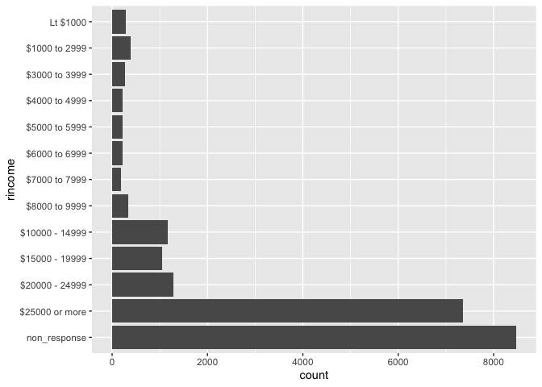

Meeting 5: Dealing with Special Data Types
================
September 9, 2021 from 7:00-8:30pm ET

## Chapters to Read

This week, we’ll be discussing working with:

-   Strings
-   Factors
-   Dates and times

### Physical Book

If you’re reading the physical book, the chapters to read are:

| Physical book chapters | Pages   |
|:-----------------------|:--------|
| Ch. 11: Strings        | 195-222 |
| Ch. 12: Factors        | 223-236 |
| Ch 13: Dates and times | 237-256 |

### Online Book

If you’re reading the online book, the chapters to read are:

| Chapter                | Link                                          |
|:-----------------------|:----------------------------------------------|
| Ch. 14: Strings        | <https://r4ds.had.co.nz/strings.html>         |
| Ch. 15: Factors        | <https://r4ds.had.co.nz/factors.html>         |
| Ch 16: Dates and times | <https://r4ds.had.co.nz/dates-and-times.html> |

## Exercises

All exercises refer to the online book chapters. The book exercises and
online exercises may differ, so to make sure everyone is doing the same
exercises, please refer to the online book chapters.

-   Chapter 14: Section 14.2.5 \# 1, 3, 5
-   Chapter 14: Section 14.3.1.1 \# 2
-   Chapter 14: Section 14.3.2.1 \# 2 (all parts)
-   Chapter 14: Section 14.3.3.1 \# 1 (all parts)
-   Chapter 14: Section 14.3.4.1 \# 3 (all parts)
-   Chapter 14: Section 14.3.5.1 \# 2 (all parts)
-   Chapter 14: Section 14.4.1.1 \# 2
-   Chapter 14: Section 14.4.2.1 \# 1
-   Chapter 14: Section 14.4.3.1 \# 2
-   Chapter 14: Section 14.4.4.1 \# 3
-   Chapter 14: Section 14.4.5.1 \# 2
-   Chapter 14: Section 14.5.1 \# 2
-   Chapter 15: Section 15.3.1 \# 1
-   Chapter 15: Section 15.4.1 \# 2
-   Chapter 15: Section 15.5.1 \# 2
-   Chapter 16: Section 16.2.4 \# 2, 3
-   Chapter 16: Section 16.3.4 \# 3, 5
-   Chapter 16: Section 16.4.5 \# 3, 4

Exercises are reproduced below.

``` r
library(tidyverse)
library(nycflights13)
library(lubridate)
```

## Chapter 14

### Section 14.2.5 (1, 3, 5)

1.  In code that doesn’t use stringr, you’ll often see `paste()` and
    `paste0()`. What’s the difference between the two functions? What
    stringr function are they equivalent to? How do the functions differ
    in their handling of NA?

> Sam’s Solution:

``` r
paste("Hello", "World")
```

    ## [1] "Hello World"

``` r
paste0("Hello", "World")
```

    ## [1] "HelloWorld"

``` r
# paste0 has no separator

str_c("Hello", "World", sep = " ")
```

    ## [1] "Hello World"

``` r
str_c("Hello", "World")
```

    ## [1] "HelloWorld"

``` r
paste("This value is missing:", NA)
```

    ## [1] "This value is missing: NA"

``` r
str_c("This value is missing:", NA, sep = " ")
```

    ## [1] NA

3.  Use `str_length()` and `str_sub()` to extract the middle character
    from a string. What will you do if the string has an even number of
    characters?

> Sam’s Solution:

``` r
odd <- "seven"
even <- "eighteen"

middle <- function(string){
  
  N <- str_length(string)
  
  str_sub(string, ceiling(N/2), ceiling(N/2))
  
}

middle(odd)
```

    ## [1] "v"

``` r
middle(even)
```

    ## [1] "h"

5.  What does `str_trim()` do? What’s the opposite of `str_trim()`?

``` r
str_trim(" Remove whitespace ")
```

    ## [1] "Remove whitespace"

``` r
str_pad("Add whitespace", width = 16, side = "both")
```

    ## [1] " Add whitespace "

### Section 14.3.1.1 (2)

2.  How would you match the sequence `"'\`?

> Sam’s Solution:

``` r
my_seq <- "\"'\\"
str_view(my_seq, "\"'\\\\")
```

<!-- -->

``` r
# base R functions for dealing with strings:
# sub()
# gsub()
```

### Section 14.3.2.1 (2)

2.  Given the corpus of common words in `stringr::words`, create regular
    expressions that find all words that:

    1.  Start with “y”.
    2.  End with “x”
    3.  Are exactly three letters long. (Don’t cheat by using
        `str_length()`!)
    4.  Have seven letters or more.

Since this list is long, you might want to use the match argument to
`str_view()` to show only the matching or non-matching words.

> Sam’s solution:

``` r
# a. Start with "y".
str_view(words, "^y", match = TRUE)
```

<!-- -->

``` r
# b. End with "x"
str_view(words, "x$", match = TRUE)
```

<!-- -->

``` r
# c. Are exactly three letters long. (Don't cheat by using `str_length()`!)
str_view(words, "^[a-z]{3}$", match = TRUE)
```

<!-- -->

``` r
# d. Have seven letters or more.
str_view(words, "[:alpha:]{7}", match = TRUE)
```

<!-- -->

### Section 14.3.3.1 (1)

1.  Create regular expressions to find all words that:

    1.  Start with a vowel.
    2.  That only contain consonants. (Hint: thinking about matching
        “not”-vowels.)
    3.  End with ed, but not with eed.
    4.  End with ing or ise.

> Live Solution:

``` r
# End with ed, but not with eed.
str_view(words, "ed$", match = TRUE)
```

<!-- -->

``` r
str_view(words, "[^e]ed$", match = TRUE)
```

<!-- -->

``` r
# str_view(words, "e{1}d$", match = TRUE)
```

> Sam’s solution:

``` r
# a. Start with a vowel.
str_view(words, "^[aeiou]", match = TRUE)
```

<!-- -->

``` r
# b. That only contain consonants. (Hint: thinking about matching "not"-vowels.)
str_view(words, "[aeiou]", match = FALSE)
```

<!-- -->

``` r
# c. End with ed, but not with eed.
str_view(words, "[^e]ed$", match = TRUE)
```

<!-- -->

``` r
# d. End with ing or ise.
str_view(words, "ing$|ise$", match = TRUE)
```

<!-- -->

### Section 14.3.4.1 (3)

3.  Create regular expressions to find all words that:

    1.  Start with three consonants.
    2.  Have three or more vowels in a row.
    3.  Have two or more vowel-consonant pairs in a row.

> Live Solution:

``` r
#  b. Have three or more vowels in a row.
str_view(words, "[aeiou]{3,}", match = TRUE)
```

<!-- -->

``` r
# note to R4DS: use match = TRUE in an example so people know to use it in the exercises. 
# how would you find the words without str_view(match = TRUE )
words[str_detect(words, "[aeiou]{3,}")]
```

    ## [1] "beauty"   "obvious"  "previous" "quiet"    "serious"  "various"

``` r
str_subset(words, "[aeiou]{3,}")
```

    ## [1] "beauty"   "obvious"  "previous" "quiet"    "serious"  "various"

``` r
# c. Have two or more vowel-consonant pairs in a row.
# any vowel consonant e.g. abid
str_view(words, "([aeiou][^aeiou]){2,}", match = TRUE)
```

<!-- -->

``` r
# same one eg. abab
str_view(words, "([aeiou])([^aeiou])\\1\\2", match = TRUE)
```

<!-- -->

``` r
str_view(fruit, "([aeiou])([^aeiou])\\1\\2", match = TRUE)
```

<!-- -->

> Sam’s solution:

``` r
# a. Start with three consonants.
str_view(words, "^[^aeiou]{3,}", match = TRUE)
```

<!-- -->

``` r
# b. Have three or more vowels in a row.
str_view(words, "[aeiou]{3,}", match = TRUE)
```

<!-- -->

``` r
# c. Have two or more vowel-consonant pairs in a row.
str_view(words, "([aeiou][^aeiou]){2,}", match = TRUE)
```

<!-- -->

### Section 14.3.5.1 (2)

2.  Construct regular expressions to match words that:

         a. Start and end with the same character.
         b. Contain a repeated pair of letters (e.g. "church" contains "ch" repeated twice.)
         c. Contain one letter repeated in at least three places (e.g. "eleven" contains three "e"s.)

> Sam’s Solution:

``` r
# a. Start and end with the same character.
str_view(words, "^([a-z])([a-z]*\\1$)|^[a-z]$", match = TRUE)
```

<!-- -->

``` r
# b. Contain a repeated pair of letters (e.g. "church" contains "ch" repeated twice.)
str_view(words, "([a-z]*)([a-z]{2})([a-z]*)(\\2)([a-z]*)", match = TRUE)
```

<!-- -->

``` r
# c. Contain one letter repeated in at least three places (e.g. "eleven" contains three "e"s.)
str_view(words, "([a-z]*)([a-z])([a-z]*)(\\2)([a-z]*)(\\2)([a-z]*)", match = TRUE)
```

<!-- -->

### Section 14.4.1.1 (2)

2.  What word has the highest number of vowels? What word has the
    highest proportion of vowels? (Hint: what is the denominator?)

> Sam’s Solution:

``` r
vowel_count <- str_count(words, pattern = "[aeiou]")
words[which.max(vowel_count)]
```

    ## [1] "appropriate"

``` r
word_length <- str_length(words)
vowel_prop <- vowel_count/word_length

words[which.max(vowel_prop)]
```

    ## [1] "a"

``` r
# "a" is kinda boring. what's the next highest? 
longer_idx <- which(word_length > 1)
next_highest <- max(vowel_prop[longer_idx])

words[longer_idx][which(vowel_prop[longer_idx] == next_highest)]
```

    ## [1] "area" "idea"

### Section 14.4.2.1 (1)

1.  In the previous example, you might have noticed that the regular
    expression matched “flickered”, which is not a colour. Modify the
    regex to fix the problem.

> Sam’s Solution:

``` r
# from the book 
colours <- c("red", "orange", "yellow", "green", "blue", "purple")
colour_match <- str_c(colours, collapse = "|")
colour_match2 <- str_c(" (", colour_match, ") ")

# captures too much
str_view(sentences, colour_match, match = TRUE)
```

<!-- -->

``` r
# captures just a color
str_view(sentences, colour_match2, match = TRUE)
```

<!-- -->

### Section 14.4.3.1 (2)

2.  Find all contractions. Separate out the pieces before and after the
    apostrophe.

> Sam’s Solution:

``` r
tibble(sentence = sentences) %>% 
  tidyr::extract(
    sentence, c("word", "contracted"),
    "([A-Z|a-z]*)'([a-z]*)", 
    remove = FALSE
  ) %>% 
  filter(!is.na(word))
```

    ## # A tibble: 15 × 3
    ##    sentence                                     word     contracted
    ##    <chr>                                        <chr>    <chr>     
    ##  1 It's easy to tell the depth of a well.       It       s         
    ##  2 The soft cushion broke the man's fall.       man      s         
    ##  3 Open the crate but don't break the glass.    don      t         
    ##  4 Add the store's account to the last cent.    store    s         
    ##  5 The beam dropped down on the workmen's head. workmen  s         
    ##  6 Let's all join as we sing the last chorus.   Let      s         
    ##  7 The copper bowl shone in the sun's rays.     sun      s         
    ##  8 A child's wit saved the day for us.          child    s         
    ##  9 A ripe plum is fit for a king's palate.      king     s         
    ## 10 It's a dense crowd in two distinct ways.     It       s         
    ## 11 We don't get much money but we have fun.     don      t         
    ## 12 Ripe pears are fit for a queen's table.      queen    s         
    ## 13 We don't like to admit our small faults.     don      t         
    ## 14 Dig deep in the earth for pirate's gold.     pirate   s         
    ## 15 She saw a cat in the neighbor's house.       neighbor s

### Section 14.4.4.1 (3)

3.  Switch the first and last letters in `words`. Which of those strings
    are still words?

> Live solution:

``` r
tibble(word = words) %>% 
  mutate(len = str_length(word)) %>% 
  filter(len > 1) %>% 
  mutate(first = str_sub(word, 1, 1), 
         last = str_sub(word, -1, -1), 
         middle = str_sub(word, 2, -2), 
         new_word = str_c(last, middle, first)) %>% 
  filter(new_word %in% words) %>% 
  pull(new_word)
```

    ##  [1] "america"    "area"       "dad"        "dead"       "lead"      
    ##  [6] "read"       "depend"     "god"        "educate"    "else"      
    ## [11] "encourage"  "engine"     "europe"     "evidence"   "example"   
    ## [16] "excuse"     "exercise"   "expense"    "experience" "eye"       
    ## [21] "dog"        "health"     "high"       "knock"      "deal"      
    ## [26] "level"      "local"      "nation"     "on"         "non"       
    ## [31] "no"         "rather"     "dear"       "refer"      "remember"  
    ## [36] "serious"    "stairs"     "test"       "tonight"    "transport" 
    ## [41] "treat"      "trust"      "window"     "yesterday"

``` r
# could also probably do it with str_split
# str_split(words, pattern = "")
```

> Sam’s solution:

``` r
tibble(word = words) %>% 
  mutate(length = str_length(word)) %>% 
  filter(length >= 2) %>% 
  tidyr::extract(
    word, c("first", "mid", "last"),
    "^([a-z]{1})([a-z]*)([a-z])$", 
    remove = FALSE
  ) %>% 
  mutate(new_word = str_c(last, mid, first)) %>% 
  filter(new_word %in% words)
```

    ## # A tibble: 44 × 6
    ##    word    first mid   last  length new_word
    ##    <chr>   <chr> <chr> <chr>  <int> <chr>   
    ##  1 america a     meric a          7 america 
    ##  2 area    a     re    a          4 area    
    ##  3 dad     d     a     d          3 dad     
    ##  4 dead    d     ea    d          4 dead    
    ##  5 deal    d     ea    l          4 lead    
    ##  6 dear    d     ea    r          4 read    
    ##  7 depend  d     epen  d          6 depend  
    ##  8 dog     d     o     g          3 god     
    ##  9 educate e     ducat e          7 educate 
    ## 10 else    e     ls    e          4 else    
    ## # … with 34 more rows

### Section 14.4.5.1 (2)

2.  Why is it better to split up by `boundary("word")` than `" "`?

> Sam’s solution:

``` r
random_words <- sample(words, 5)
space_words <- str_c(random_words, collapse = " ")
tab_words <- str_c(random_words, collapse = "  ")

str_split(space_words, " ")
```

    ## [[1]]
    ## [1] "stage"   "welcome" "jesus"   "buy"     "print"

``` r
str_split(tab_words, " ")
```

    ## [[1]]
    ## [1] "stage"   ""        "welcome" ""        "jesus"   ""        "buy"    
    ## [8] ""        "print"

``` r
str_split(space_words, boundary("word"))
```

    ## [[1]]
    ## [1] "stage"   "welcome" "jesus"   "buy"     "print"

``` r
str_split(tab_words, boundary("word"))
```

    ## [[1]]
    ## [1] "stage"   "welcome" "jesus"   "buy"     "print"

### Section 14.5.1 (2)

2.  What are the five most common words in sentences?

> Sam’s solution:

``` r
sentences %>% 
  str_split(pattern = boundary("word"), simplify = TRUE) %>% 
  as.vector() %>% 
  str_to_lower() %>% 
  table() %>% 
  sort(decreasing = T) %>% 
  head()
```

    ## .
    ##       the    a   of   to  and 
    ## 2892  751  202  132  123  118

## Chapter 15

### Section 15.3.1 (1)

1.  Explore the distribution of `rincome` (reported income). What makes
    the default bar chart hard to understand? How could you improve the
    plot?

> Sam’s solution:

``` r
gss_cat %>% 
  mutate(rincome = fct_recode(rincome,
                              non_response = "Not applicable",
                              non_response = "Refused",
                              non_response = "Don't know",
                              non_response = "No answer")) %>%
  ggplot(aes(y = rincome)) + 
  geom_bar() 
```

<!-- -->

### Section 15.4.1 (2)

2.  For each factor in `gss_cat` identify whether the order of the
    levels is arbitrary or principled.

> Sam’s solution:

``` r
glimpse(gss_cat)
```

    ## Rows: 21,483
    ## Columns: 9
    ## $ year    <int> 2000, 2000, 2000, 2000, 2000, 2000, 2000, 2000, 2000, 2000, 20…
    ## $ marital <fct> Never married, Divorced, Widowed, Never married, Divorced, Mar…
    ## $ age     <int> 26, 48, 67, 39, 25, 25, 36, 44, 44, 47, 53, 52, 52, 51, 52, 40…
    ## $ race    <fct> White, White, White, White, White, White, White, White, White,…
    ## $ rincome <fct> $8000 to 9999, $8000 to 9999, Not applicable, Not applicable, …
    ## $ partyid <fct> "Ind,near rep", "Not str republican", "Independent", "Ind,near…
    ## $ relig   <fct> Protestant, Protestant, Protestant, Orthodox-christian, None, …
    ## $ denom   <fct> "Southern baptist", "Baptist-dk which", "No denomination", "No…
    ## $ tvhours <int> 12, NA, 2, 4, 1, NA, 3, NA, 0, 3, 2, NA, 1, NA, 1, 7, NA, 3, 3…

``` r
# no order 
levels(gss_cat$marital)
```

    ## [1] "No answer"     "Never married" "Separated"     "Divorced"     
    ## [5] "Widowed"       "Married"

``` r
# no order
levels(gss_cat$race)
```

    ## [1] "Other"          "Black"          "White"          "Not applicable"

``` r
# rincome is ordered from lardest to smallest 
levels(gss_cat$rincome)
```

    ##  [1] "No answer"      "Don't know"     "Refused"        "$25000 or more"
    ##  [5] "$20000 - 24999" "$15000 - 19999" "$10000 - 14999" "$8000 to 9999" 
    ##  [9] "$7000 to 7999"  "$6000 to 6999"  "$5000 to 5999"  "$4000 to 4999" 
    ## [13] "$3000 to 3999"  "$1000 to 2999"  "Lt $1000"       "Not applicable"

``` r
# partyid is ordered by spectrum from rep - dem
levels(gss_cat$partyid)
```

    ##  [1] "No answer"          "Don't know"         "Other party"       
    ##  [4] "Strong republican"  "Not str republican" "Ind,near rep"      
    ##  [7] "Independent"        "Ind,near dem"       "Not str democrat"  
    ## [10] "Strong democrat"

``` r
# no order
levels(gss_cat$relig)
```

    ##  [1] "No answer"               "Don't know"             
    ##  [3] "Inter-nondenominational" "Native american"        
    ##  [5] "Christian"               "Orthodox-christian"     
    ##  [7] "Moslem/islam"            "Other eastern"          
    ##  [9] "Hinduism"                "Buddhism"               
    ## [11] "Other"                   "None"                   
    ## [13] "Jewish"                  "Catholic"               
    ## [15] "Protestant"              "Not applicable"

``` r
# no order
levels(gss_cat$denom)
```

    ##  [1] "No answer"            "Don't know"           "No denomination"     
    ##  [4] "Other"                "Episcopal"            "Presbyterian-dk wh"  
    ##  [7] "Presbyterian, merged" "Other presbyterian"   "United pres ch in us"
    ## [10] "Presbyterian c in us" "Lutheran-dk which"    "Evangelical luth"    
    ## [13] "Other lutheran"       "Wi evan luth synod"   "Lutheran-mo synod"   
    ## [16] "Luth ch in america"   "Am lutheran"          "Methodist-dk which"  
    ## [19] "Other methodist"      "United methodist"     "Afr meth ep zion"    
    ## [22] "Afr meth episcopal"   "Baptist-dk which"     "Other baptists"      
    ## [25] "Southern baptist"     "Nat bapt conv usa"    "Nat bapt conv of am" 
    ## [28] "Am bapt ch in usa"    "Am baptist asso"      "Not applicable"

### Section 15.5.1 (2)

2.  How could you collapse `rincome` into a small set of categories?

> Sam’s solution:

``` r
gss_cat %>% 
  mutate(rincome = fct_collapse(rincome, 
    non_response = c("No answer", "Don't know", "Refused", 
                     "Not applicable"), 
    `under $5000` = c("Lt $1000", "$1000 to 2999", "$3000 to 3999",
                   "$4000 to 4999"),
    `$5000 to 9999` = c("$5000 to 5999", "$6000 to 6999",
                     "$7000 to 7999", "$8000 to 9999")
  )) %>% 
  ggplot() + 
  geom_bar(aes(y = rincome))
```

<!-- -->

``` r
# could also do it with case_when 
```

## Chapter 16

### Section 16.2.4 (2, 3)

2.  What does the `tzone` argument to `today()` do? Why is it important?

> Sam’s Solution:

``` r
Sys.time()
```

    ## [1] "2021-09-09 20:49:43 EDT"

``` r
today()
```

    ## [1] "2021-09-09"

``` r
today(tzone = "America/Los_Angeles")
```

    ## [1] "2021-09-09"

``` r
today(tzone = "GMT")
```

    ## [1] "2021-09-10"

``` r
today(tzone = "Asia/Seoul")
```

    ## [1] "2021-09-10"

``` r
today(tzone = "Europe/Rome")
```

    ## [1] "2021-09-10"

``` r
# find timezones with ?OlsonNames
```

3.  Use the appropriate `lubridate` function to parse each of the
    following dates:

``` r
d1 <- "January 1, 2010"
d2 <- "2015-Mar-07"
d3 <- "06-Jun-2017"
d4 <- c("August 19 (2015)", "July 1 (2015)")
d5 <- "12/30/14" # Dec 30, 2014
```

> Sam’s Solution:

``` r
mdy(d1)
```

    ## [1] "2010-01-01"

``` r
ymd(d2)
```

    ## [1] "2015-03-07"

``` r
dmy(d3)
```

    ## [1] "2017-06-06"

``` r
mdy(d4)
```

    ## [1] "2015-08-19" "2015-07-01"

``` r
mdy(d5)
```

    ## [1] "2014-12-30"

### Section 16.3.4 (3, 5)

3.  Compare `air_time` with the duration between the departure and
    arrival. Explain your findings. (Hint: consider the location of the
    airport.)

> Sam’s Solution:

``` r
# first get the flights_dt data from earlier in the chapter.
make_datetime_100 <- function(year, month, day, time) {
  make_datetime(year, month, day, time %/% 100, time %% 100)
}

flights_dt <- flights %>% 
  filter(!is.na(dep_time), !is.na(arr_time)) %>% 
  mutate(
    dep_time = make_datetime_100(year, month, day, dep_time),
    arr_time = make_datetime_100(year, month, day, arr_time),
    sched_dep_time = make_datetime_100(year, month, day, sched_dep_time),
    sched_arr_time = make_datetime_100(year, month, day, sched_arr_time)
  ) %>% 
  select(origin, dest, ends_with("delay"), ends_with("time")) 

flights_dt %>% 
  mutate(duration = as.numeric(arr_time - dep_time), 
         difference = duration - air_time) %>% 
  select(origin, dest, duration, air_time, difference)
```

    ## # A tibble: 328,063 × 5
    ##    origin dest  duration air_time difference
    ##    <chr>  <chr>    <dbl>    <dbl>      <dbl>
    ##  1 EWR    IAH        193      227        -34
    ##  2 LGA    IAH        197      227        -30
    ##  3 JFK    MIA        221      160         61
    ##  4 JFK    BQN        260      183         77
    ##  5 LGA    ATL        138      116         22
    ##  6 EWR    ORD        106      150        -44
    ##  7 EWR    FLL        198      158         40
    ##  8 LGA    IAD         72       53         19
    ##  9 JFK    MCO        161      140         21
    ## 10 LGA    ORD        115      138        -23
    ## # … with 328,053 more rows

``` r
# different time zone in the destination means the times are messed up! 
```

5.  On what day of the week should you leave if you want to minimise the
    chance of a delay?

> Live solution:

``` r
flights_dt %>% 
  mutate(weekday = wday(dep_time, label = TRUE, abbr = F)) %>%
  group_by(weekday) %>% 
  filter(!is.na(arr_delay), arr_delay > 0) %>% 
  summarize(mean_arr_delay = mean(arr_delay), 
            n_big_delays = sum(arr_delay > 60),
            prop_big_delays = n_big_delays / n()) %>% 
  arrange(mean_arr_delay)
```

    ## # A tibble: 7 × 4
    ##   weekday   mean_arr_delay n_big_delays prop_big_delays
    ##   <ord>              <dbl>        <int>           <dbl>
    ## 1 Saturday            32.7         1837           0.152
    ## 2 Tuesday             37.1         3860           0.194
    ## 3 Wednesday           39.5         3901           0.195
    ## 4 Sunday              39.8         3533           0.206
    ## 5 Friday              41.4         4591           0.218
    ## 6 Thursday            43.9         5117           0.232
    ## 7 Monday              44.2         4950           0.238

> Sam’s Solution:

``` r
flights_dt %>% 
  mutate(day_of_wk = wday(sched_dep_time, 
                          label = TRUE, abbr = FALSE)) %>% 
  group_by(day_of_wk) %>% 
  filter(!is.na(arr_delay)) %>% 
  summarise(perc_delay = sum(arr_delay > 0) / n(),
            mean_delay = mean(arr_delay))
```

    ## # A tibble: 7 × 3
    ##   day_of_wk perc_delay mean_delay
    ##   <ord>          <dbl>      <dbl>
    ## 1 Sunday         0.378       4.82
    ## 2 Monday         0.422       9.65
    ## 3 Tuesday        0.404       5.39
    ## 4 Wednesday      0.410       7.05
    ## 5 Thursday       0.456      11.7 
    ## 6 Friday         0.434       9.07
    ## 7 Saturday       0.319      -1.45

``` r
# Saturdays are the best days to avoid delays
```

### Section 16.4.5 (3, 4)

3.  Create a vector of dates giving the first day of every month
    in 2015. Create a vector of dates giving the first day of every
    month in the current year.

> Sam’s Solution:

``` r
nyd15 <- make_date(year = 2015, month = 1, day = 1)
fdays15 <- nyd15 + months(0:11)
fdays21 <- fdays15 + years(6)
```

4.  Write a function that given your birthday (as a date), returns how
    old you are in years.

> Sam’s Solution:

``` r
my_age <- function(dob){
  
  if (!is.Date(dob)){
    stop("dob must be a date object")
  }
  
  myage <- today() - dob
  myage <- as.duration(myage)
  myage <- as.period(myage)
  
  year(myage)
  
}
```
