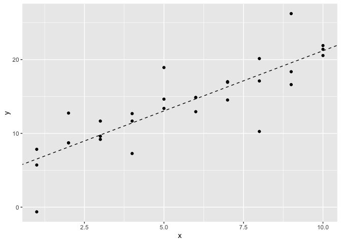
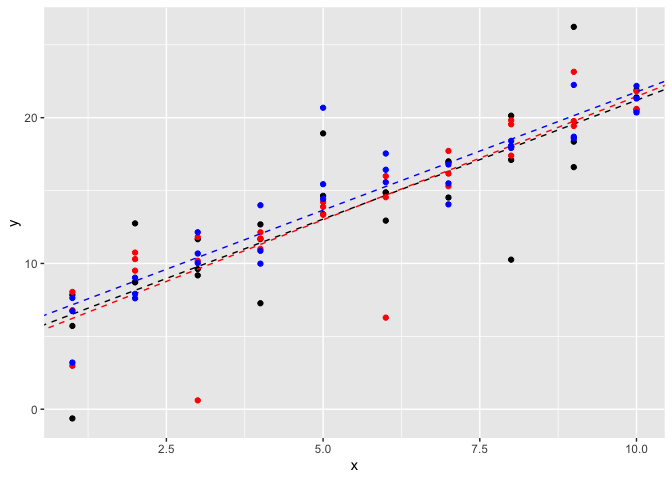
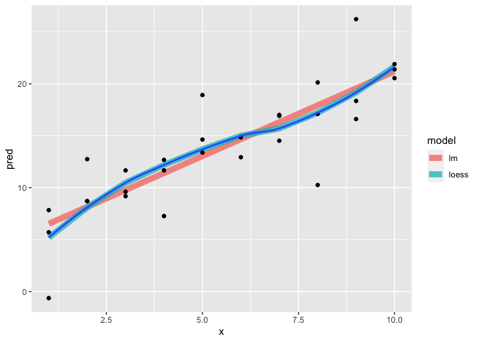
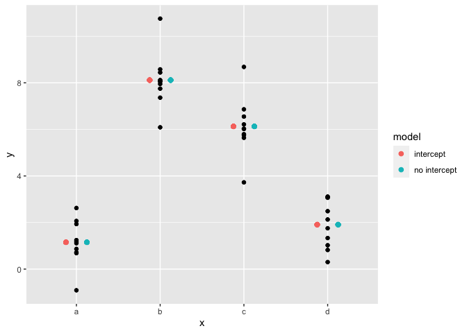
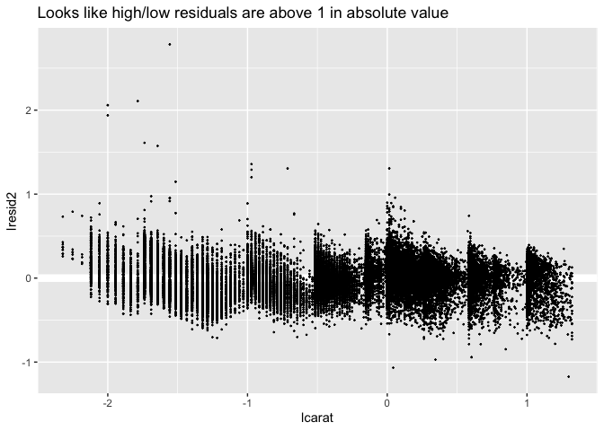
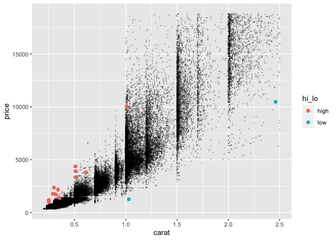
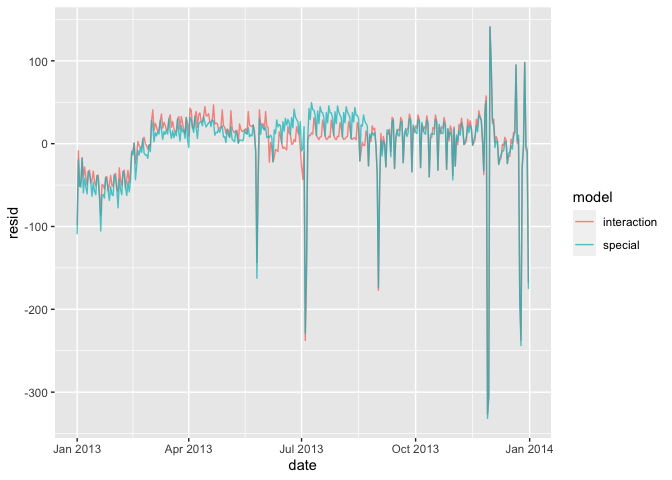
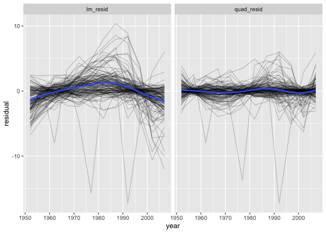
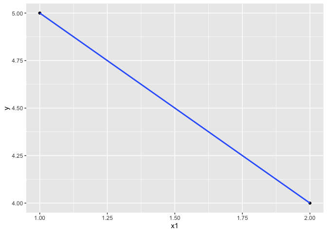

Meeting 7: Model
================
October 14, 2021 from 7:00-8:30pm ET

## Chapters to Read

This week, we’ll be discussing:

-   Preface/Introduction
-   Workflow basics
-   Workflow scripts
-   Workflow projects

### Physical Book

If you’re reading the physical book, the chapters to read are:

| Physical book chapters | Pages   |
|:-----------------------|:--------|
| All of Part IV         | 341-419 |

### Online Book

If you’re reading the online book, the chapters to read are:

| Chapter                | Link                                         |
|:-----------------------|:---------------------------------------------|
| Ch. 22: Introduction   | <https://r4ds.had.co.nz/model-intro.html>    |
| Ch. 23: Model basics   | <https://r4ds.had.co.nz/model-basics.html>   |
| Ch. 24: Model building | <https://r4ds.had.co.nz/model-building.html> |
| Ch. 25: Many models    | <https://r4ds.had.co.nz/many-models.html>    |

## Exercises

All exercises refer to the online book chapters. The book exercises and
online exercises may differ, so to make sure everyone is doing the same
exercises, please refer to the online book chapters.

-   Chapter 23: Section 23.2.1 \#1
-   Chapter 23: Section 23.3.3 \#1
-   Chapter 23: Section 23.4.5 \#1
-   Chapter 24: Section 24.2.3 \#3
-   Chapter 24: Section 24.3.5 \#3
-   Chapter 25: Section 25.2.5 \#1

Exercises are reproduced below.

### Chapter 23 Exercises

#### Section 23.2.1 \#1

1.  One downside of the linear model is that it is sensitive to unusual
    values because the distance incorporates a squared term. Fit a
    linear model to the simulated data below, and visualise the results.
    Rerun a few times to generate different simulated datasets. What do
    you notice about the model?

``` r
set.seed(1014541)
sim1a <- tibble(
  x = rep(1:10, each = 3),
  y = x * 1.5 + 6 + rt(length(x), df = 2)
)
```

> Sam’s solution:

Just run it once:

``` r
mod1 <- lm(y ~ x, data = sim1a)

ggplot() + 
  geom_point(data = sim1a, aes(x = x, y = y)) + 
  geom_abline(intercept = coef(mod1)[1], 
              slope = coef(mod1)[2],
              linetype = "dashed")
```

<!-- -->

Run it 3 times

``` r
sim1a2 <- tibble(
  x = rep(1:10, each = 3),
  y = x * 1.5 + 6 + rt(length(x), df = 2)
)
sim1a3 <- tibble(
  x = rep(1:10, each = 3),
  y = x * 1.5 + 6 + rt(length(x), df = 2)
)
mod2 <- lm(y ~ x, data = sim1a2)
mod3 <- lm(y ~ x, data = sim1a3)

ggplot() + 
  geom_point(data = sim1a, aes(x = x, y = y)) + 
  geom_abline(intercept = coef(mod1)[1], 
              slope = coef(mod1)[2],
              linetype = "dashed") +
  geom_point(data = sim1a2, aes(x = x, y = y), color = "red") + 
  geom_abline(intercept = coef(mod2)[1], 
              slope = coef(mod2)[2],
              linetype = "dashed", color = "red") + 
  geom_point(data = sim1a3, aes(x = x, y = y), color = "blue") + 
  geom_abline(intercept = coef(mod3)[1], 
              slope = coef(mod3)[2],
              linetype = "dashed", color = "blue")
```

<!-- -->

The 3 lines have very similar slopes but slightly different intercepts.
You can also see the influence of the outliers: the red line is lower
than the others where there are red outliers at e.g. x = 3, while the
blue line is higher wher there are blue outliers at e.x. x = 5.

#### Section 23.3.3 \#1

1.  Instead of using `lm()` to fit a straight line, you can use
    `loess()` to fit a smooth curve. Repeat the process of model
    fitting, grid generation, predictions, and visualisation on `sim1`
    using `loess()` instead of `lm()`. How does the result compare to
    `geom_smooth()`?

> Sam’s Solution:

``` r
lo_mod <- loess(y ~ x, data = sim1a)
# lo_mod <- loess(y ~ x, data = sim1a, degree = 0)
# lo_mod <- loess(y ~ x, data = sim1a, span = .2)

library(modelr)
grid <- sim1a %>% 
  data_grid(x) %>% 
  add_predictions(mod1, var = "pred_lm") %>% 
  add_predictions(lo_mod, var = "pred_loess")

grid %>% 
  pivot_longer(-x, names_to = "model", values_to = "pred",
               names_prefix = "pred_") %>%
  ggplot() + 
  geom_line(aes(x = x , y = pred, color = model), 
            size = 3, alpha = .75) + 
  geom_point(data = sim1a, aes(x = x, y = y)) + 
  geom_smooth(data = sim1a, aes(x = x, y = y), se = FALSE)
```

<!-- -->

#### Section 23.4.5 \#1

1.  What happens if you repeat the analysis of `sim2` using a model
    without an intercept. What happens to the model equation? What
    happens to the predictions?

> Sam’s Solution:

``` r
data(sim2)
s2mod1 <- lm(y ~ x, data = sim2)
s2mod2 <- lm(y ~ x - 1, data = sim2)

model.matrix(s2mod1)[c(1, 11, 21, 31),]
```

    ##    (Intercept) xb xc xd
    ## 1            1  0  0  0
    ## 11           1  1  0  0
    ## 21           1  0  1  0
    ## 31           1  0  0  1

``` r
model.matrix(s2mod2)[c(1, 11, 21, 31),] 
```

    ##    xa xb xc xd
    ## 1   1  0  0  0
    ## 11  0  1  0  0
    ## 21  0  0  1  0
    ## 31  0  0  0  1

``` r
sim2 %>% 
  add_predictions(s2mod1, var = "intercept") %>% 
  add_predictions(s2mod2, var = "no intercept") -> res 

res %>% 
  pivot_longer(contains("int"), names_to = "model", 
               values_to = "pred") %>% 
  ggplot() + 
  geom_point(aes(x, y)) + 
  geom_point(aes(x = x, y = pred, color = model), size = 2, 
             position = position_dodge(width = .5))
```

<!-- -->

### Chapter 24 Exercises

#### Section 24.2.3 \#3

3.  Extract the diamonds that have very high and very low residuals. Is
    there anything unusual about these diamonds? Are they particularly
    bad or good, or do you think these are pricing errors?

Some code from the book:

``` r
# diamonds2 data 
diamonds2 <- diamonds %>% 
  filter(carat <= 2.5) %>% 
  mutate(lprice = log2(price), lcarat = log2(carat))
# model 
mod_diamond2 <- lm(lprice ~ lcarat + color + cut + clarity,
                   data = diamonds2)

# add residuals 
diamonds2 <- diamonds2 %>% 
  add_residuals(mod_diamond2, "lresid2") %>% 
  add_predictions(mod_diamond2, "lpred2")


# plot residuals 
ggplot() + 
  geom_hline(yintercept = 0, color = "white", size = 3) + 
  geom_point(data = diamonds2, aes(x = lcarat, y = lresid2), size = .2) + 
  labs(title = "Looks like high/low residuals are above 1 in absolute value")
```

<!-- -->

> Sam’s Solution:

``` r
# get residuals with abs val > 1
diamonds2 %>% 
  filter(abs(lresid2) > 1) %>% 
  mutate(hi_lo = case_when(lresid2 > 0 ~ "high",
                           TRUE ~ "low")) -> large_outliers
# look at them on the non-transformed scale 
ggplot() + 
  geom_point(data = diamonds2, aes(x = carat, y = price), size = .2, alpha = .2) + 
  geom_point(data = large_outliers, aes(x = carat, y = price, color = hi_lo), size = 2)
```

<!-- -->

``` r
large_outliers %>% 
  count(hi_lo, cut)
```

    ## # A tibble: 6 × 3
    ##   hi_lo cut           n
    ##   <chr> <ord>     <int>
    ## 1 high  Fair          9
    ## 2 high  Good          1
    ## 3 high  Very Good     1
    ## 4 high  Premium       3
    ## 5 low   Fair          1
    ## 6 low   Premium       1

``` r
large_outliers %>% 
  count(hi_lo, color)
```

    ## # A tibble: 4 × 3
    ##   hi_lo color     n
    ##   <chr> <ord> <int>
    ## 1 high  D         2
    ## 2 high  F         8
    ## 3 high  G         4
    ## 4 low   E         2

``` r
large_outliers %>% 
  count(hi_lo, clarity)
```

    ## # A tibble: 7 × 3
    ##   hi_lo clarity     n
    ##   <chr> <ord>   <int>
    ## 1 high  I1          1
    ## 2 high  SI2         5
    ## 3 high  SI1         2
    ## 4 high  VS2         3
    ## 5 high  VVS2        3
    ## 6 low   I1          1
    ## 7 low   SI2         1

``` r
large_outliers %>% 
  count(hi_lo, cut, color, clarity)
```

    ## # A tibble: 13 × 5
    ##    hi_lo cut       color clarity     n
    ##    <chr> <ord>     <ord> <ord>   <int>
    ##  1 high  Fair      D     SI2         1
    ##  2 high  Fair      F     I1          1
    ##  3 high  Fair      F     SI2         1
    ##  4 high  Fair      F     SI1         1
    ##  5 high  Fair      F     VS2         1
    ##  6 high  Fair      F     VVS2        2
    ##  7 high  Fair      G     VS2         2
    ##  8 high  Good      F     SI2         1
    ##  9 high  Very Good D     VVS2        1
    ## 10 high  Premium   F     SI1         1
    ## 11 high  Premium   G     SI2         2
    ## 12 low   Fair      E     I1          1
    ## 13 low   Premium   E     SI2         1

#### Section 24.3.5 \#3

3.  Create a new variable that splits the wday variable into terms, but
    only for Saturdays, i.e. it should have `Thurs`, `Fri`, but
    `Sat-summer`, `Sat-spring`, `Sat-fall`. How does this model compare
    with the model with every combination of wday and term?

Some code from the book:

``` r
library(lubridate)
data("flights", package = "nycflights13")
daily <- flights %>% 
  mutate(date = make_date(year, month, day)) %>% 
  group_by(date) %>% 
  summarise(n = n()) %>% 
  mutate(wday = wday(date, label = TRUE))

term <- function(date) {
  cut(date, 
    breaks = ymd(20130101, 20130605, 20130825, 20140101),
    labels = c("spring", "summer", "fall") 
  )
}

daily <- daily %>% 
  mutate(term = term(date)) 

daily <- daily %>% 
  mutate(sat_term = case_when(
    wday == "Sat" ~ str_c(as.character(wday), term, sep = "-"),
    TRUE ~ as.character(wday)
    ))
daily %>% 
  count(sat_term)
```

    ## # A tibble: 9 × 2
    ##   sat_term       n
    ##   <chr>      <int>
    ## 1 Fri           52
    ## 2 Mon           52
    ## 3 Sat-fall      18
    ## 4 Sat-spring    22
    ## 5 Sat-summer    12
    ## 6 Sun           52
    ## 7 Thu           52
    ## 8 Tue           53
    ## 9 Wed           52

``` r
# original model: 
mod2 <- lm(n ~ wday * term, data = daily)

# model with the special sat_term variable 
mod2a <- lm(n ~ sat_term, data = daily)

# residuals 
daily %>% 
  gather_residuals(interaction = mod2, special = mod2a) %>%
  ggplot(aes(date, resid, colour = model)) +
    geom_line(alpha = 0.75) + 
  labs("The partial interaction variable performs better in the summer than the full interaction model, but not otherwise.")
```

<!-- -->

### Chapter 25 Exercises

#### Section 25.2.5 \#1

1.  A linear trend seems to be slightly too simple for the overall
    trend. Can you do better with a quadratic polynomial? How can you
    interpret the coefficients of the quadratic? (Hint you might want to
    transform `year` so that it has mean zero.)

Code from book:

``` r
library(gapminder)
# nest the data
by_country <- gapminder %>% 
  group_by(country, continent) %>% 
  nest()
# write a function to fit the model to each country
country_model <- function(df) {
  lm(lifeExp ~ year, data = df)
}
# create a model column in the data frame with the fitted model results for each country
by_country <- by_country %>% 
  mutate(model = map(data, country_model))

# add residuals 
by_country <- by_country %>% 
  mutate(
    resids = map2(data, model, add_residuals)
  )
```

> Sam’s Solution:

``` r
# write another function to fit the model. 
country_model_quad <- function(df) {
#  df$year2 <- df$year - median(df$year)
  lm(lifeExp ~ poly(year - median(year), 2), data = df)
}
# y = a0 + a1*x + a2 *x^2
# fit models 
by_country <- by_country %>% 
  mutate(model_quad = map(data, country_model_quad))

# add residuals 
by_country <- by_country %>% 
  mutate(
    resids_quad = map2(data, model_quad, add_residuals)
  )
by_country
```

    ## # A tibble: 142 × 7
    ## # Groups:   country, continent [142]
    ##    country    continent data         model resids      model_quad resids_quad   
    ##    <fct>      <fct>     <list>       <lis> <list>      <list>     <list>        
    ##  1 Afghanist… Asia      <tibble [12… <lm>  <tibble [1… <lm>       <tibble [12 ×…
    ##  2 Albania    Europe    <tibble [12… <lm>  <tibble [1… <lm>       <tibble [12 ×…
    ##  3 Algeria    Africa    <tibble [12… <lm>  <tibble [1… <lm>       <tibble [12 ×…
    ##  4 Angola     Africa    <tibble [12… <lm>  <tibble [1… <lm>       <tibble [12 ×…
    ##  5 Argentina  Americas  <tibble [12… <lm>  <tibble [1… <lm>       <tibble [12 ×…
    ##  6 Australia  Oceania   <tibble [12… <lm>  <tibble [1… <lm>       <tibble [12 ×…
    ##  7 Austria    Europe    <tibble [12… <lm>  <tibble [1… <lm>       <tibble [12 ×…
    ##  8 Bahrain    Asia      <tibble [12… <lm>  <tibble [1… <lm>       <tibble [12 ×…
    ##  9 Bangladesh Asia      <tibble [12… <lm>  <tibble [1… <lm>       <tibble [12 ×…
    ## 10 Belgium    Europe    <tibble [12… <lm>  <tibble [1… <lm>       <tibble [12 ×…
    ## # … with 132 more rows

Visualize

``` r
unnest(by_country, c(resids, resids_quad), 
       names_repair = "universal") %>% 
  select(country, continent, year = year...5, lm_resid = resid...9,
         quad_resid = resid...15) %>% 
  pivot_longer(contains("resid"), names_to = "model", values_to = "residual") %>%
  ggplot(aes(year, residual)) +
  geom_line(aes(group = country), alpha = .2) +
  geom_smooth(se = FALSE) + 
  facet_grid(cols = vars(model))
```

<!-- -->

# Open Discussion

``` r
df <- tribble(
  ~y, ~x1, ~x2,
  4, 2, 5,
  5, 1, 6
)
model_matrix(df, y ~ x1)
```

    ## # A tibble: 2 × 2
    ##   `(Intercept)`    x1
    ##           <dbl> <dbl>
    ## 1             1     2
    ## 2             1     1

``` r
mod <- lm(y~x1, data = df)
mod
```

    ## 
    ## Call:
    ## lm(formula = y ~ x1, data = df)
    ## 
    ## Coefficients:
    ## (Intercept)           x1  
    ##           6           -1

equation for the best fit line: y = a0*1 + a1*x1

``` r
ggplot(data = df ,aes(x = x1, y = y)) + 
  geom_point() + 
  geom_smooth(method = "lm")
```

<!-- -->

data\_grid :

``` r
sim3 %>% 
  data_grid(x1, x2)
```

    ## # A tibble: 40 × 2
    ##       x1 x2   
    ##    <int> <fct>
    ##  1     1 a    
    ##  2     1 b    
    ##  3     1 c    
    ##  4     1 d    
    ##  5     2 a    
    ##  6     2 b    
    ##  7     2 c    
    ##  8     2 d    
    ##  9     3 a    
    ## 10     3 b    
    ## # … with 30 more rows
